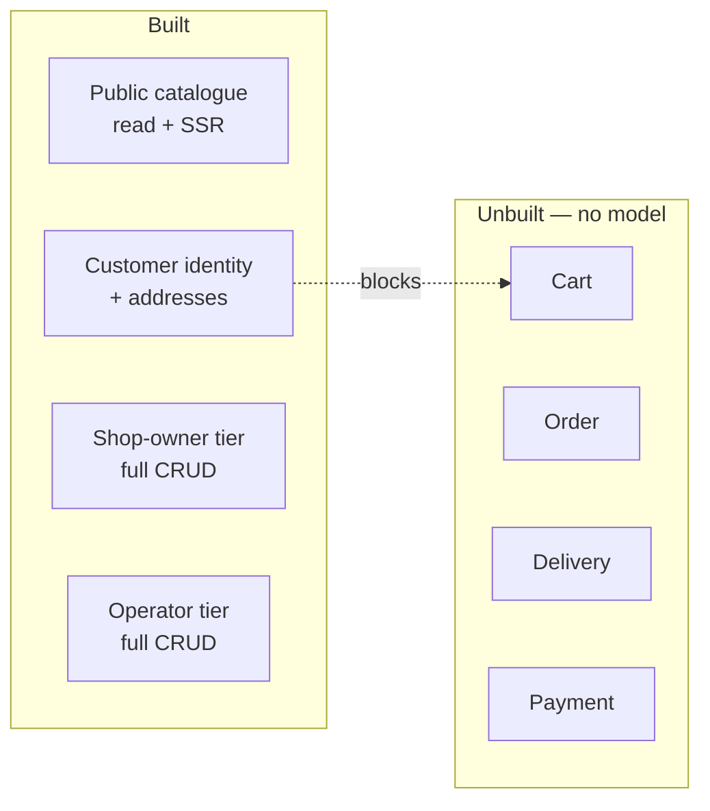
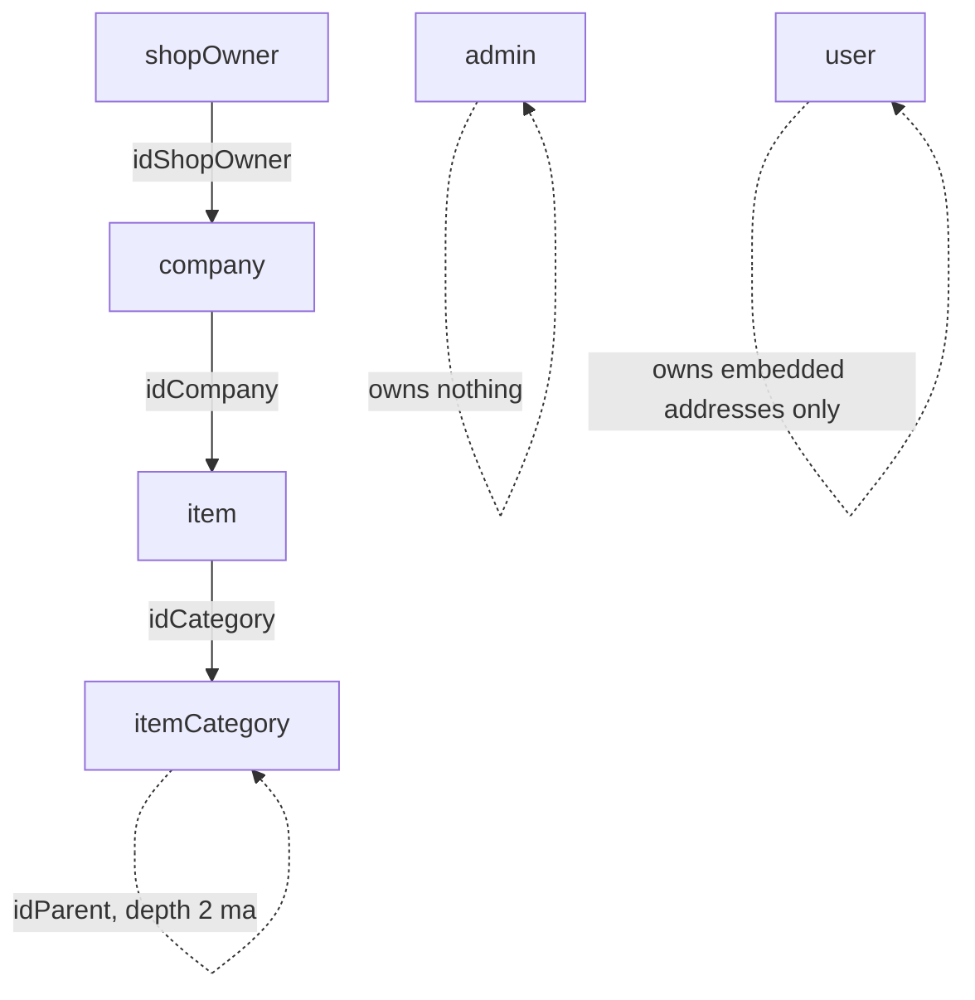

# PDR — Project Definition Record
# Marketplace

**Status:** baselined - brownfield retrofit
**Version:** 1.0
**Date:** 2026-08-07
**Author:** pdr-agent
**Changelog:** v1.0 - initial retrofit; reverse-engineered from the 15-repo working tree. No prior DEVPROTOCOL documents existed.

---

## 1. What are we building?

Multi-tenant marketplace platform. Many independent shops, one operator (thedoctorweb). Customers order from shops; shop owner runs own shop; platform operator runs whole platform. Four target surfaces: public catalogue pages, customer account area, shop-owner area, platform-operator area — see `/media/nvme/websites/fullstack-marketplace-blueprint/CLAUDE.md` §Build state.

Polyrepo, 15 independent git repos, no monorepo tooling. Verified: `find . -maxdepth 4 -name ".git" -type d` returns 15 dirs (parent + `BEs/marketplace-common` + `BEs/marketplace-db-setup` + 9 under `BEs/dev/marketplace-dev-*` + `marketplace-admin` + `marketplace-shopowner` + `marketplace-user`).

Build state, not aspiration — this is the load-bearing fact of the whole doc:



Four surfaces exist at very different depths. Public pages + customer identity landed 2026-08-05 (`marketplace-user`, `user` collection). ShopOwner and Admin tiers pre-date that and are deeper — full item/company CRUD. Commerce (cart/order/delivery/payment) has zero model, zero resolver, zero design — see §4 Out of scope.

---

## 2. Why are we building it?

Platform vendor thedoctorweb operates a multi-tenant marketplace for independent shop owners who lack own e-commerce infra. Shop owner needs: register shop, manage catalogue, get discovered. Customer needs: browse shops, eventually order. Platform operator needs: onboard/moderate shop owners, curate taxonomy.

Design note, not a current problem: the catalogue (`item` + `itemCategory`) is deliberately domain-neutral, presuming nothing about what is sold — built 2026-08-05 alongside a full customer identity tier. Why now: the catalogue must stay domain-neutral before any product type is addable — that constraint is what "why now" answers. Commerce layer is next but has no decision yet (§8).

---

## 3. For whom?

| Persona | Description | Primary need |
|---|---|---|
| End customer (`User`) | registers, confirms email, fills personal data, manages addresses. Cannot buy anything yet — `BEs/marketplace-db-setup/lib/schemas/user.js` carries no order/cart reference | account + browse today; order tomorrow, no timeline |
| Shop owner (`ShopOwner`) | runs 1+ `company` documents, each a real shop; manages own `item` catalogue under admin-curated `itemCategory` taxonomy | catalogue mgmt + discoverability, no commerce ops yet |
| Platform operator (`Admin`) | thedoctorweb staff; onboards/moderates shop owners, owns `itemCategory` taxonomy writes exclusively — `BEs/dev/marketplace-dev-admin-authenticated-resource/src/graphQLApi/schema/mutations/itemCategoryAdd.mts:14-17` states shop owners "pick from this list; they cannot add to it" | approval + taxonomy control |
| Anonymous visitor | unauthenticated, hits public SSR pages only | browse shops/items, no login required |
| Platform vendor / developer (thedoctorweb) | operates the 15-repo polyrepo itself — deploys `marketplace-common` across 9 consumers, runs migrations, maintains quality gates | one coherent platform out of 15 independently-committed repos |

No `role` field, no permission enum anywhere in the schema. Role IS which collection a session authenticated against (`CLAUDE.md` §Terminology) — this is a persona-defining fact, not an implementation detail: a 5th persona means a 5th collection, not a role check.

---

## 4. Scope

### In scope

**Tenant skeleton** — `admin`, `shopOwner`, `company` collections, ownership chain `shopOwner ──idShopOwner──> company`. Verified 6 collections total via migration filenames in `BEs/marketplace-db-setup/migrations/`: `20260301000000-create-admin.js`, `20260301000100-create-shopOwner.js`, `20260803000000-create-company.js`, `20260804000000-create-user.js`, `20260804020000-create-itemCategory.js`, `20260804030000-create-item.js`.

**Domain-neutral catalogue** — `item` + `itemCategory`, hanging off `company`, no shop collection (a shop IS a `company`). No price field, deliberately — see comment block in `BEs/marketplace-db-setup/lib/schemas/item.js:12-17`: "Cart, order, delivery and payment have no model anywhere on this platform … a price would be a guess." `itemCategory` depth capped at two levels, enforced in resolver not validator — `BEs/dev/marketplace-dev-admin-authenticated-resource/src/lib/itemCategory/funItemCategoryAdd.mts:24` calls `throwIfParentNotTopLevel(data.idParent)` before write, writes exist only in the Admin-tier resource service.

**Customer identity + addresses** — `user` collection mirrors `shopOwner` with 4 divergences (`personalData` optional, `addresses[]` array, no `waitApprov`, `defaultAddress` pointer). Default-address invariant is DB-enforced via `$and: [{$jsonSchema}, {$expr}]` validator, not app code — deletion must clear the pointer in the same write, real code:

```ts
// BEs/dev/marketplace-dev-user-authenticated-resource/src/lib/user/funUserAddressDel.mts:50-69
const ret = await User.updateOne(
  { _id: _id, 'addresses._id': addressObjectId },
  [
    { $set: { addresses: { $filter: { input: '$addresses',
        cond: { $ne: ['$$this._id', addressObjectId] } } } } },
    { $set: { defaultAddress: { $cond: [
        { $eq: ['$defaultAddress', addressObjectId] }, '$$REMOVE', '$defaultAddress'] } } }
  ],
  { updatePipeline: true }
).exec()
```

**3 auth tiers + per-tier session tier assertion** — `Admin` / `ShopOwner` / `User`, each own collection, own service pair, own Redis session `tier` field since 2026-08-05. All 9 services share one `REDIS_KEY` prefix on purpose (logout needs it), so `assertTier` is the only thing stopping a foreign-tier token — `BEs/marketplace-common/src/others/assertTier.mts:23-25` throws 403 (not 401) on mismatch, and treats a missing `tier` as invalid, never a wildcard. 3 authorization services now share their handler body via `marketplace-common@1.0.0` (`resolveAuthorizationSession`, `findAccountForSession`, `refreshSessionTokens`) while staying 3 separate deployables — decided option (c), `docs/decisions/authorization-service-consolidation.md`.

**Public SSR surface** — `marketplace-user`, TanStack Start. Public routes SSR, `/account/*` `ssr: false` — security boundary, not a style choice: `marketplace-user/src/routeOptions/account.tsx:59` sets `{ ssr: false as const, head, component: Account }`, and it is "the one place the flag appears" per the comment above it (line 11). SSR server talks to public-resource directly over `PUBLIC_RESOURCE_URL`, read in `marketplace-user/src/api/ssr.ts:40`, deliberately not `VITE_`-prefixed so it never inlines into the client bundle. `serve.mjs` binds loopback only (`marketplace-user/serve.mjs:34`, `const HOSTNAME = '127.0.0.1'`) — the one deliberate exception to every other service's wildcard bind.

**Quality-gate regime** — 100% coverage (4 metrics) + 100 mutation score in every package that ships code: 9 backend services, `marketplace-common`, `marketplace-db-setup`, 3 frontends, `services-status`. Plus `lint:check`, `tsc --noEmit`, Qodana, wired into `.githooks/pre-commit` and `.githooks/pre-push` in all 15 repos. `core.hooksPath` is local config and must be set by hand after a fresh clone of the parent (`git config core.hooksPath .githooks`) — the 14 sub-repos self-arm via their `prepare` script, the parent has no `package.json` so nothing runs it.



### Out of scope

- **Orders, cart, delivery, payment** — no collection, no resolver, no design. `item` has no price field for exactly this reason (`BEs/marketplace-db-setup/lib/schemas/item.js:12-17`). Not a backlog item with an owner — genuinely undesigned, "ask before inventing them" per `CLAUDE.md` §Build state.
- **A separate shop collection** — will not exist. A shop IS a `company`. `CLAUDE.md` states this twice, deliberately, as a thing not to re-propose.
- **Vocabulary that presumes a specific product domain** — the catalogue (`item` + `itemCategory`) is domain-neutral by design. Reintroducing domain-presuming vocabulary in a new product type is a regression, not a feature.
- **`role` field or permission enum** — role = which collection you authenticate against, by design. A dispatcher on `redData.tier` was explicitly evaluated and rejected for the authorization-consolidation question — see option (a) in `docs/decisions/authorization-service-consolidation.md`, blocked on doctrine grounds, not merely deferred.
- **Merging the 3 `*-authenticated-authorization` services into 1** — decided against, 2026-08-07, same decision doc. Crash-domain coupling (`process.exit(1)` on any uncaught exception) taking 3 tiers down for 1 bug is an availability cost the platform owner ranked above deduplication.
- **Installing nginx configs anywhere** — the edge lives at `nginx/` in the workspace root: three vhosts (apex, `shopowner.`, `admin.`), shared `conf.d/` and `snippets/`, and `test/` which runs the lot in a container. Written and exercised, not deployed: no `/etc/nginx` and no nginx binary exist in this workspace or on this machine. ⚠️ Until it is installed, nothing sets `Secure` on the session cookie — koa-utils ships `secure: false` and the rewrite is the edge's.
- **Publishing any of the 15 repos to a forge** — deciding where/under-which-org is explicitly the user's undecided call (`docs/workflow.md` §Repo layout).
- **`marketplace-common` on an npm registry** — consumed as `@axiumine/marketplace-common` by package name, but 404s on `registry.npmjs.org`. Bridged locally by `BEs/marketplace-common/deploy-local.sh`, which globs this workspace and syncs `dist/` + `package.json` into every consumer's `node_modules/`. This is a standing gap, not a future-phase item with a date.

---

## 5. Key outcomes

| Outcome | Measurable signal |
|---|---|
| No line of shipped code is untested | `test.coverage.thresholds` in `vitest.config.mts` = 100% on all 4 metrics, in all 15 packages that ship code |
| A passing test would actually fail on a wrong line | Stryker `thresholds.break: 100` in every `stryker.config.mjs`; rollout complete 2026-08-07, verified per-package before scores of 45.95%–96.47% (`README.md` §What the rollout actually found) |
| A foreign-tier access token is refused, not silently accepted | `assertTier` throws `403`, never `401`; `BEs/marketplace-common/src/others/assertTier.mts:23` |
| A push cannot land un-linted, un-typed, or un-scanned code | `.githooks/pre-push` runs `yarn lint:check` → `test:cov` → `test:mutation` → Qodana, in that order, in all 15 repos — verified executable and hooked (`core.hooksPath`) this session for the 3 explicitly checked |
| The public catalogue never full-scans on a geo query | `company.address.position_2dsphere` index — `.explain()` must show `IXSCAN`, never `COLLSCAN` (`docs/data-model.md` §Indexes) |
| An edit to `marketplace-common` is invisible to consumers until deployed | `./deploy-local.sh` re-syncs `dist/` into 9 services' `node_modules/@axiumine/marketplace-common/` — skipping it means the consumer keeps compiling the previous build with no error at the call site |
| Node version drift cannot silently break a push | every `pre-push` selects `engines.node` via nvm before shelling to yarn; yarn's `engines` check is a hard `exit 1` under yarn classic — verified `^24.18.0` in all 14 `package.json` files this session |

---

## 6. Constraints

| Constraint | Detail |
|---|---|
| Polyrepo, no atomic cross-repo commit | 1 logical change = N separate commits, one per affected repo — no tooling catches a cross-repo mistake automatically |
| Shallow history | history starts here; the working trees predate the first commit in each repo, so `git log` explains little |
| Node `^24.18.0` hard gate under yarn classic | `.nvmrc` = `24.18.0`; a mismatch is `exit 1` with "The engine node is incompatible", not a warning — bump all 14 `package.json` in one sweep if it ever moves |
| yarn everywhere, but `packageManager` pinned in only 6 of 14 | `marketplace-db-setup`, the 2 `*-user-authenticated-*` services, and the 3 frontends carry `yarn@1.22.22+sha512.…`; the other 8 resolve to whatever yarn is on `PATH` under Corepack |
| `marketplace-common` unpublished, package-name-consumed | bridged by `BEs/marketplace-common/deploy-local.sh`; a fresh `yarn install` in any service still 404s until real publish |
| Migrations immutable | never edit an applied migration; `$jsonSchema` shapes live in `BEs/marketplace-db-setup/lib/schemas/`, shared across migrations that restate them — a schema change means a full rebuild of every DB that ran the migrations |
| English-only naming, no exception | Identifiers, routes, UI text, comments, fixtures and migrations. The `en-GB` locale the SPAs format dates with is a market choice, not a name |
| Tabs, not spaces | eslint `indent: ['error','tab']` AND prettier `useTabs: true` in all 13 linted repos — running only one used to reindent against the other |
| MongoDB `$jsonSchema` + `additionalProperties: false` | every one of the 6 collections; no field slips through unvalidated |
| Redis is a cluster | multi-key `DEL` throws `CROSSSLOT` — integration test cleanup must delete one key per call |
| Secrets never printed | 4 enforcement layers (`permissions.deny`, `no-secret-leak` PreToolUse hook, `pre-commit` guard in 11 repos, 2-level `.gitignore`) — `.claude/SECRETS.md`; `.env`/`.env.*`/`.npmrc`/`.yarnrc`/keys never read, only `env`/`npmrc` placeholder templates are safe |

---

## 7. Success definition

Complete when a developer or operator can:

1. Clone all 15 repos, run `./deploy-local.sh` from `BEs/marketplace-common`, and have all 9 services build against it with no registry publish.
2. Run any of the 9 backend services with `yarn dev` and reach it on its documented port (4024–4032) bound wide, verified against the `env` template in each repo.
3. Register as `User` on `marketplace-user`, confirm email via `GET /check/verify-email-user/:email/:hash`, log in, fill personal data, add multiple addresses, and name exactly one default — never two, never a dangling pointer.
4. Register a shop as `ShopOwner`, get approved (`waitApprov`) by an `Admin`, create a `company`, publish it, add `item` documents under `Admin`-curated `itemCategory` values.
5. Browse the public catalogue anonymously via SSR and hit a geo "shops near me" query that hits `IXSCAN`, never `COLLSCAN`.
6. Push to any of the 15 repos and have `.githooks/pre-push` block on lint, 100% coverage, 100 mutation score, or a Qodana High/Critical finding — never silently pass.
7. Add a 4th product type by following the seam: model in `marketplace-common` → `exports` entry → `deploy-local.sh` → migration in `marketplace-db-setup` under `lib/schemas/` → resolvers in the 3 resource services that need it → frontend schema slice — without touching `item`'s shape unless the new type genuinely isn't just an `item` with a different `idCategory`.
8. Confirm a foreign-tier access token is refused with `403`, never `401`, at every one of the 9 services' auth boundary.
9. Confirm no secret value ever appears in a terminal, a tool result, or a `~/.claude/projects/*.jsonl` transcript for this workspace.

---

## 8. Open questions

| # | Question | Owner | Status |
|---|---|---|---|
| 1 | Where do the 15 repos get published, and under which forge org? | platform owner | open |
| 2 | Do the 3 repos built 2026-08-05 (`marketplace-dev-user-authenticated-authorization`, `marketplace-dev-user-authenticated-resource`, `marketplace-user`) get a `main` branch the way the other 12 do? | platform owner | open |
| 3 | Ordering design — cart, order, delivery, payment, and the `item.price` field they all depend on. No collection, no resolver, no schema decision exists yet | platform owner | open, blocks all commerce work |
| 4 | Who installs the nginx configs in `nginx/`, and on what host? No `/etc/nginx` exists in this workspace | platform owner / ops | open — the configs are written and tested (`nginx/test/run.sh`); what is missing is the host and the topology ADR (`ADR-INDEX.md` §5) |
| 5 | Does `marketplace-common` ever get published to a real npm registry, retiring `deploy-local.sh`? | platform owner | open |
| 6 | ~~Is there an admin-facing nginx vhost for `marketplace-admin`/`marketplace-shopowner`?~~ | platform owner | **closed** — there was not, and one had never been written. `nginx/sites-available/admin.marketplace-domain.com.conf` and `shopowner.marketplace-domain.com.conf` now exist, each terminating TLS for its own hostname |
| 7 | `marketplace-dev-public-resource/package.json` pins `@axiumine/koa-utils: ^5.9.0` (verified `BEs/dev/marketplace-dev-public-resource/package.json:38`) while `koa-utils` 5.9.0 is committed but unpushed by user instruction (`TODO`) — `yarn install` fails there until it is published. Publish timeline? | platform owner | open, blocking |
| 8 | 4 repos (`services-status`, `marketplace-user`, both `*-user-authenticated-*` services) have a `qodana.yaml` and no Cloud project — Qodana step blocks on missing `QODANA_TOKEN`, bypassed today with `SKIP_QODANA=1`. Who creates the 4 projects? | platform owner | open |
| 9 | Does MongoDB collection-level RBAC exist beneath the shared application connection, independent of the `assertTier` application-layer check? | platform owner / DBA | not verified, explicitly logged as such in `docs/decisions/authorization-service-consolidation.md` §Not verified |

---

## 9. Change control

Formal change request required before any of the following changes:

- **Scope boundaries** — adding cart, order, delivery, payment, or an `item.price` field. These are explicitly undesigned; adding any of them is scope expansion, not a bugfix.
- **The tier = role = collection rule** — no `role` field, no permission enum, no dispatch on a tier value read out of a session. Already tested once (option (a) in `docs/decisions/authorization-service-consolidation.md`) and rejected on doctrine grounds; re-opening it needs the doctrine in `CLAUDE.md` changed first, not a code review.
- **The `docs/devprotocol/` namespace** — this document's own home. Downstream Phase 2–5 documents depend on Phase 1 being stable.
- **The polyrepo split** — collapsing any 2+ repos into 1 (e.g. the 3 authorization services, or logout into resource) is a decision the platform owner has already weighed once per the decision doc above and declined twice (options a and b). A 3rd attempt needs a fresh CR, not a re-read of the existing one.
- **Re-introducing a separate shop collection, or vocabulary that presumes a specific product domain** — both explicitly rejected design directions, not oversights.

Minor updates, no CR needed:

- New product types that are genuinely `item` + a new `idCategory` value, following the existing seam.
- New Papa-Agent-style resolvers/queries within an existing service, following the existing `queries/` `mutations/` layout.
- Wording clarifications to this document that do not move a scope boundary.
- Adding a Qodana Cloud project to one of the 4 repos currently blocked on `SKIP_QODANA=1` (open question 8) — operational, not scope.
