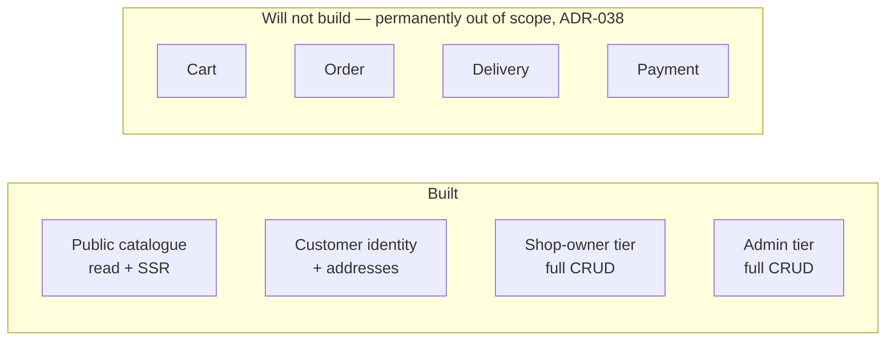
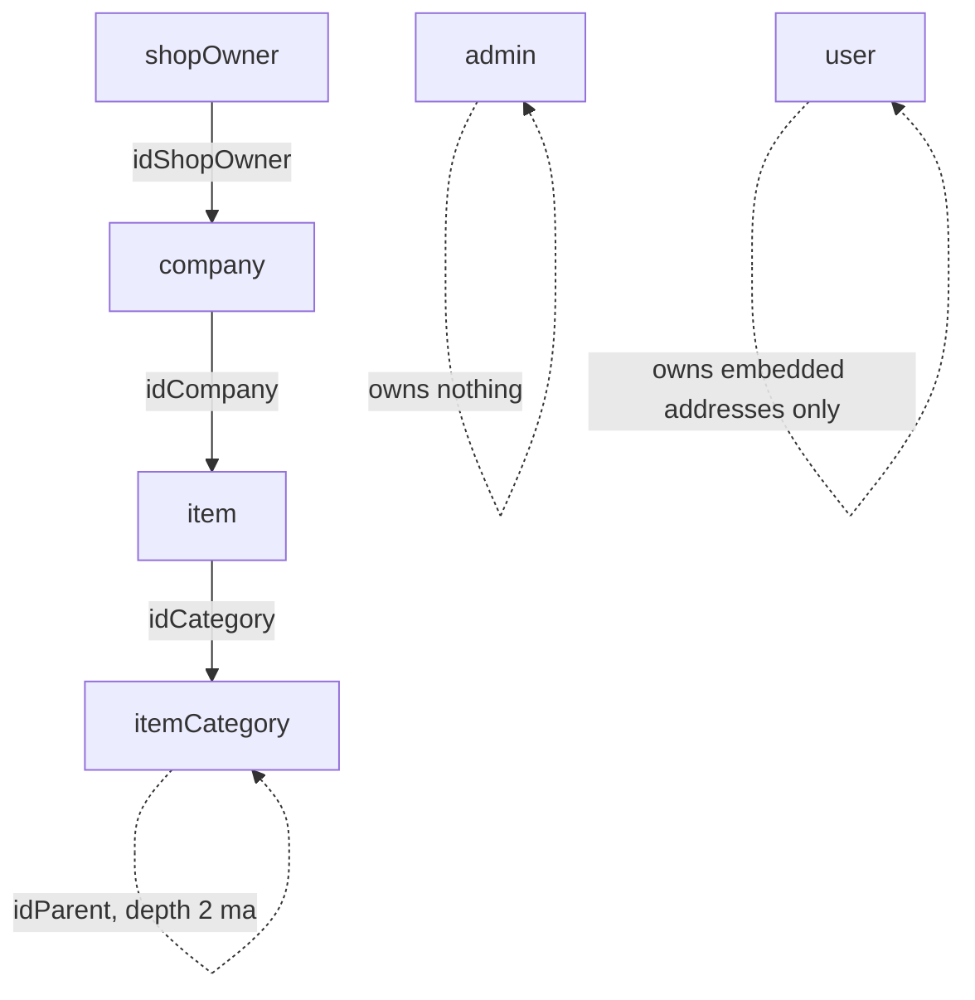

# PDR — Project Definition Record
# Marketplace

**Status:** baselined - brownfield retrofit
**Version:** 1.10
**Date:** 2026-08-27
**Author:** pdr-agent
**Changelog:** v1.0 - initial retrofit; reverse-engineered from the 15-repo working tree. No prior DEVPROTOCOL documents existed.
v1.10 - 2026-08-27, later the same day: the retired `marketplace-common on an npm registry` gap and the
constraint row above it carry `2.0.0` / `^2.0.0`, the versions live since that release; closed question 5 keeps
the `1.0.1` it was closed on and gains the follow-on. The gap stays retired for the same reason.
v1.9 - 2026-08-27, later still: **§8 open question 3's closure had cited E11's epic file, deleted that day; the pointer is repointed**, not to a replacement file — there isn't one — but to
[`ADR-038`](../phase3/adr/ADR-038-commerce-is-permanently-out-of-scope.md) §Note on the deleted E11 epic
file, where the five questions' record now lives. The epic id **E11** is unaffected — it stays in the
numbering per ADR-038 §Consequences, only the record file is gone. §4 Out of scope named no such file and
needed no change. Nothing this document asserts about scope, boundaries or the closure itself is altered.
v1.8 - 2026-08-27: **open question 3 closes as moot and §4 Out of scope stops saying "yet".** The platform owner decided that cart, order, delivery and payment are permanently out of scope — `phase3/adr/ADR-038-commerce-is-permanently-out-of-scope.md`. The scope diagram's **Unbuilt** subgraph is renamed and its `blocks` edge removed: customer identity was never blocking anything, it was waiting on a decision that has now gone the other way. The `item.price` half of question 3 closes with it, display-only price included (ADR-009 §Note 2026-08-27). **No built scope, surface or requirement changed** — this document described the commerce absence correctly throughout and still does; the word `yet` is what left it.
v1.1 - 2026-08-25: the catalogue paragraph's depth-cap citation was two versions stale — the guard now runs inside a transaction and takes a session — and "writes exist only in the Admin-tier resource service" is narrowed to the mutations, `holdItemCategory` having added one deliberate field-level exception.
v1.10 - 2026-08-30: **§4's registry bullet, §5's two rows, §7 walkthroughs 1 and 7, and §8 question 5's
answer all described a local-deploy bridge that no longer exists.**
[`ADR-047`](../phase3/adr/ADR-047-a-common-change-ships-as-a-published-release.md) deletes
`deploy-local.sh`; a change to the shared library ships as a published release, and question 5's *"no, not
retiring the script"* is reversed four days after it was written. Live versions move to `3.0.0` / `^3.0.0`.
No scope, boundary or product decision changed — only the mechanism by which one repo reaches nine.
v1.7 - 2026-08-27, later still: §4's bullet and §8 item 5 both said a `yarn install` *undoes* `deploy-local.sh`, flatly
and without condition. Verified otherwise across all 16 repos: no install path anywhere invokes the script, the only
install-time lifecycle script being `prepare`. Both places are restated on the condition that actually carries the
claim - while common holds an edit no release has shipped. Question 5 stays closed. Scope and boundaries untouched.
v1.6 - 2026-08-27, later still: two places this document still asserted the npm 404 that `ADR-037` ended on
2026-08-26, both missed by the v1.3 sweep that corrected §6. §4's non-scope bullet said the package *"404s on
`registry.npmjs.org`"* and called it *"a standing gap"*; §8 **open question 5** — *does it ever get published,
retiring `deploy-local.sh`?* — sat open with the answer already on the registry. **Question 5 closes: yes published,
no the script does not retire.** Scope and boundaries untouched.
v1.5 - 2026-08-27, later still: the pin named in the item-7 closure moved again, this time by our hand. **All nine services and `marketplace-common` are now on `@axiumine/koa-utils@^7.0.0`** — eight service `package.json` files and `marketplace-common`'s devDependency were bumped from `^6.0.0`, each with a `yarn install` whose lockfile diff moved the `koa-utils` entry and nothing else, and each repo's own suite green afterwards. The one API change between 6 and 7 is `uploadTemp` → `uploadTempImage`, which only `marketplace-dev-authenticated-resource` could have consumed and does not. §8 item 7's closure prose is corrected to match; the closure itself does not re-open. Scope and boundaries untouched.
v1.4 - 2026-08-27, later the same day: **open question 7 closes** — `@axiumine/koa-utils` is on `registry.npmjs.org` through `7.0.0`, so the *"`yarn install` fails there until it is published"* block is gone; the pin it named is stale twice over, the service being on `^6.0.0` at line 40 rather than `^5.9.0` at line 38. `R37` closes with it. Scope and boundaries untouched.
v1.3 - 2026-08-27: two facts this document asserted had stopped being true. Open question 8 is **closed — the 4 Qodana Cloud projects were never missing**, each named by the scan artefact on disk (`xPKXD`, `dXO5E`, `B5NEV`, `eobk1`); all fifteen code-shipping repos hold fifteen distinct projects, and no repo stands on `SKIP_QODANA=1`. §6's `marketplace-common` row corrected after `ADR-037`: the package is published at `1.0.1`, so `deploy-local.sh` bridges the gap between releases rather than the absence of one. Scope, boundaries and scores untouched.
v1.2 - 2026-08-26: the vendor's trading name removed from this document. It named a company in prose that is about roles, and the role words — platform vendor, platform admin, platform owner — say everything the name said. Nothing described, decided or scored changed.

---

## 1. What are we building?

Multi-tenant marketplace platform. Many independent shops, one admin. Customers order from shops; shop owner runs own shop; platform admin runs whole platform. Four target surfaces: public catalogue pages, customer account area, shop-owner area, platform-admin area — see [`CLAUDE.md`](../../../CLAUDE.md) §Build state.

Polyrepo, 16 independent git repos, no monorepo tooling. Verified: `find . -maxdepth 4 -name ".git" -type d` returns 16 dirs (parent + `BEs/marketplace-common` + `BEs/marketplace-db-setup` + 9 under `BEs/dev/marketplace-dev-*` + `marketplace-admin` + `marketplace-nginx` + `marketplace-shopowner` + `marketplace-user`).

Build state, not aspiration — this is the load-bearing fact of the whole doc:



Four surfaces exist at very different depths. Public pages + customer identity landed 2026-08-05 (`marketplace-user`, `user` collection). ShopOwner and Admin tiers pre-date that and are deeper — full item/company CRUD. Commerce (cart/order/delivery/payment) has zero model, zero resolver, zero design, and is **permanently out of scope** as of 2026-08-27 — [`ADR-038`](../phase3/adr/ADR-038-commerce-is-permanently-out-of-scope.md), see §4 Out of scope. It is a boundary of this blueprint, not a stage of it.

---

## 2. Why are we building it?

The platform vendor operates a multi-tenant marketplace for independent shop owners who lack own e-commerce infra. Shop owner needs: register shop, manage catalogue, get discovered. Customer needs: browse shops, eventually order. Platform admin needs: onboard/moderate shop owners, curate taxonomy.

Design note, not a current problem: the catalogue (`item` + `itemCategory`) is deliberately domain-neutral, presuming nothing about what is sold — built 2026-08-05 alongside a full customer identity tier. Why now: the catalogue must stay domain-neutral before any product type is addable — that constraint is what "why now" answers. Commerce layer is next but has no decision yet (§8).

---

## 3. For whom?

| Persona | Description | Primary need |
|---|---|---|
| End customer (`User`) | registers, confirms email, fills personal data, manages addresses. Cannot buy anything, permanently — `BEs/marketplace-db-setup/lib/schemas/user.js` carries no order/cart reference and never will | account + browse, and that is the whole surface — ADR-038, no order ever |
| Shop owner (`ShopOwner`) | runs 1+ `company` documents, each a real shop; manages own `item` catalogue under admin-curated `itemCategory` taxonomy | catalogue mgmt + discoverability, no commerce ops yet |
| Platform admin (`Admin`) | the vendor's own staff; onboards/moderates shop owners, owns `itemCategory` taxonomy writes exclusively — `BEs/dev/marketplace-dev-admin-authenticated-resource/src/graphQLApi/schema/mutations/itemCategoryAdd.mts:14-17` states shop owners "pick from this list; they cannot add to it" | approval + taxonomy control |
| Anonymous visitor | unauthenticated, hits public SSR pages only | browse shops/items, no login required |
| Platform vendor / developer | operates the 16-repo polyrepo itself — deploys `marketplace-common` across 9 consumers, runs migrations, maintains quality gates | one coherent platform out of 16 independently-committed repos |

No `role` field, no permission enum anywhere in the schema. Role IS which collection a session authenticated against (`CLAUDE.md` §Terminology) — this is a persona-defining fact, not an implementation detail: a 5th persona means a 5th collection, not a role check.

---

## 4. Scope

### In scope

**Tenant skeleton** — `admin`, `shopOwner`, `company` collections, ownership chain `shopOwner ──idShopOwner──> company`. Verified 6 collections total via migration filenames in `BEs/marketplace-db-setup/migrations/`: `20260301000000-create-admin.js`, `20260301000100-create-shopOwner.js`, `20260301000200-create-company.js`, `20260301000300-create-user.js`, `20260301000400-create-itemCategory.js`, `20260301000500-create-item.js`.

**Domain-neutral catalogue** — `item` + `itemCategory`, hanging off `company`, no shop collection (a shop IS a `company`). No price field, deliberately — see comment block in `BEs/marketplace-db-setup/lib/schemas/item.js`: "Cart, order, delivery and payment have no model anywhere on this platform … a price would be a guess." `itemCategory` depth capped at two levels, enforced in resolver not validator — `BEs/dev/marketplace-dev-admin-authenticated-resource/src/lib/itemCategory/funItemCategoryAdd.mts:44` calls `throwIfParentNotTopLevel(data.idParent, session)` inside the transaction that carries the write, and every `itemCategory` mutation lives in the Admin-tier resource service (one field on the collection is written from the ShopOwner tier, deliberately — ADR-012).

**Customer identity + addresses** — `user` collection mirrors `shopOwner` with 4 divergences (`personalData` optional, `addresses[]` array, no `waitApprov`, `defaultAddress` pointer). Default-address invariant is DB-enforced via `$and: [{$jsonSchema}, {$expr}]` validator, not app code — deletion must clear the pointer in the same write, real code:

```ts
// BEs/dev/marketplace-dev-user-authenticated-resource/src/lib/user/funUserAddressDel.mts:50-69
const ret = await User.updateOne(
  { _id: _id, 'addresses._id': addressObjectId },
  [
    { $set: { addresses: { $filter: { input: '$addresses',
        cond: { $ne: ['$$this._id', addressObjectId] } } } } },
    { $set: { defaultAddress: { $cond: [
        { $eq: ['$defaultAddress', addressObjectId] }, '$$REMOVE', '$defaultAddress'] } } }
  ],
  { updatePipeline: true }
).exec()
```

**3 auth tiers + per-tier session tier assertion** — `Admin` / `ShopOwner` / `User`, each own collection, own service pair, own Redis session `tier` field since 2026-08-05. All 9 services share one `REDIS_KEY` prefix on purpose (logout needs it), so `assertTier` is the only thing stopping a foreign-tier token — `BEs/marketplace-common/src/others/assertTier.mts:23-25` throws 403 (not 401) on mismatch, and treats a missing `tier` as invalid, never a wildcard. 3 authorization services now share their handler body via `marketplace-common@1.0.0` (`resolveAuthorizationSession`, `findAccountForSession`, `refreshSessionTokens`) while staying 3 separate deployables — decided option (c), `docs/decisions/authorization-service-consolidation.md`.

**Public SSR surface** — `marketplace-user`, TanStack Start. Public routes SSR, `/account/*` `ssr: false` — security boundary, not a style choice: `marketplace-user/src/routeOptions/account.tsx:59` sets `{ ssr: false as const, head, component: Account }`, and it is "the one place the flag appears" per the comment above it (line 11). SSR server talks to public-resource directly over `PUBLIC_RESOURCE_URL`, read in `marketplace-user/src/api/ssr.ts:40`, deliberately not `VITE_`-prefixed so it never inlines into the client bundle. `serve.mjs` binds loopback only (`marketplace-user/serve.mjs:34`, `const HOSTNAME = '127.0.0.1'`) — the one deliberate exception to every other service's wildcard bind.

**Quality-gate regime** — 100% coverage (4 metrics) + 100 mutation score in every package that ships code: 9 backend services, `marketplace-common`, `marketplace-db-setup`, 3 frontends, `marketplace-services-status`. Plus `lint:check`, `tsc --noEmit`, Qodana, wired into `.githooks/pre-commit` and `.githooks/pre-push` in 15 of the 16 repos — all but `marketplace-nginx`, which has no `package.json` and no code to gate; its `pre-push` runs `test/run.sh` and its `pre-commit` runs the secret guard alone (ADR-030), so all 16 gate on both, 15 of them on code. `core.hooksPath` is local config and must be set by hand after a fresh clone of the parent or of `marketplace-nginx` (`git config core.hooksPath .githooks`) — the 14 sub-repos that are packages self-arm via their `prepare` script, the other two have no `package.json` so nothing runs it.



### Out of scope

- **Orders, cart, delivery, payment** — no collection, no resolver, no design, **permanently** ([`ADR-038`](../phase3/adr/ADR-038-commerce-is-permanently-out-of-scope.md), 2026-08-27). `item` has no price field for exactly this reason and will not get one, display-only included (`BEs/marketplace-db-setup/lib/schemas/item.js`, ADR-009 §Note). ⚠️ This bullet used to end *"not a backlog item with an owner — genuinely undesigned, ask before inventing them"*. It is now not a backlog item at all: the ask is answered, and the answer is no. Re-opening needs an ADR superseding ADR-038.
- **A separate shop collection** — will not exist. A shop IS a `company`. [`CLAUDE.md`](../../../CLAUDE.md) states this twice, deliberately, as a thing not to re-propose.
- **Vocabulary that presumes a specific product domain** — the catalogue (`item` + `itemCategory`) is domain-neutral by design. Reintroducing domain-presuming vocabulary in a new product type is a regression, not a feature.
- **`role` field or permission enum** — role = which collection you authenticate against, by design. A dispatcher on `redData.tier` was explicitly evaluated and rejected for the authorization-consolidation question — see option (a) in [`docs/decisions/authorization-service-consolidation.md`](../../decisions/authorization-service-consolidation.md), blocked on doctrine grounds, not merely deferred.
- **Merging the 3 `*-authenticated-authorization` services into 1** — decided against, 2026-08-07, same decision doc. Crash-domain coupling (`process.exit(1)` on any uncaught exception) taking 3 tiers down for 1 bug is an availability cost the platform owner ranked above deduplication.
- **Installing nginx configs anywhere** — the edge lives in its own repo at `marketplace-nginx/`, in the workspace root: three vhosts (apex, `shopowner.`, `admin.`), shared `conf.d/` and `snippets/`, and `test/` which runs the lot in a container. Written and exercised, not deployed: no `/etc/nginx` and no nginx binary exist in this workspace or on this machine. ⚠️ Until it is installed, nothing sets `Secure` on the session cookie — koa-utils ships `secure: false` and the rewrite is the edge's.
- **Publishing any of the 16 repos to a forge** — deciding where/under-which-org is explicitly the user's undecided call (`docs/workflow.md` §Repo layout).

---

## 5. Key outcomes

| Outcome | Measurable signal |
|---|---|
| No line of shipped code is untested | `test.coverage.thresholds` in `vitest.config.mts` = 100% on all 4 metrics, in all 15 packages that ship code |
| A passing test would actually fail on a wrong line | Stryker `thresholds.break: 100` in every `stryker.config.mjs`; rollout complete 2026-08-07, verified per-package before scores of 45.95%–96.47% (`README.md` §What the rollout actually found) |
| A foreign-tier access token is refused, not silently accepted | `assertTier` throws `403`, never `401`; `BEs/marketplace-common/src/others/assertTier.mts:23` |
| A push cannot land un-linted, un-typed, or un-scanned code | `.githooks/pre-push` runs `yarn lint:check` → `test:cov` → `test:mutation` → Qodana, in that order, in the 15 gated repos — verified executable and hooked (`core.hooksPath`) this session for the 3 explicitly checked |
| The public catalogue never full-scans on a geo query | `company.address.position_2dsphere` index — `.explain()` must show `IXSCAN`, never `COLLSCAN` (`docs/data-model.md` §Indexes) |
| An edit to `marketplace-common` is invisible to consumers until it is published | a release carries it: bump, changelog, merge, tag, gated push, `yarn upload`, then move each consumer's range and re-install. Skipping that leaves the consumer compiling the previous **published** build with no error at the call site — and there is no local copy path to reach for, since ADR-047 deleted it |
| Node version drift cannot silently break a push | every `pre-push` selects `engines.node` via nvm before shelling to yarn; yarn's `engines` check is a hard `exit 1` under yarn classic — verified `^24.18.0` in all 14 `package.json` files this session |

---

## 6. Constraints

| Constraint | Detail |
|---|---|
| Polyrepo, no atomic cross-repo commit | 1 logical change = N separate commits, one per affected repo — no tooling catches a cross-repo mistake automatically |
| Shallow history | history starts here; the working trees predate the first commit in each repo, so `git log` explains little |
| Node `^24.18.0` hard gate under yarn classic | `.nvmrc` = `24.18.0`; a mismatch is `exit 1` with "The engine node is incompatible", not a warning — bump all 14 `package.json` in one sweep if it ever moves |
| yarn everywhere, `packageManager` pinned in all 15 packages | the same `yarn@1.22.22+sha512.…` string in every `package.json`. It used to be in 7 of them, with the other 8 — `marketplace-common` and the seven original backend services — resolving to whatever yarn Corepack found on `PATH` |
| `marketplace-common` consumed by package name at `^3.0.0` | ⚠️ **Corrected 2026-08-27 by [`ADR-037`](../phase3/adr/ADR-037-marketplace-common-is-published-to-npm.md)** — this row read *"unpublished"* and *"a fresh `yarn install` in any service still 404s until real publish"*. It is published, on `registry.npmjs.org`, and `yarn install` resolves it. ⚠️ **Corrected again 2026-08-30 by [`ADR-047`](../phase3/adr/ADR-047-a-common-change-ships-as-a-published-release.md)**: the `deploy-local.sh` bridge over the registry is deleted, so the registry is not a floor under a local copy — it is the whole mechanism, and an unpublished edit reaches nobody |
| Migrations immutable | never edit an applied migration; `$jsonSchema` shapes live in `BEs/marketplace-db-setup/lib/schemas/`, shared across migrations that restate them — a schema change means a full rebuild of every DB that ran the migrations |
| English-only naming, no exception | Identifiers, routes, UI text, comments, fixtures and migrations. The `en-GB` locale the SPAs format dates with is a market choice, not a name |
| Tabs, not spaces | eslint `indent: ['error','tab']` AND prettier `useTabs: true` in all 13 linted repos — running only one used to reindent against the other |
| MongoDB `$jsonSchema` + `additionalProperties: false` | every one of the 6 collections; no field slips through unvalidated |
| Redis is a cluster | multi-key `DEL` throws `CROSSSLOT` — integration test cleanup must delete one key per call |
| Secrets never printed | 4 enforcement layers (`permissions.deny`, `no-secret-leak` PreToolUse hook, `pre-commit` guard in the 15 gated repos, 2-level `.gitignore`) — `.claude/SECRETS.md`; `.env`/`.env.*`/`.npmrc`/`.yarnrc`/keys never read, only `env`/`npmrc` placeholder templates are safe |

---

## 7. Success definition

Complete when a developer or admin can:

1. Clone all 16 repos, run `yarn install` in each, and have all 9 services build against `@axiumine/marketplace-common@^3.0.0` resolved from `registry.npmjs.org` — no local copy step, on any machine.
2. Run any of the 9 backend services with `yarn dev` and reach it on its documented port (4024–4032) bound wide, verified against the `env` template in each repo.
3. Register as `User` on `marketplace-user`, confirm email via `GET /check/verify-email-user/:email/:hash`, log in, fill personal data, add multiple addresses, and name exactly one default — never two, never a dangling pointer.
4. Register a shop as `ShopOwner`, get approved (`waitApprov`) by an `Admin`, create a `company`, publish it, add `item` documents under `Admin`-curated `itemCategory` values.
5. Browse the public catalogue anonymously via SSR and hit a geo "shops near me" query that hits `IXSCAN`, never `COLLSCAN`.
6. Push to any of the 15 gated repos and have `.githooks/pre-push` block on lint, 100% coverage, 100 mutation score, or a Qodana High/Critical finding — never silently pass.
7. Add a 4th product type by following the seam: model in `marketplace-common` → `exports` entry → **published release** → migration in `marketplace-db-setup` under `lib/schemas/` → resolvers in the 3 resource services that need it → frontend schema slice — without touching `item`'s shape unless the new type genuinely isn't just an `item` with a different `idCategory`.
8. Confirm a foreign-tier access token is refused with `403`, never `401`, at every one of the 9 services' auth boundary.
9. Confirm no secret value ever appears in a terminal, a tool result, or a `~/.claude/projects/*.jsonl` transcript for this workspace.

---

## 8. Open questions

| # | Question | Owner | Status |
|---|---|---|---|
| 1 | Where do the 16 repos get published, and under which forge org? | platform owner | open |
| 2 | Do the 3 repos built 2026-08-05 (`marketplace-dev-user-authenticated-authorization`, `marketplace-dev-user-authenticated-resource`, `marketplace-user`) get a `main` branch the way the other 12 do? | platform owner | open |
| 3 | Ordering design — cart, order, delivery, payment, and the `item.price` field they all depend on. No collection, no resolver, no schema decision exists yet | platform owner | **closed 2026-08-27 — moot: there is no ordering design and there will not be.** The four are permanently out of scope ([`ADR-038`](../phase3/adr/ADR-038-commerce-is-permanently-out-of-scope.md)) and `item` gets no `price`, transactional or display-only (ADR-009 §Note 2026-08-27). It blocked "all commerce work" and there is no commerce work to block. Same closure as `phase2/BOUNDED_CONTEXT.md` §7 q4, `phase2/EVENT_STORMING.md` §5 q4 and the five questions [ADR-038](../phase3/adr/ADR-038-commerce-is-permanently-out-of-scope.md) §Note on the deleted E11 epic file now carries |
| 4 | Who installs the nginx configs in `marketplace-nginx/`, and on what host? No `/etc/nginx` exists in this workspace | platform owner / ops | open — the configs are written and tested (`marketplace-nginx/test/run.sh`); what is missing is the host and the topology ADR (`ADR-INDEX.md` §5) |
| 5 | Does `marketplace-common` ever get published to a real npm registry, retiring `deploy-local.sh`? | platform owner | **closed 2026-08-26 — yes, published; no, not retiring the script. ⚠️ The second half was reversed on 2026-08-30: the script is retired after all.** `@axiumine/marketplace-common` is on `registry.npmjs.org` at `3.0.0` and consumers pin `^3.0.0` (`ADR-037`, `ADR-047`). Publishing first narrowed the script's job to *edited → released*; the platform owner then deleted it, on the ground that a build no lockfile names is a build only one machine has |
| 6 | Is there an admin-facing nginx vhost for `marketplace-admin`/`marketplace-shopowner`? | platform owner | **closed** — there was not, and one had never been written. `marketplace-nginx/sites-available/admin.marketplace-domain.com.conf` and `shopowner.marketplace-domain.com.conf` now exist, each terminating TLS for its own hostname |
| 7 | `marketplace-dev-public-resource/package.json` pins `@axiumine/koa-utils: ^5.9.0` (verified `BEs/dev/marketplace-dev-public-resource/package.json:38`) while `koa-utils` 5.9.0 is committed but unpushed by user instruction (`TODO`) — `yarn install` fails there until it is published. Publish timeline? | platform owner | **closed 2026-08-27 — published, and the pin moved on.** `registry.npmjs.org` serves `@axiumine/koa-utils` up to `7.0.0`, `5.9.0` and `6.0.0` included. The service pinned `^6.0.0` (`package.json:40`), not `^5.9.0`. ⚠️ **Superseded the same day:** all nine services and `marketplace-common` were bumped to `^7.0.0`, so no repo in the workspace is on `^6.0.0` any more. Nothing blocks on this publish |
| 8 | 4 repos (`marketplace-services-status`, `marketplace-user`, both `*-user-authenticated-*` services) have a `qodana.yaml` and no Cloud project — Qodana step blocks on missing `QODANA_TOKEN`, bypassed today with `SKIP_QODANA=1`. Who creates the 4 projects? | platform owner | **closed 2026-08-27 — nobody has to; the 4 projects exist.** Each of the fifteen code-shipping repos uploads to its own Cloud project, named on disk by the `.qodana/results/open-in-ide.json` its last scan wrote: `MP Service Status` (`xPKXD`), `MP User` (`dXO5E`), `MP User Authenticated Authorization` (`B5NEV`), `MP User Authenticated Resources` (`eobk1`). No repo stands on `SKIP_QODANA=1`. Detail in [`NFR.md`](./NFR.md) §7 question 4 |
| 9 | Does MongoDB collection-level RBAC exist beneath the shared application connection, independent of the `assertTier` application-layer check? | platform owner / DBA | not verified, explicitly logged as such in [`docs/decisions/authorization-service-consolidation.md`](../../decisions/authorization-service-consolidation.md) §Not verified |

---

## 9. Change control

Formal change request required before any of the following changes:

- **Scope boundaries** — adding cart, order, delivery, payment, or an `item.price` field. These are permanently out of scope by decision (ADR-038), not merely undesigned; adding any of them is a reversal of a recorded decision, not a bugfix and not scope expansion.
- **The tier = role = collection rule** — no `role` field, no permission enum, no dispatch on a tier value read out of a session. Already tested once (option (a) in `docs/decisions/authorization-service-consolidation.md`) and rejected on doctrine grounds; re-opening it needs the doctrine in `CLAUDE.md` changed first, not a code review.
- **The `docs/devprotocol/` namespace** — this document's own home. Downstream Phase 2–5 documents depend on Phase 1 being stable.
- **The polyrepo split** — collapsing any 2+ repos into 1 (e.g. the 3 authorization services, or logout into resource) is a decision the platform owner has already weighed once per the decision doc above and declined twice (options a and b). A 3rd attempt needs a fresh CR, not a re-read of the existing one.
- **Re-introducing a separate shop collection, or vocabulary that presumes a specific product domain** — both explicitly rejected design directions, not oversights.

Minor updates, no CR needed:

- New product types that are genuinely `item` + a new `idCategory` value, following the existing seam.
- New Papa-Agent-style resolvers/queries within an existing service, following the existing `queries/` `mutations/` layout.
- Wording clarifications to this document that do not move a scope boundary.
- Provisioning or re-provisioning a repo's Qodana Cloud project — operational, not scope. (The 4 repos this line named as blocked on `SKIP_QODANA=1` were not; open question 8 closed 2026-08-27.)
