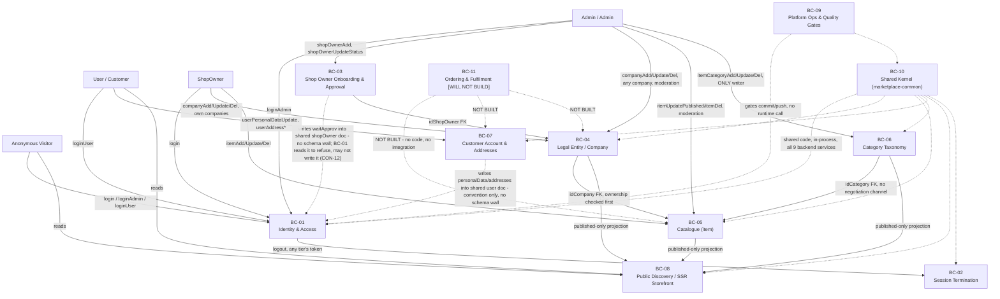

# Bounded Context Map
# Marketplace

**Status:** baselined - brownfield retrofit
**Version:** 1.19
**Date:** 2026-08-30
**Author:** bounded-context-agent
**Changelog:** v1.0 - initial retrofit; reverse-engineered from the 15-repo working tree. No prior DEVPROTOCOL documents existed.
v1.19 - 2026-08-30: **BC-10's boundary is a published release, and the local sync script is deleted.** The
platform owner ruled that an edit to `marketplace-common` reaches a consumer by being published and by
nothing else ([`phase3/adr/ADR-047-a-common-change-ships-as-a-published-release.md`](../phase3/adr/ADR-047-a-common-change-ships-as-a-published-release.md)),
which inverts the half of v1.12 and v1.13 that treated a `yarn install` as something that *undoes* work:
with nothing deployed by hand, an install restores the state the lockfile names and can destroy nothing.
BC-10's **Produces** line, the §5 ownership row that pointed at the script and the §6 anti-corruption row
are restated on the release; versions move to `3.0.0` / `^3.0.0`. The three earlier entries stand as the
record of what was true when they were written. No context, boundary, aggregate or relationship changed.
v1.18 - 2026-08-27, later the same day: three `marketplace-common` version strings move to `2.0.0` / `^2.0.0`
after that release; the dated `1.0.1` publication of 2026-08-26 is kept where it is the record rather than the
live state. No boundary, no context map edge and no ownership changed.
v1.17 - 2026-08-27, later the same day: the epic file that recorded BC-11's gap is deleted and its record is
absorbed into ADR-038's own closing note. Every citation of that file
in this document is repointed rather than left dangling: v1.15 and v1.5's changelog entries keep what they
recorded but mark the file gone, v1.7's entry is annotated with the later closure it could not have known about
at the time, BC-11's `Consumes` line and its relationship row (§4) gain the same warning stated harder — none of
the three records BC-11 would have consumed was ever waiting on anything, and reading one as half a commerce
model is the specific mistake this record exists to prevent — and §7 questions 4 and 5 are repointed to ADR-038
and to each other rather than to a file that no longer resolves. Question 4 also gains the *who*/*what shape*
distinction and the concern-vs-context fork that only that file had recorded; both were already moot. No context,
boundary, relationship or other question moved.
v1.16 - 2026-08-27, later the same day: §7 question 6 was `Open` here and **closed on 2026-08-14** in `EVENT_STORMING.md` §6 question 6 — one question, two documents, two different statuses. This copy now carries the closure that was already on record: an Admin-created company gets the id of a live `shopOwner` or is not created, because `funCompanyAdd` resolves `idShopOwner` against `ShopOwner.exists(...)` and 404s otherwise. Nothing was decided to write this entry, and the citation moved to `funCompanyAdd.mts:39-41` because the guard moved down the file, not because it changed. Question 4's closure cited `EVENT_STORMING.md` "§5 open question 4" and now cites §6, where that row has always been. A closing note under the table records that all eight rows are now closed, and that an empty "Open questions" section means nothing is unresolved *on this map* rather than nowhere. No context, boundary, relationship or other question moved.
v1.15 - 2026-08-27: **BC-11 is `WILL NOT BUILD`, not `PLANNED`.** The platform owner decided that cart, order, delivery and payment are permanently out of scope — `phase3/adr/ADR-038-commerce-is-permanently-out-of-scope.md`, taken when asked what to do with the gap the recording epic had flagged — a file that does not exist any more: it was deleted 2026-08-27, its own record absorbed into ADR-038's closing note. §7 question 4 closes with it, as moot rather than answered: it asked who signs off the first commerce schema, and no first schema is coming. **Every factual claim about BC-11 in this document was already true and stays true** — it owns nothing, produces nothing, no collection, no resolver, no price — so nothing was corrected here; what changed is the word that framed all of it as pending. BC-11 keeps its section, its node on the map and its two relationship rows on purpose: the four have to stay recognisable enough to be refused, and a context deleted from a map reads as an oversight rather than a decision. No other context, aggregate or relationship moved.
v1.14 - 2026-08-25: BC-06's responsibility line said "Admin-only writes; every other tier reads only". The three mutations are still Admin-only, but `holdItemCategory` on the ShopOwner tier writes `__v` on a category inside every item write, on purpose, to close a write-skew window against `itemCategoryDel`. The line now says which of the two claims holds and BC-05 is named as the other half. The depth-cap example was stale by two versions and is replaced with the transaction the guard actually runs in. ⚠️ **Renumbered 2026-08-27.** This entry was written as `v1.8`, which the 2026-08-14 entry further down already held — two different edits under one number, and a citation of "BOUNDED_CONTEXT v1.8" could not be resolved. It takes the next free number instead, which puts it out of date order at the top of this list and in the right place in the version order. Nothing in the entry itself, or in the document, changed with the renumber. No other document cited either number.
v1.13 - 2026-08-27, later the same day: BC-10's boundary row said a `yarn install` *silently restores the last released
build over a deployed one* with no condition attached, and its mitigation cell did not say that no install invokes the
script. Both corrected. The boundary is unchanged - so is every context, aggregate and relationship.
v1.12 - 2026-08-27, later the same day: BC-10's **Produces** line said the package *"is not published to any
registry"* and that `deploy-local.sh` is *"the only thing that makes an edit visible"*. `ADR-037` published it at
`1.0.1` on 2026-08-26 and `2.0.0` on 2026-08-27, consumers on `^2.0.0`; the script now bridges
*edited → released*, and a plain `yarn install`
undoes it. v1.11's anti-corruption row stands. No context, boundary or relationship changed.
v1.11 - 2026-08-27: BC-10's anti-corruption row justified the `deploy-local.sh` boundary on the package being *on no registry at all*. `ADR-037` published it on 2026-08-26, so the row is restated on the premise that survives: the registry carries releases, the script carries edits, and a `yarn install` undoes the script. The boundary itself is unchanged - so is every context, aggregate and relationship.
v1.10 - 2026-08-25: BC-07's "no lever exists after registration either" was true for one day. E19 built `userUpdateStatus`, `usersActiveTbl` and the `/customers` screen the same day the gap was written down, so the paragraph names the writer and the table instead of the hand-made MongoDB write. The approval-gate half of the paragraph is unchanged and still permanent.
v1.9 - 2026-08-25: BC-07 gains the answer to the question E07 §6 said it did not carry — a customer tier with no approval gate is the permanent design, not a starting point, and `user.disabled` is read by every gate and written by nothing.
v1.1 - 2026-08-11: the Mutability line drops team sign-off (single developer) and states the route for
*adding* a context, which it never described — the gap that left a proposed BC-12 with nowhere to go. That
BC-12 is **withdrawn** and is not coming: it was proposed only to give E16 and E17 a context to own under an
epic-to-context rule that `phase5/CONSTRAINTS.md` §5 has since removed. The eleven contexts themselves are
unchanged.
v1.2 - 2026-08-12: §7 open question 7 closed — no anti-corruption layer across `shopOwner` or `user`, now
or later; both pairs share one `$jsonSchema` builder, which is a Shared Kernel rather than two models
needing a translator. The §6 rows stop saying "gap, not a protection": the `shopOwner` one is enforced by
E01-S10 / CON-12, the `user` one has nothing to enforce yet and says why. Question 8 opened in the same
pass: `waitApprov` gates nothing, and §1, BC-01, BC-03 and §4 each said otherwise.
v1.3 - 2026-08-12: question 8 closed the way every other document had assumed — the gate is real now.
`checkShopOwnerApproval` (marketplace-common) refuses a parked shop owner at login (BC-01, 4028) and
again on every refresh (BC-01, 4029), so BC-01 **does** read `waitApprov` and the §6 wall had to give it
room: CON-12 keeps the four-shape ban on `notes`, and on `waitApprov` bans the object-literal *write*
only, inside `src/**` of the two authorization repos. The reset-password flow still ignores the flag on
purpose, and for a stated reason (state oracle). Question 3 is unchanged and now load-bearing.
v1.4 - 2026-08-12: questions 1 and 3 both closed by E03-S08, which built the public seller registration.
BC-03 gains a second creation route and a second service: `shopOwnerRegister` on the public one (4027)
writes a `shopOwner` with `waitApprov: true`, while `shopOwnerAdd` on the Admin service keeps writing
nothing there. The context's "Responsibility" line stops saying no self-service exists, and the first of
its two hotspots is gone. BC-01 gains a second gate on the same path — `checkShopOwnerEmailVerified`
immediately before `checkShopOwnerApproval` in `tryLoginShopOwner` — because a self-registration arrives
with both flags up and only one of them is the applicant's to clear.
v1.5 - 2026-08-13: BC-11's `item.js` quotation is now the sentence that file actually holds
(`item.js:11-13`). The paraphrase that stood there — "a guess at a design decision nobody has made" — was
close in meaning and absent in fact, found by E11-S01 checking its own criterion that BC-11 and the epic
record it kept agreed on the same four named concepts. Nothing else in BC-11 moved: it owns nothing, produces nothing and is still the one context this
platform may not design without being asked.
v1.6 - 2026-08-13: BC-03's last hotspot and §7 question 2 close (E03-S04), and both closed on a **factual
correction** as much as on a decision — this document asserted twice that no mutation anywhere writes the
two onboarding fields, and `shopOwnerUpdatePreferences` has written both since before any of these
documents existed. The claim E03-S04 makes, and the only one that is true, keeps the word this file
dropped: no **other** mutation does. The decision is that this stays so until a shop-owner onboarding flow
is designed.
v1.7 - 2026-08-14: §7 question 5 closes and BC-05's hotspot line with it — the platform owner accepted the
`item.published` race as last-writer-wins, taken with the same decision for `company`. No lock field, no
version field. Both places now add what the finding never said: the two writers are asymmetric, the owner's
being a whole-card `$set` that carries `published`, so an ordinary save undoes an admin's takedown
without touching the flag. A related question — whether an order may reference a live flag rather than a
snapshot of it, which was BC-11 design work, not this race — stayed open on purpose at the time, until it
closed too, as **moot**, on 2026-08-27 ([`ADR-038`](../phase3/adr/ADR-038-commerce-is-permanently-out-of-scope.md));
§7 q5 below carries the closure now.
v1.8 - 2026-08-14, later the same day: **the asymmetry v1.7 had just written down is gone, by decision.**
`published` left `GraphQLInputItem` and both `GraphQLInputCompany`s, and publishing became its own
mutation on both tiers — `itemUpdatePublished` and `companyUpdatePublished`, one writer of each flag per
tier. The race v1.7 accepted survives and is still last-writer-wins; what does not survive is a save of a
description undoing a takedown, which was never a decision anyone took.
**Depends on:** PDR.md ✅ [`docs/devprotocol/phase1/PDR.md`](../phase1/PDR.md) · EVENT_STORMING.md ✅ [`docs/devprotocol/phase2/EVENT_STORMING.md`](./EVENT_STORMING.md) · UBIQUITOUS_LANGUAGE.md ✅ [`docs/devprotocol/phase2/UBIQUITOUS_LANGUAGE.md`](./UBIQUITOUS_LANGUAGE.md)
**Mutability:** the platform owner decides and writes the reason down before the edit — **one developer, so no
vote and no second approver exists.** Splitting or merging contexts is a major refactor. Carving a new context
out of an existing one is a **split**, not an addition, and takes that same route. A genuine **addition** is the
rarer case where no existing context's "Owns" list gets shorter — responsibility nothing owned before. It
carries the full §2 entry, the §3 diagram node and the §4 integration rows in one change, and states why it is
not an extension of an existing context. No epic needs a context to exist (`phase5/CONSTRAINTS.md` §5), so "an
epic needs somewhere to live" is never that reason.

---

## 1. Purpose

Draws boundaries between sub-domains of Marketplace, a 16-repo polyrepo (`CLAUDE.md`). Each bounded context owns its own data and language; no context reaches into another's internals except through the integration patterns named in §4. Terms used below are canonical per `UBIQUITOUS_LANGUAGE.md` - no synonym, no re-translation.

Boundary enforcement note, load-bearing for every entry below: on this platform "tier" (`Admin` / `ShopOwner` / `User`) is a collection plus a dedicated service pair, never a role flag (`UBIQUITOUS_LANGUAGE.md` §3-4, `CLAUDE.md` §Terminology - "There is no `role` field and no permission enum anywhere"). That makes the three identity contexts enforced **by construction**: separate MongoDB collections (`admin`/`shopOwner`/`user`), separate git repos, separate ports, a `tier` value stamped into the Redis session and asserted on every call (`assertTier`, `BEs/marketplace-common/src/others/assertTier.mts:21-23`). Not every boundary below gets that guarantee. Two do not, and are flagged where they occur: the split between Identity & Access and Shop Owner Onboarding & Approval (both write different sub-documents of the same `shopOwner` collection, from two different services, with no schema-level partition) and the split between Identity & Access and Customer Account & Addresses (same story, one `user` collection, one resource service, two conceptual owners of different sub-documents). Those are conventions this document records, not walls MongoDB enforces — with one part now built: **which fields BC-01 may name at all** on `shopOwner` is checked by lint in all three ShopOwner-tier repos (E01-S10 / CON-12, §6). The shape stays shared on purpose; only the scope is walled.

---

## 2. Bounded contexts

### BC-01 - Identity & Access
**Responsibility:** Authenticates a caller against exactly one of three collections and mints/rotates/validates the opaque token pair that proves it for the rest of a session. One instance of this responsibility per tier - never a single service branching on a role.
**Owns:** `admin`, `shopOwner`, `user` collections' `login`/`resetPwd`/`emailVerify` sub-documents (shared shape `LOGIN`/`RESET_PWD`/`EMAIL_VERIFY`, `BEs/marketplace-db-setup/lib/schemas/account.js`); the Redis session hash keyed `${REDIS_KEY}${token}`; the `TIER` constant and `assertTier` guard (`BEs/marketplace-common/src/others/Tier.mts:12-18`, `BEs/marketplace-common/src/others/assertTier.mts:21-23`); the three `*-authenticated-authorization` services (`BEs/dev/marketplace-dev-authenticated-authorization`, `BEs/dev/marketplace-dev-admin-authenticated-authorization`, `BEs/dev/marketplace-dev-user-authenticated-authorization`) plus `marketplace-dev-public-authorization` for first login (`login`/`loginAdmin`/`loginUser`).
**Produces:** Customer Logged In / Shop Owner Logged In / Admin Logged In, Login Refused (per-tier reason, generic error shape outward), Access Token Rotated, Refresh Refused - Foreign Tier, Verification Email Sent, Email Verified (`UBIQUITOUS_LANGUAGE.md` §15).
**Consumes:** bcrypt-hashed credentials from each collection (`SALT_ROUNDS=14`), the Keygrip-signed refresh cookie, `x-introspectioncode` for service-to-service bypass (`resolveAuthorizationSession`, `BEs/marketplace-common/src/others/resolveAuthorizationSession.mts`).
**Does not own:** logout (BC-02, separate context on purpose), `waitApprov`/onboarding gate content (BC-03 writes it; this context **reads** `waitApprov` and refuses on it, and may not write it — see §7 q8, closed), `personalData`/`addresses` (BC-07).

---

### BC-02 - Session Termination
**Responsibility:** Deletes a session's Redis keys given only the token content - the single logout mutation serving all three tiers, because deletion needs no knowledge of which collection minted the token.
**Owns:** `BEs/dev/marketplace-dev-authenticated-logout` (the whole repo, one service, `logout` mutation, `BEs/dev/marketplace-dev-authenticated-logout/src/graphQLApi/schema/mutations/logout.mts`), `authorizationLogoutHandler.mts` (`BEs/dev/marketplace-dev-authenticated-logout/src/lib/authorizationLogoutHandler.mts:60,74` - deletes by `REDIS_KEY + token`, two `del` calls because Redis is a cluster and a multi-key `del` would throw `CROSSSLOT`).
**Produces:** Session Destroyed.
**Consumes:** the bearer token itself (no session lookup, no tier check - it does not need one). All three frontends point at port 4030.
**Does not own:** session creation, session content, tier assertion - those stay in BC-01. This is why it is its own bounded context rather than a method inside BC-01: its correctness depends on knowing *nothing* about tier, and merging it into BC-01 would be the one change most likely to accidentally reintroduce a tier check that breaks the shared-service property.

**Why this is a context, not a shortcut** - a single `REDIS_KEY=marketplaceDev:` prefix is shared across all 9 services on purpose (`UBIQUITOUS_LANGUAGE.md` §4 REDIS_KEY), and a per-tier prefix was evaluated and rejected specifically because it would break this service:
```ts
// BEs/dev/marketplace-dev-authenticated-logout/src/lib/authorizationLogoutHandler.mts:60,74
// deletes by token content alone - never asks which collection minted it
```

---

### BC-03 - Shop Owner Onboarding & Approval
**Responsibility:** Provisions a `ShopOwner` account — Admin-initiated through `shopOwnerAdd`, or since E03-S08 self-service through `shopOwnerRegister` on the **public** service (4027), which is the one place this context lives outside `marketplace-dev-admin-authenticated-resource` — and decides whether it may be used. ⚠️ **The two routes differ in one field and it is this context's own:** the public one writes `waitApprov: true`, the Admin one writes nothing, because an admin typing the account in has approved it by doing so. ⚠️ **Records *and* gates, since q8 was closed:** `waitApprov` is written here and read by BC-01 at both gates — `tryLoginShopOwner` projects it and `checkShopOwnerApproval` refuses the login (4028), and `refresh` runs the same check on every rotation (4029), so parking a shop owner ends the session already in their hands within one access-token lifetime rather than one refresh-token lifetime. The reset-password flow still ignores it, deliberately and with the reason written down at `BEs/dev/marketplace-dev-public-resource/src/lib/access/resetPwdFlow.mts`: refusing there would answer "is this account parked?" to anyone who can type an address into the form, and the account is already unusable.
**Owns:** `shopOwner.waitApprov` (write side only — the read belongs to BC-01, and CON-12 enforces exactly that split), `shopOwner.notes` (admin-only, and since E01-S10 not merely unloaded by the ShopOwner tier but unloadable - `no-restricted-syntax` refuses all four shapes of the name in all three of its repos, CON-12), `shopOwnerAdd` / `shopOwnerUpdateStatus` / `shopOwnerUpdateNote` / `shopOwnerUpdatePreferences` mutations, all four living in `BEs/dev/marketplace-dev-admin-authenticated-resource/src/graphQLApi/schema/mutations/`, plus `shopOwnerRegister` in `BEs/dev/marketplace-dev-public-resource/src/graphQLPublic/schema/mutations/` — the account-creation half of this context, sitting on an unauthenticated service because the person creating the account has no session yet.
**Produces:** Shop Owner Account Created, Duplicate Login Email Rejected, Shop Owner Approval Granted, Shop Owner Approval Withheld, Shop Owner Disabled, Shop Owner Note Recorded.
**Consumes:** nothing from another context to act - `shopOwnerUpdateStatus` writes `disabled` and `waitApprov` together as a full-state save, never a partial patch:
```ts
// BEs/dev/marketplace-dev-admin-authenticated-resource/.../shopOwnerUpdateStatus.mts:6-10,29-30
interface IArgs { _id: Types.ObjectId; disabled: boolean; waitApprov: boolean }
args: { disabled: { type: new GraphQLNonNull(GraphQLBoolean) },
         waitApprov: { type: new GraphQLNonNull(GraphQLBoolean) } }
```
**Does not own:** the login attempt itself (BC-01 reads `waitApprov` to refuse a login, this context only writes it). ⚠️ **Both hotspots are now closed, and the second one closed on a correction as well as a decision** (2026-08-13, E03-S04). This sentence used to say that no mutation under any `mutations/` directory on the platform writes `onboardingStep`/`onboardingDone`, which was never true: `shopOwnerUpdatePreferences` on the Admin service writes both, and E03-S04's own acceptance criterion says so with the word this line dropped — no **other** mutation does. What is true is that nothing advances either field as a side effect of the shop owner's own progress, and that is now a decision rather than an omission: the admin's hand is the writer until a shop-owner onboarding flow is designed, which is deferred work (`EVENT_STORMING.md` §5 hotspot 2, `phase5/RISK_REGISTER.md` R53). E03-S08 is what makes the deferral worth naming, since a self-registered account has *only* a login until onboarding fills the rest in. The first hotspot closed earlier: a `ShopOwner` starts gated when they registered themselves and ungated when an admin created them (§7 q3).

**Boundary is convention on the shape, construction on the scope:** this context and BC-01 both touch the `shopOwner` collection, from two different repos (`marketplace-dev-admin-authenticated-resource` writes, `marketplace-dev-authenticated-authorization` reads), with no schema partition separating "onboarding fields" from "login fields" - the shared `$jsonSchema` builder in `BEs/marketplace-db-setup/lib/schemas/shopOwner.js` is what keeps both sides honest about the shape, and that is deliberate: one builder is a Shared Kernel, which is exactly why an anti-corruption layer between the two would translate a shape into itself (§7 q7, closed). What *is* enforced is which fields BC-01 may name at all - E01-S10 / CON-12.

---

### BC-04 - Legal Entity / Company
**Responsibility:** Owns the `company` aggregate - simultaneously the legal entity (`legalName`, `vatNumber`, `certifiedEmail`, `registryExtract`) a `ShopOwner` registers and the shop itself, since no separate shop collection exists or will (`CLAUDE.md` §Terminology).
**Owns:** `company` collection (`BEs/marketplace-db-setup/lib/schemas/company.js`), its Mongoose model in `BEs/marketplace-common` (shared by both writer services so the shape cannot drift between them), `companyAdd`/`companyUpdate`/`companyUpdatePublished`/`companyDel` in two resource services - `BEs/dev/marketplace-dev-authenticated-resource/src/graphQLApi/schema/mutations/companyAdd.mts` (ShopOwner tier, own companies only, answers `OnlyIdType`) and `BEs/dev/marketplace-dev-admin-authenticated-resource/src/graphQLApi/schema/mutations/companyAdd.mts` (Admin tier, any company, answers plain `Boolean`).
**Produces:** Company Registered, Company Updated, Company Made Public (`companyUpdatePublished` flips `published` true — its own operation on both tiers since 2026-08-14, never a side effect of `companyUpdate`, and refused by the collection's `$expr` unless `publicName` and `slug` are already stored), Company Taken Down (the same mutation, false), Company Retired (soft delete), Delete Refused - Already Retired (ShopOwner tier, 403), Delete Accepted On Already-Retired Company (Admin tier, 200).
**Consumes:** `idShopOwner` FK from BC-01's `shopOwner` collection (unenforced, checked at read/ownership time by `throwIfShopOwnerDontOwnCompany`).
**Does not own:** `item` documents (BC-05), the public read projection (BC-08 reads through a fixed pipeline, never writes here).

Two writers by design, not overlap - and they diverge on delete semantics for an already-retired company, which is the platform's canonical example of "liveness belongs on read/ownership guards, never on the delete write itself" (`docs/data-model.md`):
```js
// BEs/marketplace-db-setup/lib/schemas/company.js
const PUBLISHED_IMPLIES_LINKABLE = {
  $expr: { $or: [
    { $ne: ['$published', true] },
    { $and: [ { $eq: [{ $type: '$slug' }, 'string'] }, { $eq: [{ $type: '$publicName' }, 'string'] } ] }
  ] }
};
```

---

### BC-05 - Catalogue
**Responsibility:** Owns `item`, the single generic catalogue entry. Domain-neutral by design — presumes nothing about what is sold. One thing a `Company` sells; deliberately carries no price.
**Owns:** `item` collection (`BEs/marketplace-db-setup/lib/schemas/item.js`), `itemAdd`/`itemUpdate`/`itemUpdatePublished`/`itemDel` (ShopOwner tier, own company only, `BEs/dev/marketplace-dev-authenticated-resource/src/graphQLApi/schema/mutations/itemAdd.mts`), `itemUpdatePublished`/`itemDel` (Admin tier moderation, `BEs/dev/marketplace-dev-admin-authenticated-resource/src/graphQLApi/schema/mutations/itemUpdatePublished.mts`).
**Produces:** Item Added, Add Refused - Company Not Owned, Add Refused - Category Missing, Item Updated, Item Published/Unpublished, Item Deleted, Item Published/Unpublished By Admin, Item Deleted By Admin.
**Consumes:** `idCompany` FK from BC-04 (ownership checked first), `idCategory` FK from BC-06 (existence checked second, deliberately after ownership):
```ts
// BEs/dev/marketplace-dev-authenticated-resource/src/graphQLApi/schema/mutations/itemAdd.mts:39-46
async resolve(_: unknown, args: IArgs, ctx: IContextShopOwnerAuthenticatedResource) {
  await throwIfShopOwnerDontOwnCompany(ctx.state.user._id, args.item.idCompany)
  await throwIfItemCategoryMissing(args.item.idCategory)
  const newItem: IItemSchema = { _id: new Types.ObjectId(), ...args.item }
```
**Does not own:** price, cart membership, order lines - none exist and none will (BC-11, `WILL NOT BUILD` - ADR-038). `idCategory` shape or depth cap (BC-06).

Two independent writers of `item.published` (each tier's own `itemUpdatePublished`) with no version/lock field in the schema - ⚠️ **examined and accepted 2026-08-14: last writer wins, and an owner republishing after an admin's unpublish is a normal outcome** (`EVENT_STORMING.md` §5 hotspot 4 and §6 q5, both closed; `phase5/RISK_REGISTER.md` §5). ⚠️ **The asymmetry this line carried for half a day is gone**: the owner's writer was `itemUpdate`, which `$set`s the whole card and carried the flag inside `GraphQLInputItem`, so an ordinary save undid a takedown without touching it. Publishing was split out the same day — `published` left the input, `itemAdd` stamps `false`, and both tiers now write the flag through a mutation whose entire subject is publication. What races is two deliberate acts, not a save and an act. `itemDel` is still the takedown no republish reverses, `deleted` being outside every input.

---

### BC-06 - Category Taxonomy
**Responsibility:** Curates the two-level `itemCategory` tree every `item` files under. Every mutation on it is Admin-tier; every other tier reads it. ⚠️ **One deliberate exception, one field:** BC-05's `itemAdd`/`itemUpdate` `$inc` a category's `__v` (`holdItemCategory`) inside their own transaction, so an item write and a concurrent `itemCategoryDel` collide on one document instead of skewing past each other. No domain field of this context is reachable from there.
**Owns:** `itemCategory` collection (`BEs/marketplace-db-setup/lib/schemas/itemCategory.js`), `itemCategoryAdd`/`Update`/`Del`, all three ONLY in `BEs/dev/marketplace-dev-admin-authenticated-resource/src/lib/itemCategory/funItemCategoryAdd.mts` and siblings - no such file exists under `marketplace-dev-authenticated-resource` or `marketplace-dev-public-resource`.
**Produces:** Item Category Created, Deep-Nesting Rejected, Duplicate Slug Rejected, Item Category Updated, Item Category Deleted.
**Consumes:** nothing from another context - `idParent` is a self-FK, depth-capped in the resolver because a `$jsonSchema` cannot read a sibling document:
```ts
// BEs/dev/marketplace-dev-admin-authenticated-resource/src/lib/itemCategory/funItemCategoryAdd.mts:38-55
export async function funItemCategoryAdd(data: IItemCategoryValidated) {
	const _id = new Types.ObjectId()
	const session = await mongoose.startSession()
	try {
		await session.withTransaction(async () => {
			// reads the parent WITH a write ($inc __v) — see throwIfParentNotTopLevel
			if (data.idParent !== undefined) await throwIfParentNotTopLevel(data.idParent, session)
			await ItemCategory.create([{ _id, ...data }], { session })
		})
	} catch (e) {
		if (duplicateKey(e)) throwAlreadyTakenError('slug already used by another category')
		throw e
	} finally { await session.endSession() }
}
```
**Does not own:** `item` documents themselves (BC-05) - deleting a category leaves items filed under it resolvable, on purpose.

---

### BC-07 - Customer Account & Addresses
**Responsibility:** Owns the parts of a `User`'s own record beyond login - optional `personalData` filled in after email confirm, an array of `addresses`, and at most one `defaultAddress` pointer.
**Owns:** `user.personalData`, `user.addresses[]`, `user.defaultAddress` (`BEs/marketplace-db-setup/lib/schemas/user.js`), `userPersonalDataUpdate`/`userAddressAdd`/`userAddressUpdate`/`userDefaultAddressSet`/`userAddressDel`/`userUpdatePwd`, all in `BEs/dev/marketplace-dev-user-authenticated-resource`.
**Produces:** Personal Data Filled In, Address Added/Updated/Deleted, Default Address Set, Set Refused - Address Not Owned, Default Address Pointer Cleared, Password Changed.
**Consumes:** the authenticated `User` identity from BC-01 (`ctx.state.user._id`) - no external data.
**Does not own:** login/session content (BC-01), addresses' relationship to an order (BC-11, `WILL NOT BUILD` - ADR-038: no such relationship exists and none is coming, so `addresses` is a customer-facing record only).

The "at most one default" invariant is a shape, not a checked rule - a single root pointer instead of a per-element boolean makes a second default inexpressible, enforced by the collection's own `$expr`:
```js
// BEs/marketplace-db-setup/lib/schemas/user.js
const DEFAULT_ADDRESS_POINTS_INTO_ADDRESSES = {
  $expr: { $or: [
    { $eq: [{ $type: '$defaultAddress' }, 'missing'] },
    { $in: ['$defaultAddress', { $map: { input: { $ifNull: ['$addresses', []] }, in: '$$this._id' } }] }
  ] }
};
```
Deleting the default address must `$unset` the pointer in the same aggregation-pipeline update, or the database itself rejects the write (`funUserAddressDel.mts`, `BEs/dev/marketplace-dev-user-authenticated-resource/src/lib/user/funUserAddressDel.mts:50-62`).

**Boundary is convention, not construction:** same story as BC-03/BC-01 - `personalData`/`addresses` and `login`/`resetPwd`/`emailVerify` live on the same `user` document, served by the same resource service, with no MongoDB-level wall between them. Nothing stops a future resolver in this context from reaching into the login sub-document; only code review does.

⚠️ **This tier has no approval gate and permanently will not** (platform owner, 2026-08-25 — `phase5/CUSTOMER_ACCOUNT_ADDRESSES.md` §6, `phase3/adr/ADR-INDEX.md` §4). There is no `waitApprov` on `user` and no equivalent is coming: `emailVerify.valid` is the whole distance between `userRegister` and a session. BC-03's flag exists because approving a shop owner publishes a shop on this platform's domain; nothing equivalent happens when a customer registers. ⚠️ **The lever after registration was missing until 2026-08-25 and now exists** - `user.disabled` is in the validator and every gate reads it (`tryLoginUser`, `tokenInfoUser`, `funUserUpdatePwd`), and `userUpdateStatus` on the Admin resource service (`marketplace-dev-admin-authenticated-resource`) is what writes it, ending every session that customer holds in the same call when the flag goes on. Suspending a customer is no longer a direct MongoDB write. The admin reaches it from `usersActiveTbl` and the `/customers` screen in `marketplace-admin`, which sort and filter on `registeredAt` and the status flags only - no encrypted field became queryable (ADR-029).

---

### BC-08 - Public Discovery / SSR Storefront
**Responsibility:** Serves anonymous and customer traffic a read-only, published-only projection of `company`/`item`/`itemCategory` - the only surface with no domain event, because nothing here mutates state.
**Owns:** `BEs/dev/marketplace-dev-public-resource` read queries (`companies`, `companiesNearby`, `companyBySlug`, `items`, `itemBySlug`, `itemCategories`, `search`, `sitemapEntries`), the `livePublic`/`LIVE_PUBLIC_PIPELINE` filter stage (`BEs/dev/marketplace-dev-public-resource/src/lib/catalogue/publicRead.mts`), the SSR half of `marketplace-user` (every route except `/account/*`), the 2dsphere geo index `company.address.position_2dsphere`.
**Produces:** no domain events - read models only (`UBIQUITOUS_LANGUAGE.md` §17), including `sitemapEntries` for SSR sitemap generation.
**Consumes:** the published projection of BC-04's `company` and BC-05's `item`/BC-06's `itemCategory`, filtered through one shared pipeline stage rather than repeated per query.
**Does not own:** customer registration (`userRegister` lives here as a mutation but the account it creates is BC-01/BC-07's, not this context's), any write to `company`/`item`/`itemCategory`.

`companiesNearby` runs exactly one of two disjoint code paths depending on the argument sent, never both:
```ts
// BEs/dev/marketplace-dev-public-resource/src/graphQLPublic/schema/queries/companiesNearby.mts:1-4,44-48
// $geoNear (reports distance, sorts by it) vs centerSphereFilter (no distance, sorts by relevance),
// used by `search`. Both read address.position_2dsphere.
```
SSR half of `marketplace-user` is the one deliberate loopback-only bind on the platform (`serve.mjs`) - reaching it directly bypasses nginx rate limits and the `proxy_cache` bypass-on-session-cookie rule that keeps this context anonymous-safe.

---

### BC-09 - Platform Operations & Quality Gates
**Responsibility:** Keeps every other context honest at commit/push time - coverage, mutation score, lint, Qodana, and the migration pipeline that changes the shape every context above builds on.
**Owns:** `BEs/marketplace-db-setup/migrations/` (immutable once applied) and `lib/schemas/*.js` (the actual builders, restated by every migration that touches a collection), `.githooks/pre-commit` + `.githooks/pre-push` in the 15 gated repos, each repo's `qodana.yaml`/`qodana.sh`/`stryker.config.mjs`, `marketplace-services-status` (`marketplace-services-status/src/server.ts`, `marketplace-services-status/src/systemd.ts`, `marketplace-services-status/src/monitor.ts` - the odd one out: tracked by the parent repo, no repo of its own, gated from the parent's own hooks rather than its own).
**Produces:** pass/fail gate signals (coverage, mutation, lint, Qodana), migration `up`/`down` pairs, service-liveness probes.
**Consumes:** nothing from the domain contexts above except their source trees to scan and their test suites to run.
**Does not own:** any domain collection's runtime data - it owns the *shape* (via migrations) and the *proof of correctness* (via gates), never a live document.

`marketplace-services-status` had a gate that was never wired - the mode bug that made it silent is the platform's canonical cautionary tale for this context:
```
qodana.sh committed at mode 100644 (should be 100755) -> died with "Permission denied" before
reaching Qodana -> exited non-zero with no results directory -> both hooks reported
"Qodana failed" pointing at a SARIF that was never created. A chmod, rendered as a finding.
```
(`docs/frontends.md` §marketplace-user, ⚠️ "`marketplace-services-status/qodana.sh` must stay mode `100755`").

---

### BC-10 - Shared Kernel (marketplace-common)
**Responsibility:** Supplies the code every other backend context compiles against directly rather than calling over the network - session resolution, tier assertion, the disabled/deleted guard, the Mongoose models themselves.
**Owns:** `BEs/marketplace-common/src/others/Tier.mts`, `assertTier.mts`, `resolveAuthorizationSession.mts`, `findAccountForSession.mts`, `refreshSessionTokens.mts`, `checkUserAuthorizationDisDel`, the `Company`/`Item`/`ItemCategory`/`ShopOwner`/`User`/`Admin` Mongoose models, ~139 `exports` map entries in `package.json` (no barrel export - an unlisted file is unreachable, `yarn test:contract` catches omissions).
**Produces:** the compiled `@axiumine/marketplace-common` package, published to `registry.npmjs.org` at `3.0.0` with every consumer on `^3.0.0` (`ADR-037`), and reaching a consumer by that publication and by no other route (`ADR-047`, 2026-08-30) - each consumer resolves the version its own `yarn.lock` names, so a release lands in a repo when that lockfile moves and not before.
**Consumes:** nothing from the other contexts - by definition a shared kernel is upstream of all of them.
**Does not own:** any resolver, any GraphQL schema slice, any route.

⚠️ Since `marketplace-common@1.0.0` this context has a Koa/GraphQL-shaped surface, not just data models - `resolveAuthorizationSession`, `findAccountForSession`, `refreshSessionTokens` are the shared body BC-01's three authorization services now call into (`docs/decisions/authorization-service-consolidation.md`). Consumed by 3 of the 9 backend services, but **installed in all 9**, since all nine declare the package - an edit here is wider than it looks, and `vitest.mutation.config.mts` in the consumers must inline both `@axiumine/marketplace-common` and `@axiumine/koa-utils` or a `vi.mock` of a koa-utils subpath silently stops intercepting.

---

### BC-11 - Ordering & Fulfilment [WILL NOT BUILD]
⚠️ **Permanently out of scope as of 2026-08-27** — the platform owner's decision, [`ADR-038`](../phase3/adr/ADR-038-commerce-is-permanently-out-of-scope.md). This context is kept on the map so the four concepts stay recognisable enough to be **refused**; its presence is not a plan and never becomes one. Re-opening needs an ADR superseding ADR-038, not a story. It read `[PLANNED - NOT BUILT]` until that date, and every factual line below was true then and is true now — only the framing changed.
**Responsibility:** Would have owned cart, order, delivery and payment - the commerce flow a customer would need to actually buy an `item`. This platform does not sell, so nobody owns it. Named here so the vocabulary is refused consistently, not so it is built consistently.
**Owns:** nothing. No collection, no migration, no model, no resolver, no schema builder exists anywhere in the 16 repos (`EVENT_STORMING.md` §2.9, verified: no `mutations/` directory in any of the 9 services under `BEs/dev/` contains a file matching `cart`/`order`/`payment`/`delivery`).
**Produces:** nothing real. Hypothetical, unimplemented events named for vocabulary readiness: Cart Item Added, Order Placed, Payment Authorised, Delivery Dispatched - none exists in code.
**Consumes:** would need BC-05's `item` (still with no price - `BEs/marketplace-db-setup/lib/schemas/item.js:11-17` states a price "would be a guess at a currency, a precision, a VAT treatment and a discount model all at once" — ⚠️ **quoted exactly since 2026-08-13 (E11-S01)**; the paraphrase that stood here before was not a string in that file. The comment was rewritten on 2026-08-27 for ADR-038 and this sentence was deliberately kept word-for-word and unbroken across its line wrap, so the citation still greps; only its span moved from `:11-13` to `:11-17`), BC-07's `addresses` for delivery, BC-04's `company` for fulfilment ownership. ⚠️ **None of the three is waiting on anything.** `user.addresses` is a customer-facing record in its own right (BC-07), `item` is a complete catalogue entry (BC-05), and `company` is a complete tenant (BC-04) — reading any of them as half a commerce model is the specific mistake this record exists to prevent.
**Does not own:** anything, permanently. **Do not invent any part of this** - what used to be "ask before inventing" (`CLAUDE.md` §Build state) is now answered in advance: the answer is no. Not a schema, not a mutation, not a state machine, not a `price` field on `item`, and not "a first small step" toward any of them (ADR-038 §4 of `phase3/adr/ADR-INDEX.md`).

---

## 3. Context map



Solid arrows carry a real GraphQL command or FK read at runtime. Dashed arrows are compile-time (Shared Kernel), gate-time (Platform Ops), convention-only (Onboarding/Account into Identity), or entirely hypothetical (Ordering & Fulfilment - and permanently so, ADR-038).

---

## 4. Context relationships

| From | To | Relationship | Integration pattern |
|---|---|---|---|
| BC-01 Identity & Access | BC-02 Session Termination | Three tiers all call the one shared logout service | Customer-Supplier (three customers, one supplier) via Published Language - the shared `REDIS_KEY` prefix and token-content addressing is the contract, not a per-tier API |
| BC-03 Shop Owner Onboarding & Approval | BC-01 Identity & Access | BC-03 writes `waitApprov`; **BC-01 reads it and refuses on it** - `tryLoginShopOwner` projects it and `checkShopOwnerApproval` throws Unauthorized (4028), and `refresh` re-runs the same check on every rotation (4029). Approval is enforced in front of the session and again inside it; the write stays BC-03's alone, which is the whole of what CON-12 enforces here | Conformist **by design and permanently** - one `shopOwner` collection built from one `$jsonSchema` builder, so there is no second model to translate to. No schema-level wall on the shape; a lint-level wall on the scope, E01-S10 / CON-12 |
| BC-07 Customer Account & Addresses | BC-01 Identity & Access | Both live on the `user` collection, different sub-documents, same resource service | Conformist, convention only - see §1 boundary note |
| BC-03 Shop Owner Onboarding & Approval | BC-04 Legal Entity / Company | `company.idShopOwner` FK points at an account BC-03 provisioned | Customer-Supplier - Company is downstream, the FK is unenforced |
| BC-04 Legal Entity / Company | BC-05 Catalogue | `item.idCompany` FK, ownership checked before category existence | Customer-Supplier |
| BC-06 Category Taxonomy | BC-05 Catalogue | `item.idCategory` FK; ShopOwner tier has zero write access to taxonomy shape or depth | Conformist - Catalogue has no negotiating channel, must accept whatever Admin curates |
| BC-04, BC-05, BC-06 | BC-08 Public Discovery / SSR Storefront | Read-only, published-only projection through one shared pipeline stage | Open Host Service + Published Language - `livePublic`/`LIVE_PUBLIC_PIPELINE` (`BEs/dev/marketplace-dev-public-resource/src/lib/catalogue/publicRead.mts`) is the stable contract; the public GraphQL schema itself is the published language anonymous clients and the SSR app both consume |
| BC-01, BC-04, BC-05, BC-06, BC-07, BC-08, BC-02 | BC-10 Shared Kernel | Direct compile-time import of Mongoose models, `assertTier`, `checkUserAuthorizationDisDel`, session-resolution functions | Shared Kernel - textbook case, in-process function calls, not a network boundary |
| BC-01 through BC-08, BC-10 | BC-09 Platform Operations & Quality Gates | Coverage/mutation/lint/Qodana gates run against every repo's tree at commit/push time; migrations in `BEs/marketplace-db-setup` define every collection shape the others build on | Separate Ways at runtime (no shared model, no API call) - but a Generic Subdomain every other context depends on at build/deploy time |
| BC-11 Ordering & Fulfilment [WILL NOT BUILD] | BC-05 Catalogue, BC-07 Customer Account & Addresses, BC-04 Legal Entity / Company | Would have needed `item` (priceless permanently - ADR-009 + ADR-038), `addresses` for delivery, `company` for fulfilment ownership. None of the three is consumed and none will be | Separate Ways, permanently - literally no code exists to integrate and none is coming; do not pre-build an ACL for a context that will not exist. ⚠️ None of the three is waiting on anything either — `addresses` is a customer-facing record in its own right, `item` is a complete catalogue entry, `company` is a complete tenant — and reading any of them as half a commerce model is the specific mistake this record exists to prevent |

---

## 5. Shared kernel

Terms and shapes multiple contexts use identically, with zero translation at the boundary - every one defined once in code and imported, never re-typed per context. All defined fully in [`UBIQUITOUS_LANGUAGE.md`](./UBIQUITOUS_LANGUAGE.md).

| Shared term | Defined in | Shared by (contexts) | UL section |
|---|---|---|---|
| `Tier` (`'admin' \| 'shopOwner' \| 'user'`) | `BEs/marketplace-common/src/others/Tier.mts:12-18` | BC-01, BC-02 (implicitly, by NOT using it), BC-10 | §4 |
| `assertTier` | `BEs/marketplace-common/src/others/assertTier.mts:21-23` | Every resource/authorization service except BC-02's logout | §4 |
| `checkUserAuthorizationDisDel` | `BEs/marketplace-common` | BC-01, BC-03, BC-04, BC-05, BC-06, BC-07 | §4 |
| `REDIS_KEY` prefix (`marketplaceDev:`) | shared across all 9 services' env | BC-01, BC-02 | §4 |
| `LOGIN` / `RESET_PWD` / `EMAIL_VERIFY` sub-document shapes | `BEs/marketplace-db-setup/lib/schemas/account.js` | BC-01 (all three collections it authenticates against) | §11 |
| `DELETED` / `DISABLED` soft-delete convention (`deleted`: date, never removed; `disabled`: bool) | `BEs/marketplace-db-setup/lib/schemas/account.js` | BC-01, BC-03, BC-04, BC-05, BC-06, BC-07 - every collection on the platform | §11, §13 |
| shared `address` block | `BEs/marketplace-db-setup/lib/schemas/geo.js` | BC-04 (`company.address`, `position` required), BC-07 (`user.addresses[]`, `position` optional) | §11 |
| GeoJSON `position` builder + `COORDINATE_TUPLE` | `BEs/marketplace-db-setup/lib/schemas/geo.js` | BC-04, BC-07, BC-08 (reads the `2dsphere` index both produce) | §11 |
| `OnlyIdType` return convention on ShopOwner-tier creates | `BEs/dev/marketplace-dev-authenticated-resource/.../companyAdd.mts:1,27` | BC-04, BC-05 (ShopOwner tier only - Admin tier returns plain `Boolean` for the same mutations) | §14 |
| Mongoose models (`Company`, `Item`, `ItemCategory`, `ShopOwner`, `User`, `Admin`) | `BEs/marketplace-common` | BC-01, BC-03, BC-04, BC-05, BC-06, BC-07, BC-08 | §13 (published release, `ADR-047`) |

Two field names deliberately mean **different things** in different contexts and must never be conflated across this shared vocabulary - `position` is GeoJSON coordinates on `company.address`/`user.addresses[]` (BC-04, BC-07) but a plain sort-order integer on `itemCategory` (BC-06); [`UBIQUITOUS_LANGUAGE.md`](./UBIQUITOUS_LANGUAGE.md) §8 and §10 both carry an explicit "Not to be confused with" cross-reference for this reason.

---

## 6. Anti-corruption layers

| Boundary | Risk | Protection |
|---|---|---|
| Foreign-tier access token presented to the wrong resource service | An `Admin` token accepted by the ShopOwner resource service (real historical hole - `authorizationAuthenticatedResourceHandler.mts` set `ctx.state.user` on any non-empty Redis hash before 2026-08-05, and all 9 services share one `REDIS_KEY`) | `assertTier(actual, expected)` throws 403 (never 401), fails closed on a session with no `tier` field - `BEs/marketplace-common/src/others/assertTier.mts:21-23` |
| BC-08 Public Discovery reading BC-04/BC-05/BC-06's live data | An unpublished/draft `company` or `item` leaking to anonymous traffic if a query forgot its own filter | One shared pipeline stage, `livePublic`/`LIVE_PUBLIC_PIPELINE`, applied once rather than re-implemented per query - `BEs/dev/marketplace-dev-public-resource/src/lib/catalogue/publicRead.mts` |
| BC-03 Shop Owner Onboarding writing `shopOwner.waitApprov`/`notes`, BC-01 reading the same collection for login | A ShopOwner-tier resolver widening its projection by one word and handing the subject the admin's own encrypted note about them, or writing the approval gate on their own account | **Closed by E01-S10, and deliberately not with an ACL** - both sides are one model built from one `$jsonSchema` builder, so there is nothing to translate. `ADMIN_ONLY_FIELDS_SHOP_OWNER` (`BEs/marketplace-common/src/others/adminOnlyFields.mts`) names `notes`, and `no-restricted-syntax` selectors in all three ShopOwner-tier repos refuse the property, the type signature, the member read and the projection string of it; `APPROVAL_GATE_FIELD_SHOP_OWNER` names `waitApprov` separately, because closing q8 made BC-01 a legitimate *reader* of it - what stays banned there is the object-literal write, in `src/**` of the two authorization repos, so a ShopOwner-tier service cannot approve its own account. A test in marketplace-common holds every name in both constants to a real path on `ShopOwnerSchema`. See CON-12 |
| BC-07 Customer Account writing `user.personalData`/`addresses`, BC-01 reading `user.login`/`emailVerify` | Same shape of risk on the `user` collection | **Not enforced, and correctly so today**: `user` carries no admin-only field - no `notes`, no `waitApprov`, and the Admin tier has no `user` resolvers at all - so there is nothing for a list to hold. An empty counterpart would read as a boundary being enforced when nothing is. `BEs/marketplace-db-setup/lib/schemas/user.js` is the shared discipline; the first admin-only field to land on `user` brings the E01-S10 pair with it |
| BC-10 Shared Kernel package boundary | An edit to `marketplace-common` is invisible to every consumer until it is **released**: the registry serves what was published, not what was edited, and every consumer compiles against the version its own `yarn.lock` names. ⚠️ **Restated twice.** 2026-08-27: this cell read *"the package is not on any registry (`@axiumine/marketplace-common` 404s on `registry.npmjs.org`)"*; it is published — `1.0.1` that day, `2.0.0` later the same day (`phase3/adr/ADR-037-marketplace-common-is-published-to-npm.md`). 2026-08-30: the rest of the cell described a local sync script and an install that *undid* it; that script is deleted (`phase3/adr/ADR-047-a-common-change-ships-as-a-published-release.md`), so a `yarn install` now restores the state the lockfile names and takes nothing away — there is no build anywhere that a version number does not identify | the nine-step release flow in `BEs/marketplace-common/CLAUDE.md` §Publishing a release (bump → changelog → tag → push → `yarn upload` → move each consumer's range), `yarn test:contract` (verifies the `exports` map against actual files) |
| BC-08's SSR half (`/`, public routes) vs `/account/*` on `marketplace-user` | Rendering authenticated HTML behind a shared `proxy_cache` could serve one customer's data to the next visitor | Two halves of one mechanism: `/account/*` is `ssr: false` (never rendered server-side) and the cache bypasses on the session cookie - weakening either alone is enough to leak |
| BC-11 Ordering & Fulfilment [WILL NOT BUILD] against everything else | None, and none is owed - there is no aggregate to corrupt. This is why `item` has no price field, permanently (ADR-009 + ADR-038) | [`ADR-038`](../phase3/adr/ADR-038-commerce-is-permanently-out-of-scope.md) - the protection is no longer "refuse the boundary until the context is designed" but "the context is not designed, ever"; `CLAUDE.md` §Build state now refuses rather than invites the ask |

---

## 7. Open questions

| # | Question | Owner | Status |
|---|---|---|---|
| 1 | Does self-service shop-owner registration ever get built, or does Admin-provisioning (BC-03) stay permanent? | Product | **Closed 2026-08-12 - built, and the two coexist.** `shopOwnerRegister` on the public service (4027) writes a `shopOwner` from an address and a password, `waitApprov: true`, and mails an activation link; `/register/seller` in `marketplace-user` is the form. `shopOwnerAdd` stays exactly as it was, for a shop the platform recruited - the admin doing the typing is the approval. E03-S08 |
| 2 | What advances `shopOwner.onboardingStep`/`onboardingDone` (BC-01/BC-03 boundary)? ⚠️ **Where the write lives was never in doubt**: `shopOwnerUpdatePreferences` (Admin tier) writes both fields and always has. | Platform dev | **Closed 2026-08-13 (E03-S04) — an admin's hand, by decision. A shop-owner-side write is deferred design, not a missing line; residual R53.** |
| 3 | Is `waitApprov` (BC-03) true or false/absent by default at account creation? Schema comment conflates "awaiting approval" with "deleted" in one field's own doc comment (`BEs/marketplace-db-setup/lib/schemas/shopOwner.js`). | Platform dev | **Closed 2026-08-12 - the default is per creation route, which is the answer rather than a hedge.** `shopOwnerRegister` writes `waitApprov: true`, `shopOwnerAdd` writes nothing. No migration: every row on disk predates the public form, so all of them are Admin-created and correctly ungated. The doc comment was rewritten in the same change - it now says the field means "may not log in until an admin approves", names both writers, and records that approval `$unset`s it, which is why every reader tests presence and never equality. E03-S08 |
| 4 | When BC-11 Ordering & Fulfilment design work starts, who signs off the first schema - and does it become one context or split (Cart / Order / Delivery / Payment each their own)? | Platform owner | **Closed 2026-08-27 — moot, not answered: design work does not start.** Cart, order, delivery and payment are permanently out of scope ([`ADR-038`](../phase3/adr/ADR-038-commerce-is-permanently-out-of-scope.md)), so there is no first schema to sign off and no context to split. The fork this question carried was the same one either way, restated in the Shared Kernel's own terms (`phase2/UBIQUITOUS_LANGUAGE.md` "Service pair"): a new *concern* inside an existing tier, or a genuinely new collection-owning context — moot, both branches, because neither is being built. ⚠️ The owner cell said **Product + platform dev** for the life of this question, and that was the tell: this platform has no product function — it is a blueprint published for the community (ADR-037), and the platform owner is the decision-maker of record for everything here. The half that asked *who* was answerable at any point in the last year; the half that asked *what shape* never had a decider waiting on it. The same closure lands on `EVENT_STORMING.md` §6 open question 4, `phase1/PDR.md` open question 3, and all five questions the recording epic's §6 held — that file itself was deleted the same day, its record absorbed into ADR-038's closing note |
| 5 | Should `item.published` (BC-05) get a version/lock field before ShopOwner's `itemUpdate` and Admin's `itemUpdatePublished` can race on the same item? | Platform dev | **Closed 2026-08-14 — no.** Accepted as last-writer-wins by the platform owner, with the same decision for `company` (`phase5/COMPANY_LEGAL_ENTITY.md` §6). `EVENT_STORMING.md` §5 hotspot 4, `phase5/RISK_REGISTER.md` §5. ⚠️ **`itemUpdate` is not one of the two writers**: the same day, `published` left `GraphQLInputItem` and `itemUpdatePublished` became the owner's writer too. The race the answer accepts is between the two tiers' publish operations; a save undoing a takedown is not part of it. ⚠️ The BC-11 half this left open — whether an *order* may reference a live `published` flag rather than a snapshot of it — is **not** closed by this concurrency answer; it closed separately, as **moot**, on 2026-08-27 ([`ADR-038`](../phase3/adr/ADR-038-commerce-is-permanently-out-of-scope.md)): no order references anything, so nothing reads `published` at time-of-order. It was recorded in the same recording epic's §6 q3 until that file was deleted the same day, its record folded into ADR-038's closing note. |
| 6 | What `idShopOwner` does an Admin-created `company` document (BC-04) get, absent an owning ShopOwner having created it first via BC-03? | Platform dev | **Closed 2026-08-14 — the id of a live `shopOwner`, or the company is not created.** `funCompanyAdd` resolves the explicit `idShopOwner: ID!` argument against `ShopOwner.exists({ _id, deleted: { $exists: false } })` and 404s otherwise (`BEs/dev/marketplace-dev-admin-authenticated-resource/src/lib/company/funCompanyAdd.mts:39-41`), so the "absent an owning ShopOwner" case cannot occur. See `EVENT_STORMING.md` §5 hotspot 5. ⚠️ **This row said `Open` for thirteen days after the question had been answered.** `EVENT_STORMING.md` §6 question 6 — the same question, word for word — was closed on 2026-08-14 and this copy was never updated, so the two documents contradicted each other about the *status* of a question they agreed on the *answer* to. Nothing was decided on 2026-08-27: the closure is transcribed from there, and its citation re-pointed from `:34-36` to `:39-41`, where the guard sits today. |
| 7 | Should the BC-01/BC-03 (`shopOwner`) and BC-01/BC-07 (`user`) convention-only boundaries get a real anti-corruption layer (e.g. each context restricted to its own resolver-level projection) before a fourth tier is added and the pattern is copied a third time? | Platform dev | **Closed 2026-08-12 - no ACL, ever.** Both pairs share one `$jsonSchema` builder and one Mongoose model: that is a Shared Kernel, and a mapper across it would translate a shape into itself at a permanent CON-08 cost. The real defect was field *scope*, not corruption, and E01-S10 closes it with a named field list plus `no-restricted-syntax` in the three ShopOwner-tier repos (CON-12). A fourth tier copies that, not an ACL. Re-open only if the two sides stop sharing the builder |
| 8 | `shopOwner.waitApprov` gates nothing. It is written by `shopOwnerUpdateStatus`, displayed by the Admin area, and read by no other service on the platform - `login` does not project it, `refresh` renews a session without it, `resetPwdFlow` documents ignoring it on purpose. So an unapproved shop owner can log in and use the ShopOwner tier normally. Is the manual-approval gate meant to bite at login (a deliberate BC-01 read, which E01-S10 would then have to carve an exception for), or is `waitApprov` correctly just an admin-facing flag and every document calling it a gate wrong? Surfaced 2026-08-12 while closing q7. | Product + platform dev | **Closed 2026-08-12 - it is a gate.** `checkShopOwnerApproval` (`BEs/marketplace-common/src/others/checkShopOwnerApproval.mts`) refuses a parked shop owner in `tryLoginShopOwner` (4028) and in `tokenInfoShopOwner` (4029), both projections naming the field. Two places deliberately left alone: the reset-password flow, where refusing would leak account state to an unauthenticated caller, and shop-owner *registration*, which did not exist at the time - `registerNewUser` writes to `user`. ⚠️ **That second half expired on 2026-08-12**, when E03-S08 built `shopOwnerRegister`: registration is now the platform's main *producer* of parked accounts, and it writes the flag rather than reading it, so nothing about this closure changes. E01-S10 carved the exception the question predicted: `ADMIN_ONLY_FIELDS_SHOP_OWNER` is now `notes` alone, `APPROVAL_GATE_FIELD_SHOP_OWNER` is `waitApprov`, and the lint ban on it is the write shape only, scoped to `src/**` of the two authorization repos. See CON-12 |

⚠️ **Every row in this table is closed as of 2026-08-27, and the section keeps its name.** Eight questions, eight answers — six decided, question 4 closed as moot by [`ADR-038`](../phase3/adr/ADR-038-commerce-is-permanently-out-of-scope.md), and question 6 transcribed from a closure `EVENT_STORMING.md` had held since 2026-08-14. An empty "Open questions" section is not evidence that nothing is unresolved: it means nothing is unresolved *here*, on the context map. A new question is added as a ninth row, not by deleting these.
