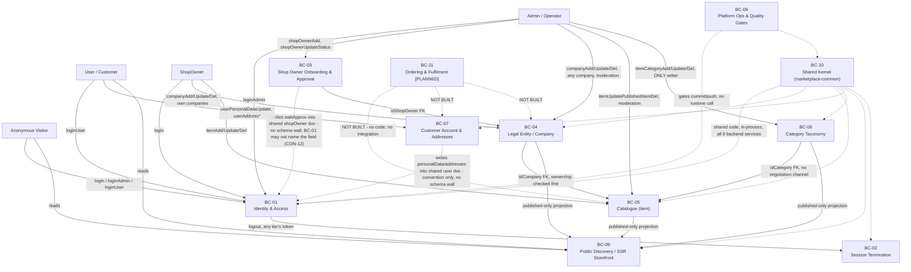

# Bounded Context Map
# Marketplace

**Status:** baselined - brownfield retrofit
**Version:** 1.2
**Date:** 2026-08-07
**Author:** bounded-context-agent
**Changelog:** v1.0 - initial retrofit; reverse-engineered from the 15-repo working tree. No prior DEVPROTOCOL documents existed.
v1.1 - 2026-08-11: the Mutability line drops team sign-off (single developer) and states the route for
*adding* a context, which it never described — the gap that left a proposed BC-12 with nowhere to go. That
BC-12 is **withdrawn** and is not coming: it was proposed only to give E16 and E17 a context to own under an
epic-to-context rule that `phase5/CONSTRAINTS.md` §5 has since removed. The eleven contexts themselves are
unchanged.
v1.2 - 2026-08-12: §7 open question 7 closed — no anti-corruption layer across `shopOwner` or `user`, now
or later; both pairs share one `$jsonSchema` builder, which is a Shared Kernel rather than two models
needing a translator. The §6 rows stop saying "gap, not a protection": the `shopOwner` one is enforced by
E01-S10 / CON-12, the `user` one has nothing to enforce yet and says why. Question 8 opened in the same
pass: `waitApprov` gates nothing, and §1, BC-01, BC-03 and §4 each said otherwise.
**Depends on:** PDR.md ✅ [`docs/devprotocol/phase1/PDR.md`](../phase1/PDR.md) · EVENT_STORMING.md ✅ [`docs/devprotocol/phase2/EVENT_STORMING.md`](./EVENT_STORMING.md) · UBIQUITOUS_LANGUAGE.md ✅ [`docs/devprotocol/phase2/UBIQUITOUS_LANGUAGE.md`](./UBIQUITOUS_LANGUAGE.md)
**Mutability:** the platform owner decides and writes the reason down before the edit — **one developer, so no
vote and no second approver exists.** Splitting or merging contexts is a major refactor. Carving a new context
out of an existing one is a **split**, not an addition, and takes that same route. A genuine **addition** is the
rarer case where no existing context's "Owns" list gets shorter — responsibility nothing owned before. It
carries the full §2 entry, the §3 diagram node and the §4 integration rows in one change, and states why it is
not an extension of an existing context. No epic needs a context to exist (`phase5/CONSTRAINTS.md` §5), so "an
epic needs somewhere to live" is never that reason.

---

## 1. Purpose

Draws boundaries between sub-domains of Marketplace, a 16-repo polyrepo (`CLAUDE.md`). Each bounded context owns its own data and language; no context reaches into another's internals except through the integration patterns named in §4. Terms used below are canonical per `UBIQUITOUS_LANGUAGE.md` - no synonym, no re-translation.

Boundary enforcement note, load-bearing for every entry below: on this platform "tier" (`Admin` / `ShopOwner` / `User`) is a collection plus a dedicated service pair, never a role flag (`UBIQUITOUS_LANGUAGE.md` §3-4, `CLAUDE.md` §Terminology - "There is no `role` field and no permission enum anywhere"). That makes the three identity contexts enforced **by construction**: separate MongoDB collections (`admin`/`shopOwner`/`user`), separate git repos, separate ports, a `tier` value stamped into the Redis session and asserted on every call (`assertTier`, `BEs/marketplace-common/src/others/assertTier.mts:21-23`). Not every boundary below gets that guarantee. Two do not, and are flagged where they occur: the split between Identity & Access and Shop Owner Onboarding & Approval (both write different sub-documents of the same `shopOwner` collection, from two different services, with no schema-level partition) and the split between Identity & Access and Customer Account & Addresses (same story, one `user` collection, one resource service, two conceptual owners of different sub-documents). Those are conventions this document records, not walls MongoDB enforces — with one part now built: **which fields BC-01 may name at all** on `shopOwner` is checked by lint in all three ShopOwner-tier repos (E01-S10 / CON-12, §6). The shape stays shared on purpose; only the scope is walled.

---

## 2. Bounded contexts

### BC-01 - Identity & Access
**Responsibility:** Authenticates a caller against exactly one of three collections and mints/rotates/validates the opaque token pair that proves it for the rest of a session. One instance of this responsibility per tier - never a single service branching on a role.
**Owns:** `admin`, `shopOwner`, `user` collections' `login`/`resetPwd`/`emailVerify` sub-documents (shared shape `LOGIN`/`RESET_PWD`/`EMAIL_VERIFY`, `BEs/marketplace-db-setup/lib/schemas/account.js`); the Redis session hash keyed `${REDIS_KEY}${token}`; the `TIER` constant and `assertTier` guard (`BEs/marketplace-common/src/others/Tier.mts:12-18`, `BEs/marketplace-common/src/others/assertTier.mts:21-23`); the three `*-authenticated-authorization` services (`BEs/dev/marketplace-dev-authenticated-authorization`, `BEs/dev/marketplace-dev-admin-authenticated-authorization`, `BEs/dev/marketplace-dev-user-authenticated-authorization`) plus `marketplace-dev-public-authorization` for first login (`login`/`loginAdmin`/`loginUser`).
**Produces:** Customer Logged In / Shop Owner Logged In / Admin Logged In, Login Refused (per-tier reason, generic error shape outward), Access Token Rotated, Refresh Refused - Foreign Tier, Verification Email Sent, Email Verified (`UBIQUITOUS_LANGUAGE.md` §15).
**Consumes:** bcrypt-hashed credentials from each collection (`SALT_ROUNDS=14`), the Keygrip-signed refresh cookie, `x-introspectioncode` for service-to-service bypass (`resolveAuthorizationSession`, `BEs/marketplace-common/src/others/resolveAuthorizationSession.mts`).
**Does not own:** logout (BC-02, separate context on purpose), `waitApprov`/onboarding gate content (BC-03 writes it; ⚠️ this context does **not** read it — see §7 q8), `personalData`/`addresses` (BC-07).

---

### BC-02 - Session Termination
**Responsibility:** Deletes a session's Redis keys given only the token content - the single logout mutation serving all three tiers, because deletion needs no knowledge of which collection minted the token.
**Owns:** `BEs/dev/marketplace-dev-authenticated-logout` (the whole repo, one service, `logout` mutation, `BEs/dev/marketplace-dev-authenticated-logout/src/graphQLApi/schema/mutations/logout.mts`), `authorizationLogoutHandler.mts` (`BEs/dev/marketplace-dev-authenticated-logout/src/lib/authorizationLogoutHandler.mts:60,74` - deletes by `REDIS_KEY + token`, two `del` calls because Redis is a cluster and a multi-key `del` would throw `CROSSSLOT`).
**Produces:** Session Destroyed.
**Consumes:** the bearer token itself (no session lookup, no tier check - it does not need one). All three frontends point at port 4030.
**Does not own:** session creation, session content, tier assertion - those stay in BC-01. This is why it is its own bounded context rather than a method inside BC-01: its correctness depends on knowing *nothing* about tier, and merging it into BC-01 would be the one change most likely to accidentally reintroduce a tier check that breaks the shared-service property.

**Why this is a context, not a shortcut** - a single `REDIS_KEY=marketplaceDev:` prefix is shared across all 9 services on purpose (`UBIQUITOUS_LANGUAGE.md` §4 REDIS_KEY), and a per-tier prefix was evaluated and rejected specifically because it would break this service:
```ts
// BEs/dev/marketplace-dev-authenticated-logout/src/lib/authorizationLogoutHandler.mts:60,74
// deletes by token content alone - never asks which collection minted it
```

---

### BC-03 - Shop Owner Onboarding & Approval
**Responsibility:** Provisions a `ShopOwner` account (Admin-initiated, no self-service registration exists) and records whether it is approved. ⚠️ **Records, not gates:** `waitApprov` is written and displayed by the Admin area and read by nothing else — `login` does not project it, `refresh` succeeds without it, the reset-password flow ignores it (`BEs/dev/marketplace-dev-public-resource/src/lib/access/resetPwdFlow.mts`). An unapproved shop owner can log in today. §7 q8.
**Owns:** `shopOwner.waitApprov`, `shopOwner.notes` (operator-only, and since E01-S10 not merely unloaded by the ShopOwner tier but unloadable - `no-restricted-syntax` refuses both names in all three of its repos, CON-12), `shopOwnerAdd` / `shopOwnerUpdateStatus` / `shopOwnerUpdateNote` / `shopOwnerUpdatePreferences` mutations, all four living in `BEs/dev/marketplace-dev-admin-authenticated-resource/src/graphQLApi/schema/mutations/`.
**Produces:** Shop Owner Account Created, Duplicate Login Email Rejected, Shop Owner Approval Granted, Shop Owner Approval Withheld, Shop Owner Disabled, Shop Owner Note Recorded.
**Consumes:** nothing from another context to act - `shopOwnerUpdateStatus` writes `disabled` and `waitApprov` together as a full-state save, never a partial patch:
```ts
// BEs/dev/marketplace-dev-admin-authenticated-resource/.../shopOwnerUpdateStatus.mts:6-10,29-30
interface IArgs { _id: Types.ObjectId; disabled: boolean; waitApprov: boolean }
args: { disabled: { type: new GraphQLNonNull(GraphQLBoolean) },
         waitApprov: { type: new GraphQLNonNull(GraphQLBoolean) } }
```
**Does not own:** the login attempt itself (BC-01 reads `waitApprov` to refuse a login, this context only writes it). Two hotspots live here, unresolved on disk: whether a freshly created `ShopOwner` starts gated or ungated (`EVENT_STORMING.md` §5 hotspot 1), and what advances `onboardingStep`/`onboardingDone` - no mutation under any `mutations/` directory on the platform writes either field (`EVENT_STORMING.md` §5 hotspot 2).

**Boundary is convention on the shape, construction on the scope:** this context and BC-01 both touch the `shopOwner` collection, from two different repos (`marketplace-dev-admin-authenticated-resource` writes, `marketplace-dev-authenticated-authorization` reads), with no schema partition separating "onboarding fields" from "login fields" - the shared `$jsonSchema` builder in `BEs/marketplace-db-setup/lib/schemas/shopOwner.js` is what keeps both sides honest about the shape, and that is deliberate: one builder is a Shared Kernel, which is exactly why an anti-corruption layer between the two would translate a shape into itself (§7 q7, closed). What *is* enforced is which fields BC-01 may name at all - E01-S10 / CON-12.

---

### BC-04 - Legal Entity / Company
**Responsibility:** Owns the `company` aggregate - simultaneously the legal entity (`legalName`, `vatNumber`, `certifiedEmail`, `registryExtract`) a `ShopOwner` registers and the shop itself, since no separate shop collection exists or will (`CLAUDE.md` §Terminology).
**Owns:** `company` collection (`BEs/marketplace-db-setup/lib/schemas/company.js`), its Mongoose model in `BEs/marketplace-common` (shared by both writer services so the shape cannot drift between them), `companyAdd`/`companyUpdate`/`companyDel` in two resource services - `BEs/dev/marketplace-dev-authenticated-resource/src/graphQLApi/schema/mutations/companyAdd.mts` (ShopOwner tier, own companies only, answers `OnlyIdType`) and `BEs/dev/marketplace-dev-admin-authenticated-resource/src/graphQLApi/schema/mutations/companyAdd.mts` (Admin tier, any company, answers plain `Boolean`).
**Produces:** Company Registered, Company Updated, Company Made Public (`published` flips true once `publicName`/`slug`/`description` are populated), Company Retired (soft delete), Delete Refused - Already Retired (ShopOwner tier, 403), Delete Accepted On Already-Retired Company (Admin tier, 200).
**Consumes:** `idShopOwner` FK from BC-01's `shopOwner` collection (unenforced, checked at read/ownership time by `throwIfShopOwnerDontOwnCompany`).
**Does not own:** `item` documents (BC-05), the public read projection (BC-08 reads through a fixed pipeline, never writes here).

Two writers by design, not overlap - and they diverge on delete semantics for an already-retired company, which is the platform's canonical example of "liveness belongs on read/ownership guards, never on the delete write itself" (`docs/data-model.md`):
```js
// BEs/marketplace-db-setup/lib/schemas/company.js
const PUBLISHED_IMPLIES_LINKABLE = {
  $expr: { $or: [
    { $ne: ['$published', true] },
    { $and: [ { $eq: [{ $type: '$slug' }, 'string'] }, { $eq: [{ $type: '$publicName' }, 'string'] } ] }
  ] }
};
```

---

### BC-05 - Catalogue
**Responsibility:** Owns `item`, the single generic catalogue entry. Domain-neutral by design — presumes nothing about what is sold. One thing a `Company` sells; deliberately carries no price.
**Owns:** `item` collection (`BEs/marketplace-db-setup/lib/schemas/item.js`), `itemAdd`/`itemUpdate`/`itemDel` (ShopOwner tier, own company only, `BEs/dev/marketplace-dev-authenticated-resource/src/graphQLApi/schema/mutations/itemAdd.mts`), `itemUpdatePublished`/`itemDel` (Admin tier moderation, `BEs/dev/marketplace-dev-admin-authenticated-resource/src/graphQLApi/schema/mutations/itemUpdatePublished.mts`).
**Produces:** Item Added, Add Refused - Company Not Owned, Add Refused - Category Missing, Item Updated, Item Published/Unpublished, Item Deleted, Item Published/Unpublished By Admin, Item Deleted By Admin.
**Consumes:** `idCompany` FK from BC-04 (ownership checked first), `idCategory` FK from BC-06 (existence checked second, deliberately after ownership):
```ts
// BEs/dev/marketplace-dev-authenticated-resource/src/graphQLApi/schema/mutations/itemAdd.mts:39-46
async resolve(_: unknown, args: IArgs, ctx: IContextShopOwnerAuthenticatedResource) {
  await throwIfShopOwnerDontOwnCompany(ctx.state.user._id, args.item.idCompany)
  await throwIfItemCategoryMissing(args.item.idCategory)
  const newItem: IItemSchema = { _id: new Types.ObjectId(), ...args.item }
```
**Does not own:** price, cart membership, order lines - none exist (BC-11, planned). `idCategory` shape or depth cap (BC-06).

Two independent writers of `item.published` (ShopOwner's `itemUpdate`, Admin's `itemUpdatePublished`) with no version/lock field found in the schema - a race is unexamined (`EVENT_STORMING.md` §5 hotspot 4, open question 5).

---

### BC-06 - Category Taxonomy
**Responsibility:** Curates the two-level `itemCategory` tree every `item` files under. Admin-only writes; every other tier reads only.
**Owns:** `itemCategory` collection (`BEs/marketplace-db-setup/lib/schemas/itemCategory.js`), `itemCategoryAdd`/`Update`/`Del`, all three ONLY in `BEs/dev/marketplace-dev-admin-authenticated-resource/src/lib/itemCategory/funItemCategoryAdd.mts` and siblings - verified no such file exists under `marketplace-dev-authenticated-resource` or `marketplace-dev-public-resource`.
**Produces:** Item Category Created, Deep-Nesting Rejected, Duplicate Slug Rejected, Item Category Updated, Item Category Deleted.
**Consumes:** nothing from another context - `idParent` is a self-FK, depth-capped in the resolver because a `$jsonSchema` cannot read a sibling document:
```ts
// BEs/dev/marketplace-dev-admin-authenticated-resource/src/lib/itemCategory/funItemCategoryAdd.mts:23-33
export async function funItemCategoryAdd(data: IItemCategoryValidated) {
  if (data.idParent !== undefined) await throwIfParentNotTopLevel(data.idParent)
  try { await ItemCategory.create({ _id: new Types.ObjectId(), ...data }) }
  catch (e) { if (duplicateKey(e)) throwAlreadyTakenError('slug already used by another category'); throw e }
}
```
**Does not own:** `item` documents themselves (BC-05) - deleting a category leaves items filed under it resolvable, on purpose.

---

### BC-07 - Customer Account & Addresses
**Responsibility:** Owns the parts of a `User`'s own record beyond login - optional `personalData` filled in after email confirm, an array of `addresses`, and at most one `defaultAddress` pointer.
**Owns:** `user.personalData`, `user.addresses[]`, `user.defaultAddress` (`BEs/marketplace-db-setup/lib/schemas/user.js`), `userPersonalDataUpdate`/`userAddressAdd`/`userAddressUpdate`/`userDefaultAddressSet`/`userAddressDel`/`userUpdatePwd`, all in `BEs/dev/marketplace-dev-user-authenticated-resource`.
**Produces:** Personal Data Filled In, Address Added/Updated/Deleted, Default Address Set, Set Refused - Address Not Owned, Default Address Pointer Cleared, Password Changed.
**Consumes:** the authenticated `User` identity from BC-01 (`ctx.state.user._id`) - no external data.
**Does not own:** login/session content (BC-01), addresses' relationship to any future order (BC-11, no such relationship exists).

The "at most one default" invariant is a shape, not a checked rule - a single root pointer instead of a per-element boolean makes a second default inexpressible, enforced by the collection's own `$expr`:
```js
// BEs/marketplace-db-setup/lib/schemas/user.js
const DEFAULT_ADDRESS_POINTS_INTO_ADDRESSES = {
  $expr: { $or: [
    { $eq: [{ $type: '$defaultAddress' }, 'missing'] },
    { $in: ['$defaultAddress', { $map: { input: { $ifNull: ['$addresses', []] }, in: '$$this._id' } }] }
  ] }
};
```
Deleting the default address must `$unset` the pointer in the same aggregation-pipeline update, or the database itself rejects the write (`funUserAddressDel.mts`, `BEs/dev/marketplace-dev-user-authenticated-resource/src/lib/user/funUserAddressDel.mts:50-62`).

**Boundary is convention, not construction:** same story as BC-03/BC-01 - `personalData`/`addresses` and `login`/`resetPwd`/`emailVerify` live on the same `user` document, served by the same resource service, with no MongoDB-level wall between them. Nothing stops a future resolver in this context from reaching into the login sub-document; only code review does.

---

### BC-08 - Public Discovery / SSR Storefront
**Responsibility:** Serves anonymous and customer traffic a read-only, published-only projection of `company`/`item`/`itemCategory` - the only surface with no domain event, because nothing here mutates state.
**Owns:** `BEs/dev/marketplace-dev-public-resource` read queries (`companies`, `companiesNearby`, `companyBySlug`, `items`, `itemBySlug`, `itemCategories`, `search`, `sitemapEntries`), the `livePublic`/`LIVE_PUBLIC_PIPELINE` filter stage (`BEs/dev/marketplace-dev-public-resource/src/lib/catalogue/publicRead.mts`), the SSR half of `marketplace-user` (every route except `/account/*`), the 2dsphere geo index `company.address.position_2dsphere`.
**Produces:** no domain events - read models only (`UBIQUITOUS_LANGUAGE.md` §17), including `sitemapEntries` for SSR sitemap generation.
**Consumes:** the published projection of BC-04's `company` and BC-05's `item`/BC-06's `itemCategory`, filtered through one shared pipeline stage rather than repeated per query.
**Does not own:** customer registration (`userRegister` lives here as a mutation but the account it creates is BC-01/BC-07's, not this context's), any write to `company`/`item`/`itemCategory`.

`companiesNearby` runs exactly one of two disjoint code paths depending on the argument sent, never both:
```ts
// BEs/dev/marketplace-dev-public-resource/src/graphQLPublic/schema/queries/companiesNearby.mts:1-4,44-48
// $geoNear (reports distance, sorts by it) vs centerSphereFilter (no distance, sorts by relevance),
// used by `search`. Both read address.position_2dsphere.
```
SSR half of `marketplace-user` is the one deliberate loopback-only bind on the platform (`serve.mjs`) - reaching it directly bypasses nginx rate limits and the `proxy_cache` bypass-on-session-cookie rule that keeps this context anonymous-safe.

---

### BC-09 - Platform Operations & Quality Gates
**Responsibility:** Keeps every other context honest at commit/push time - coverage, mutation score, lint, Qodana, and the migration pipeline that changes the shape every context above builds on.
**Owns:** `BEs/marketplace-db-setup/migrations/` (immutable once applied) and `lib/schemas/*.js` (the actual builders, restated by every migration that touches a collection), `.githooks/pre-commit` + `.githooks/pre-push` in the 15 gated repos, each repo's `qodana.yaml`/`qodana.sh`/`stryker.config.mjs`, `services-status` (`services-status/src/server.ts`, `services-status/src/systemd.ts`, `services-status/src/monitor.ts` - the odd one out: tracked by the parent repo, no repo of its own, gated from the parent's own hooks rather than its own).
**Produces:** pass/fail gate signals (coverage, mutation, lint, Qodana), migration `up`/`down` pairs, service-liveness probes.
**Consumes:** nothing from the domain contexts above except their source trees to scan and their test suites to run.
**Does not own:** any domain collection's runtime data - it owns the *shape* (via migrations) and the *proof of correctness* (via gates), never a live document.

`services-status` had a gate that was never wired - the mode bug that made it silent is the platform's canonical cautionary tale for this context:
```
qodana.sh committed at mode 100644 (should be 100755) -> died with "Permission denied" before
reaching Qodana -> exited non-zero with no results directory -> both hooks reported
"Qodana failed" pointing at a SARIF that was never created. A chmod, rendered as a finding.
```
(`docs/frontends.md` §marketplace-user, ⚠️ "`services-status/qodana.sh` must stay mode `100755`").

---

### BC-10 - Shared Kernel (marketplace-common)
**Responsibility:** Supplies the code every other backend context compiles against directly rather than calling over the network - session resolution, tier assertion, the disabled/deleted guard, the Mongoose models themselves.
**Owns:** `BEs/marketplace-common/src/others/Tier.mts`, `assertTier.mts`, `resolveAuthorizationSession.mts`, `findAccountForSession.mts`, `refreshSessionTokens.mts`, `checkUserAuthorizationDisDel`, the `Company`/`Item`/`ItemCategory`/`ShopOwner`/`User`/`Admin` Mongoose models, ~139 `exports` map entries in `package.json` (no barrel export - an unlisted file is unreachable, `yarn test:contract` catches omissions).
**Produces:** the compiled `@axiumine/marketplace-common` package, synced into every consumer's `node_modules` by `BEs/marketplace-common/deploy-local.sh` (the package is not published to any registry - `deploy-local.sh` is the only thing that makes an edit visible).
**Consumes:** nothing from the other contexts - by definition a shared kernel is upstream of all of them.
**Does not own:** any resolver, any GraphQL schema slice, any route.

⚠️ Since `marketplace-common@1.0.0` this context has a Koa/GraphQL-shaped surface, not just data models - `resolveAuthorizationSession`, `findAccountForSession`, `refreshSessionTokens` are the shared body BC-01's three authorization services now call into (`docs/decisions/authorization-service-consolidation.md`). Consumed by 3 of the 9 backend services, but **deployed to all 9** by the same `deploy-local.sh` glob - an edit here is wider than it looks, and `vitest.mutation.config.mts` in the consumers must inline both `@axiumine/marketplace-common` and `@axiumine/koa-utils` or a `vi.mock` of a koa-utils subpath silently stops intercepting.

---

### BC-11 - Ordering & Fulfilment [PLANNED - NOT BUILT]
**Responsibility:** Would own cart, order, delivery and payment - the commerce flow a customer needs to actually buy an `item`. Named here for glossary and boundary readiness only.
**Owns:** nothing. No collection, no migration, no model, no resolver, no schema builder exists anywhere in the 16 repos (`EVENT_STORMING.md` §2.9, verified: no `mutations/` directory in any of the 9 services under `BEs/dev/` contains a file matching `cart`/`order`/`payment`/`delivery`).
**Produces:** nothing real. Hypothetical, unimplemented events named for vocabulary readiness: Cart Item Added, Order Placed, Payment Authorised, Delivery Dispatched - none exists in code.
**Consumes:** would need BC-05's `item` (still with no price - `BEs/marketplace-db-setup/lib/schemas/item.js` states a price "would be a guess at a design decision nobody has made"), BC-07's `addresses` for delivery, BC-04's `company` for fulfilment ownership.
**Does not own:** anything yet. **Ask before inventing any part of this** (`CLAUDE.md` §Build state) - designing it requires operator sign-off, not an agent's inference from the shape of the other ten contexts.

---

## 3. Context map



Solid arrows carry a real GraphQL command or FK read at runtime. Dashed arrows are compile-time (Shared Kernel), gate-time (Platform Ops), convention-only (Onboarding/Account into Identity), or entirely hypothetical (Ordering & Fulfilment).

---

## 4. Context relationships

| From | To | Relationship | Integration pattern |
|---|---|---|---|
| BC-01 Identity & Access | BC-02 Session Termination | Three tiers all call the one shared logout service | Customer-Supplier (three customers, one supplier) via Published Language - the shared `REDIS_KEY` prefix and token-content addressing is the contract, not a per-tier API |
| BC-03 Shop Owner Onboarding & Approval | BC-01 Identity & Access | BC-03 writes `waitApprov`; **BC-01 does not read it** - `login` neither projects nor gates on it, and `refresh` succeeds for an unapproved account. Approval is enforced downstream of the session, not in front of it | Conformist **by design and permanently** - one `shopOwner` collection built from one `$jsonSchema` builder, so there is no second model to translate to. No schema-level wall on the shape; a lint-level wall on the scope, E01-S10 / CON-12 |
| BC-07 Customer Account & Addresses | BC-01 Identity & Access | Both live on the `user` collection, different sub-documents, same resource service | Conformist, convention only - see §1 boundary note |
| BC-03 Shop Owner Onboarding & Approval | BC-04 Legal Entity / Company | `company.idShopOwner` FK points at an account BC-03 provisioned | Customer-Supplier - Company is downstream, the FK is unenforced |
| BC-04 Legal Entity / Company | BC-05 Catalogue | `item.idCompany` FK, ownership checked before category existence | Customer-Supplier |
| BC-06 Category Taxonomy | BC-05 Catalogue | `item.idCategory` FK; ShopOwner tier has zero write access to taxonomy shape or depth | Conformist - Catalogue has no negotiating channel, must accept whatever Admin curates |
| BC-04, BC-05, BC-06 | BC-08 Public Discovery / SSR Storefront | Read-only, published-only projection through one shared pipeline stage | Open Host Service + Published Language - `livePublic`/`LIVE_PUBLIC_PIPELINE` (`BEs/dev/marketplace-dev-public-resource/src/lib/catalogue/publicRead.mts`) is the stable contract; the public GraphQL schema itself is the published language anonymous clients and the SSR app both consume |
| BC-01, BC-04, BC-05, BC-06, BC-07, BC-08, BC-02 | BC-10 Shared Kernel | Direct compile-time import of Mongoose models, `assertTier`, `checkUserAuthorizationDisDel`, session-resolution functions | Shared Kernel - textbook case, in-process function calls, not a network boundary |
| BC-01 through BC-08, BC-10 | BC-09 Platform Operations & Quality Gates | Coverage/mutation/lint/Qodana gates run against every repo's tree at commit/push time; migrations in `BEs/marketplace-db-setup` define every collection shape the others build on | Separate Ways at runtime (no shared model, no API call) - but a Generic Subdomain every other context depends on at build/deploy time |
| BC-11 Ordering & Fulfilment [PLANNED] | BC-05 Catalogue, BC-07 Customer Account & Addresses, BC-04 Legal Entity / Company | Would need `item` (still priceless), `addresses` for delivery, `company` for fulfilment ownership, once built | Separate Ways - literally no code exists to integrate; do not pre-build an ACL for a context with no shape yet |

---

## 5. Shared kernel

Terms and shapes multiple contexts use identically, with zero translation at the boundary - every one defined once in code and imported, never re-typed per context. All defined fully in [`UBIQUITOUS_LANGUAGE.md`](./UBIQUITOUS_LANGUAGE.md).

| Shared term | Defined in | Shared by (contexts) | UL section |
|---|---|---|---|
| `Tier` (`'admin' \| 'shopOwner' \| 'user'`) | `BEs/marketplace-common/src/others/Tier.mts:12-18` | BC-01, BC-02 (implicitly, by NOT using it), BC-10 | §4 |
| `assertTier` | `BEs/marketplace-common/src/others/assertTier.mts:21-23` | Every resource/authorization service except BC-02's logout | §4 |
| `checkUserAuthorizationDisDel` | `BEs/marketplace-common` | BC-01, BC-03, BC-04, BC-05, BC-06, BC-07 | §4 |
| `REDIS_KEY` prefix (`marketplaceDev:`) | shared across all 9 services' env | BC-01, BC-02 | §4 |
| `LOGIN` / `RESET_PWD` / `EMAIL_VERIFY` sub-document shapes | `BEs/marketplace-db-setup/lib/schemas/account.js` | BC-01 (all three collections it authenticates against) | §11 |
| `DELETED` / `DISABLED` soft-delete convention (`deleted`: date, never removed; `disabled`: bool) | `BEs/marketplace-db-setup/lib/schemas/account.js` | BC-01, BC-03, BC-04, BC-05, BC-06, BC-07 - every collection on the platform | §11, §13 |
| shared `address` block | `BEs/marketplace-db-setup/lib/schemas/geo.js` | BC-04 (`company.address`, `position` required), BC-07 (`user.addresses[]`, `position` optional) | §11 |
| GeoJSON `position` builder + `COORDINATE_TUPLE` | `BEs/marketplace-db-setup/lib/schemas/geo.js` | BC-04, BC-07, BC-08 (reads the `2dsphere` index both produce) | §11 |
| `OnlyIdType` return convention on ShopOwner-tier creates | `BEs/dev/marketplace-dev-authenticated-resource/.../companyAdd.mts:1,27` | BC-04, BC-05 (ShopOwner tier only - Admin tier returns plain `Boolean` for the same mutations) | §14 |
| Mongoose models (`Company`, `Item`, `ItemCategory`, `ShopOwner`, `User`, `Admin`) | `BEs/marketplace-common` | BC-01, BC-03, BC-04, BC-05, BC-06, BC-07, BC-08 | §13 (`deploy-local.sh`) |

Two field names deliberately mean **different things** in different contexts and must never be conflated across this shared vocabulary - `position` is GeoJSON coordinates on `company.address`/`user.addresses[]` (BC-04, BC-07) but a plain sort-order integer on `itemCategory` (BC-06); [`UBIQUITOUS_LANGUAGE.md`](./UBIQUITOUS_LANGUAGE.md) §8 and §10 both carry an explicit "Not to be confused with" cross-reference for this reason.

---

## 6. Anti-corruption layers

| Boundary | Risk | Protection |
|---|---|---|
| Foreign-tier access token presented to the wrong resource service | An `Admin` token accepted by the ShopOwner resource service (real historical hole - `authorizationAuthenticatedResourceHandler.mts` set `ctx.state.user` on any non-empty Redis hash before 2026-08-05, and all 9 services share one `REDIS_KEY`) | `assertTier(actual, expected)` throws 403 (never 401), fails closed on a session with no `tier` field - `BEs/marketplace-common/src/others/assertTier.mts:21-23` |
| BC-08 Public Discovery reading BC-04/BC-05/BC-06's live data | An unpublished/draft `company` or `item` leaking to anonymous traffic if a query forgot its own filter | One shared pipeline stage, `livePublic`/`LIVE_PUBLIC_PIPELINE`, applied once rather than re-implemented per query - `BEs/dev/marketplace-dev-public-resource/src/lib/catalogue/publicRead.mts` |
| BC-03 Shop Owner Onboarding writing `shopOwner.waitApprov`/`notes`, BC-01 reading the same collection for login | A ShopOwner-tier resolver widening its projection by one word and handing the subject the operator's own encrypted note about them, or writing the approval gate on their own account | **Closed by E01-S10, and deliberately not with an ACL** - both sides are one model built from one `$jsonSchema` builder, so there is nothing to translate. `OPERATOR_ONLY_FIELDS_SHOP_OWNER` (`BEs/marketplace-common/src/others/operatorOnlyFields.mts`) names the two fields; a test there holds every name to a real path on `ShopOwnerSchema`; `no-restricted-syntax` selectors in all three ShopOwner-tier repos refuse the property, the type signature, the member read and the projection string. See CON-12 |
| BC-07 Customer Account writing `user.personalData`/`addresses`, BC-01 reading `user.login`/`emailVerify` | Same shape of risk on the `user` collection | **Not enforced, and correctly so today**: `user` carries no operator-only field - no `notes`, no `waitApprov`, and the Admin tier has no `user` resolvers at all - so there is nothing for a list to hold. An empty counterpart would read as a boundary being enforced when nothing is. `BEs/marketplace-db-setup/lib/schemas/user.js` is the shared discipline; the first operator-only field to land on `user` brings the E01-S10 pair with it |
| BC-10 Shared Kernel package boundary | An edit to `marketplace-common` is invisible to every consumer until synced - the package is not on any registry (`@axiumine/marketplace-common` 404s on `registry.npmjs.org`) | `BEs/marketplace-common/deploy-local.sh` (must be re-run after every edit), `yarn test:contract` (verifies the `exports` map against actual files) |
| BC-08's SSR half (`/`, public routes) vs `/account/*` on `marketplace-user` | Rendering authenticated HTML behind a shared `proxy_cache` could serve one customer's data to the next visitor | Two halves of one mechanism: `/account/*` is `ssr: false` (never rendered server-side) and the cache bypasses on the session cookie - weakening either alone is enough to leak |
| BC-11 Ordering & Fulfilment [PLANNED] against everything else | None yet - the risk of designing an ACL prematurely, before the aggregate exists, is why `item` still has no price field | [`CLAUDE.md`](../../../CLAUDE.md) §Build state: "ask before inventing them" - the protection here is refusing to build the boundary until the context itself is designed |

---

## 7. Open questions

| # | Question | Owner | Status |
|---|---|---|---|
| 1 | Does self-service shop-owner registration ever get built, or does Admin-provisioning (BC-03) stay permanent? | Product | Open |
| 2 | What advances `shopOwner.onboardingStep`/`onboardingDone` (BC-01/BC-03 boundary), and where does that write live? No mutation under any `mutations/` directory on the platform was found to write either field. | Platform dev | Open |
| 3 | Is `waitApprov` (BC-03) true or false/absent by default at account creation? Schema comment conflates "awaiting approval" with "deleted" in one field's own doc comment (`BEs/marketplace-db-setup/lib/schemas/shopOwner.js`). | Platform dev | Open |
| 4 | When BC-11 Ordering & Fulfilment design work starts, who signs off the first schema - and does it become one context or split (Cart / Order / Delivery / Payment each their own)? | Product + platform dev | Open |
| 5 | Should `item.published` (BC-05) get a version/lock field before ShopOwner's `itemUpdate` and Admin's `itemUpdatePublished` can race on the same item? | Platform dev | Open |
| 6 | What `idShopOwner` does an Admin-created `company` document (BC-04) get, absent an owning ShopOwner having created it first via BC-03? | Platform dev | Open |
| 7 | Should the BC-01/BC-03 (`shopOwner`) and BC-01/BC-07 (`user`) convention-only boundaries get a real anti-corruption layer (e.g. each context restricted to its own resolver-level projection) before a fourth tier is added and the pattern is copied a third time? | Platform dev | **Closed 2026-08-12 - no ACL, ever.** Both pairs share one `$jsonSchema` builder and one Mongoose model: that is a Shared Kernel, and a mapper across it would translate a shape into itself at a permanent CON-08 cost. The real defect was field *scope*, not corruption, and E01-S10 closes it with a named field list plus `no-restricted-syntax` in the three ShopOwner-tier repos (CON-12). A fourth tier copies that, not an ACL. Re-open only if the two sides stop sharing the builder |
| 8 | `shopOwner.waitApprov` gates nothing. It is written by `shopOwnerUpdateStatus`, displayed by the Admin area, and read by no other service on the platform - `login` does not project it, `refresh` renews a session without it, `resetPwdFlow` documents ignoring it on purpose. So an unapproved shop owner can log in and use the ShopOwner tier normally. Is the manual-approval gate meant to bite at login (a deliberate BC-01 read, which E01-S10 would then have to carve an exception for), or is `waitApprov` correctly just an operator-facing flag and every document calling it a gate wrong? Surfaced 2026-08-12 while closing q7. | Product + platform dev | Open |


