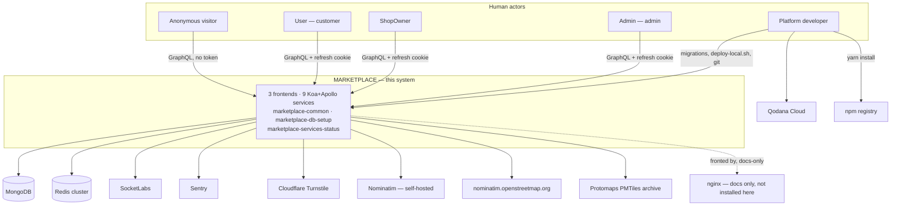

# C4 — Context Diagram
# Marketplace

**Status:** baselined - brownfield retrofit
**Version:** 1.6
**Date:** 2026-08-28
**Author:** c4-agent
**Changelog:** v1.0 - initial retrofit; reverse-engineered from the 15-repo working tree.
v1.6 - 2026-08-28: the npm-registry rows in §3 and §4 carry `2.0.1`, the JSDoc-only patch released that day.
No system, actor or relationship changed.
v1.5 - 2026-08-27, later the same day: the npm-registry row and its changelog note carry `2.0.0` rather than the
`1.0.1` of 2026-08-26. No system, actor or relationship changed.
v1.4 - 2026-08-27: §3's `User` row said the tier cannot buy anything because no cart or order model exists, which read as a build-order statement. ADR-038 (2026-08-27) makes that permanent: the models are not coming.
v1.3 - 2026-08-27, later the same day: v1.2 corrected the npm row in §3 and missed the identical claim in the
relationships table, which still read *"every package except `marketplace-common`"*. Corrected the same way. No
actor, system or relationship changed.
v1.2 - 2026-08-27: the npm-registry row said the registry resolves every dependency *except* `@axiumine/marketplace-common`, *"which 404s there"*. `ADR-037` published it on 2026-08-26 at `1.0.1`, so the exception is gone and `deploy-local.sh` bridges *edited → released* instead. No container, actor or relationship changed.
v1.1 - 2026-08-12: the ShopOwner actor row said they register through `marketplace-shopowner`, which has no
registration screen and never had one. E03-S08 built the flow on the public SSR app instead — corrected to
the two real creation paths.
**Depends on:** [`docs/devprotocol/phase1/PDR.md`](../phase1/PDR.md) ✅ · [`docs/devprotocol/phase1/SYSTEM_CONTEXT.md`](../phase1/SYSTEM_CONTEXT.md) ✅ · [`docs/devprotocol/phase2/BOUNDED_CONTEXT.md`](../phase2/BOUNDED_CONTEXT.md) ✅
**Mutability:** keep in sync — update on each architectural change

---

## 1. Purpose

One system, one box: Marketplace — multi-tenant marketplace platform, 16-repo polyrepo, ground truth is
[`CLAUDE.md`](../../../CLAUDE.md) plus `docs/` at the workspace root. This document draws the box and everything around it: human actors,
external systems, what crosses the boundary. Detail on each interface contract already lives in
[`docs/devprotocol/phase1/SYSTEM_CONTEXT.md`](../phase1/SYSTEM_CONTEXT.md) §5 — this document references it and stays consistent with
it, never restates it. Container-level detail (every deployable unit, ports, tier × concern split) is
[`docs/devprotocol/phase3/C4_CONTAINER.md`](./C4_CONTAINER.md).

---

## 2. Context diagram

Boundary, actors and external systems below match [`docs/devprotocol/phase1/SYSTEM_CONTEXT.md`](../phase1/SYSTEM_CONTEXT.md) §4 —
verified against it, kept in sync by hand since neither document regenerates the other.

---

## 3. Actor and system descriptions

### Human actors

| Actor | Role | Primary interaction |
|---|---|---|
| Anonymous visitor | no session | reads public SSR routes on `marketplace-user` (`/`, `/shops`, `/shop/:slug`, `/category/:slug`) — GraphQL over the public-resource service, no auth token |
| User | end customer, `user` collection | registers, confirms email, logs in (`loginUser`), fills `personalData`, manages `addresses[]` + `defaultAddress` under `marketplace-user` `/account/*`. Cannot buy anything, ever — no cart or order model exists and none will be built ([ADR-038](./adr/ADR-038-commerce-is-permanently-out-of-scope.md)) |
| ShopOwner | shop owner, `shopOwner` collection | arrives one of two ways — self-registers at `/register/seller` on the **public** app `marketplace-user` and waits on `waitApprov`, or is provisioned by an Admin through `shopOwnerAdd` and waits on nothing. Then confirms the email, logs in on `marketplace-shopowner`, manages own `company` document(s) and `item` catalogue. ⚠️ `marketplace-shopowner` has **no registration screen** — it is the panel you reach once you have an account |
| Admin | platform admin, `admin` collection | uses `marketplace-admin` — approves ShopOwners, exclusive write access to `itemCategory` |
| Platform developer | no session — operates the repos, not the app | runs migrations, `BEs/marketplace-common/deploy-local.sh`, commits/pushes 16 independent repos, provisions Qodana/Mongo/Redis credentials outside this tree |

Full contract detail: [`docs/devprotocol/phase1/SYSTEM_CONTEXT.md`](../phase1/SYSTEM_CONTEXT.md) §3.1. No `role` field anywhere on the
platform — actor identity = which MongoDB collection the session authenticated against (`CLAUDE.md`
§Terminology; CON-01 in `docs/devprotocol/phase3/CONSTRAINTS.md`).

### External systems

| System | Optional | Interaction |
|---|---|---|
| MongoDB | no | 6 collections, `$jsonSchema`-validated, read/written by all 9 backend services via Mongoose |
| Redis (cluster) | no | opaque access/refresh session hashes under one shared `REDIS_KEY` prefix across all 9 services |
| SocketLabs | no, for verify/reset flows | transactional email — verify-email and reset-password links |
| Sentry | yes, DSN-gated | error/perf events from all 9 backend services and all 3 frontends |
| Nominatim — self-hosted | yes | `marketplace-user` browser → nginx `/geocode/` → on-prem instance, address search-as-you-type |
| Nominatim — public OSM | yes | `marketplace-admin` / `marketplace-shopowner` browser → `nominatim.openstreetmap.org`, low-volume internal-panel use |
| Cloudflare Turnstile | yes | anti-bot token, browser-issued, verified server-side against `siteverify` by `marketplace-dev-public-resource` (registration, resend, password reset) **and** `marketplace-dev-public-authorization` (all three tier logins) |
| Protomaps PMTiles archive | yes | static basemap tiles, `marketplace-user` browser ↔ nginx `/tiles/`, HTTP range requests |
| nginx | — | TLS termination for three hostnames, HTML cache, rate limits, and the `Secure` cookie rewrite — configs live at `marketplace-nginx/` in the workspace root and are exercised by `marketplace-nginx/test/run.sh`, but **no nginx is installed anywhere in this workspace** |
| Qodana Cloud | no, quality gate | every repo's `pre-commit`/`pre-push` hook uploads a SARIF-shaped scan, one project + token per repo |
| npm registry | no | resolves every dependency, `@axiumine/marketplace-common` included — published since 2026-08-26 (`ADR-037`), `2.0.0` since 2026-08-27 and `2.0.1` since 2026-08-28, where this row recorded a 404. `deploy-local.sh` now bridges *edited → released* rather than *unpublished → published* |

Full contract detail, direction and payload: [`docs/devprotocol/phase1/SYSTEM_CONTEXT.md`](../phase1/SYSTEM_CONTEXT.md) §3.2 and §5.

---

## 4. Key relationships

| From | To | Description |
|---|---|---|
| Anonymous visitor | Marketplace | reads public catalogue over SSR, no auth |
| User | Marketplace | `loginUser` → opaque session → account area, identity only, no commerce |
| ShopOwner | Marketplace | `login` → manages own `company` + `item` documents, gated by `waitApprov` |
| Admin | Marketplace | `loginAdmin` → approves ShopOwners, sole writer of `itemCategory` |
| Platform developer | Marketplace | out-of-band ops — migrations, `deploy-local.sh`, git, Qodana tokens |
| Marketplace | MongoDB | primary datastore, 6 collections, ownership chain `shopOwner → company → item → itemCategory` |
| Marketplace | Redis | session store, one shared `REDIS_KEY` prefix on purpose — the single logout service depends on it |
| Marketplace | SocketLabs | verify-email / reset-password transactional email |
| Marketplace | Sentry | error and perf telemetry, opt-in via DSN presence |
| Marketplace | Nominatim (two topologies) | address geocode/search — self-hosted, proxied for `marketplace-user`; public OSM, direct for the two admin SPAs |
| Marketplace | Cloudflare Turnstile | anti-bot verification on public-resource writes and on all three logins |
| Marketplace | Protomaps PMTiles | static map tile source for the customer-facing map island |
| Marketplace | nginx | documented reverse-proxy / cache boundary, not installed in this workspace |
| Marketplace | Qodana Cloud | static-analysis gate, one project + token per repo |
| Marketplace | npm registry | dependency resolution for every package, `marketplace-common` included — published at `2.0.1` (`ADR-037`) |

---

Container-level detail — every deployable unit, its port, its tier, its concern, and the full
tier × concern grid — is [`docs/devprotocol/phase3/C4_CONTAINER.md`](./C4_CONTAINER.md).
