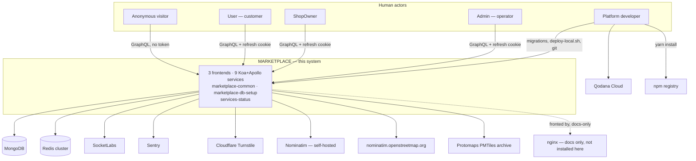

# C4 — Context Diagram
# Marketplace

**Status:** baselined - brownfield retrofit
**Version:** 1.0
**Date:** 2026-08-07
**Author:** c4-agent
**Changelog:** v1.0 - initial retrofit; reverse-engineered from the 15-repo working tree.
**Depends on:** `docs/devprotocol/phase1/PDR.md` ✅ · `docs/devprotocol/phase1/SYSTEM_CONTEXT.md` ✅ · `docs/devprotocol/phase2/BOUNDED_CONTEXT.md` ✅
**Mutability:** keep in sync — update on each architectural change

---

## 1. Purpose

One system, one box: Marketplace — multi-tenant marketplace platform, 15-repo polyrepo, ground truth is
`CLAUDE.md` plus `docs/` at the workspace root. This document draws the box and everything around it: human actors,
external systems, what crosses the boundary. Detail on each interface contract already lives in
`docs/devprotocol/phase1/SYSTEM_CONTEXT.md` §5 — this document references it and stays consistent with
it, never restates it. Container-level detail (every deployable unit, ports, tier × concern split) is
`docs/devprotocol/phase3/C4_CONTAINER.md`.

---

## 2. Context diagram

Boundary, actors and external systems below match `docs/devprotocol/phase1/SYSTEM_CONTEXT.md` §4 —
verified against it, kept in sync by hand since neither document regenerates the other.

---

## 3. Actor and system descriptions

### Human actors

| Actor | Role | Primary interaction |
|---|---|---|
| Anonymous visitor | no session | reads public SSR routes on `marketplace-user` (`/`, `/shops`, `/shop/:slug`, `/category/:slug`) — GraphQL over the public-resource service, no auth token |
| User | end customer, `user` collection | registers, confirms email, logs in (`loginUser`), fills `personalData`, manages `addresses[]` + `defaultAddress` under `marketplace-user` `/account/*`. Cannot buy anything — no cart or order model exists |
| ShopOwner | shop owner, `shopOwner` collection | registers via `marketplace-shopowner`, waits on `waitApprov` from an Admin, manages own `company` document(s) and `item` catalogue |
| Admin | platform operator, `admin` collection | uses `marketplace-admin` — approves ShopOwners, exclusive write access to `itemCategory` |
| Platform developer | no session — operates the repos, not the app | runs migrations, `BEs/marketplace-common/deploy-local.sh`, commits/pushes 15 independent repos, provisions Qodana/Mongo/Redis credentials outside this tree |

Full contract detail: `docs/devprotocol/phase1/SYSTEM_CONTEXT.md` §3.1. No `role` field anywhere on the
platform — actor identity = which MongoDB collection the session authenticated against (`CLAUDE.md`
§Terminology; CON-01 in `docs/devprotocol/phase3/CONSTRAINTS.md`).

### External systems

| System | Optional | Interaction |
|---|---|---|
| MongoDB | no | 6 collections, `$jsonSchema`-validated, read/written by all 9 backend services via Mongoose |
| Redis (cluster) | no | opaque access/refresh session hashes under one shared `REDIS_KEY` prefix across all 9 services |
| SocketLabs | no, for verify/reset flows | transactional email — verify-email and reset-password links |
| Sentry | yes, DSN-gated | error/perf events from all 9 backend services and all 3 frontends |
| Nominatim — self-hosted | yes | `marketplace-user` browser → nginx `/geocode/` → on-prem instance, address search-as-you-type |
| Nominatim — public OSM | yes | `marketplace-admin` / `marketplace-shopowner` browser → `nominatim.openstreetmap.org`, low-volume internal-panel use |
| Cloudflare Turnstile | yes | anti-bot token, browser-issued, verified server-side by `marketplace-dev-public-resource` against `siteverify` |
| Protomaps PMTiles archive | yes | static basemap tiles, `marketplace-user` browser ↔ nginx `/tiles/`, HTTP range requests |
| nginx | — | TLS termination for three hostnames, HTML cache, rate limits, and the `Secure` cookie rewrite — configs live at `nginx/` in the workspace root and are exercised by `nginx/test/run.sh`, but **no nginx is installed anywhere in this workspace** |
| Qodana Cloud | no, quality gate | every repo's `pre-commit`/`pre-push` hook uploads a SARIF-shaped scan, one project + token per repo |
| npm registry | no | resolves every dependency except `@axiumine/marketplace-common`, which 404s there — bridged by `deploy-local.sh` |

Full contract detail, direction and payload: `docs/devprotocol/phase1/SYSTEM_CONTEXT.md` §3.2 and §5.

---

## 4. Key relationships

| From | To | Description |
|---|---|---|
| Anonymous visitor | Marketplace | reads public catalogue over SSR, no auth |
| User | Marketplace | `loginUser` → opaque session → account area, identity only, no commerce |
| ShopOwner | Marketplace | `login` → manages own `company` + `item` documents, gated by `waitApprov` |
| Admin | Marketplace | `loginAdmin` → approves ShopOwners, sole writer of `itemCategory` |
| Platform developer | Marketplace | out-of-band ops — migrations, `deploy-local.sh`, git, Qodana tokens |
| Marketplace | MongoDB | primary datastore, 6 collections, ownership chain `shopOwner → company → item → itemCategory` |
| Marketplace | Redis | session store, one shared `REDIS_KEY` prefix on purpose — the single logout service depends on it |
| Marketplace | SocketLabs | verify-email / reset-password transactional email |
| Marketplace | Sentry | error and perf telemetry, opt-in via DSN presence |
| Marketplace | Nominatim (two topologies) | address geocode/search — self-hosted, proxied for `marketplace-user`; public OSM, direct for the two operator SPAs |
| Marketplace | Cloudflare Turnstile | anti-bot verification on public-resource writes |
| Marketplace | Protomaps PMTiles | static map tile source for the customer-facing map island |
| Marketplace | nginx | documented reverse-proxy / cache boundary, not installed in this workspace |
| Marketplace | Qodana Cloud | static-analysis gate, one project + token per repo |
| Marketplace | npm registry | dependency resolution for every package except `marketplace-common` |

---

Container-level detail — every deployable unit, its port, its tier, its concern, and the full
tier × concern grid — is `docs/devprotocol/phase3/C4_CONTAINER.md`.
