# Infrastructure Diagram
# Marketplace

**Status:** baselined - brownfield retrofit
**Version:** 1.4
**Date:** 2026-08-30
**Author:** infra-agent
**Changelog:** v1.0 - initial retrofit; reverse-engineered from the 15-repo working tree.
v1.4 - 2026-08-30: **§7 question 7's second half is answered the other way, and the build paragraph follows.**
It recorded that `deploy-local.sh` is *not* retired; the platform owner retired it on 2026-08-30 — a change
to `marketplace-common` reaches a consumer by being published and by nothing else
([`adr/ADR-047-a-common-change-ships-as-a-published-release.md`](./adr/ADR-047-a-common-change-ships-as-a-published-release.md)).
The `marketplace-common` build paragraph now ends at `yarn build` plus the release, versions move to
`3.0.0` / `^3.0.0`, and no host, port, process or unit changed.
**Depends on:** `PDR.md` ✅ · `NFR.md` ✅ · `SYSTEM_CONTEXT.md` ✅
v1.3 - 2026-08-28, later the same day: §14 q8 is narrowed a second time and **still counted open** — [`ADR-040`](./adr/ADR-040-the-secrets-manager-vendor-choice-is-the-adopters.md) records that this blueprint never chooses a secrets manager, delegating the choice to any adopter, so the row's *"still owed"* becomes *"permanently declined here"* without becoming an answer. Six questions still open, the same six, and the count in the closing paragraph does not move. Nothing in §1-§13 changed.
v1.2 - 2026-08-28: §14 loses four of its ten open questions to decisions taken elsewhere, and gains no shape of its own — [`ADR-039`](./adr/ADR-039-production-topology-cloudflare-app-host-trusted-datastore-segment.md) answers q3 (Cloudflare in front, one application host, a cloud security group closing every port but 443) and q10 (nginx is the termination point, behind Cloudflare, which is why `conf.d/06-real-ip.conf` exists at all — it restores the caller's address from `CF-Connecting-IP` for Cloudflare's ranges, so the zones keying on `$binary_remote_addr` meter the client rather than the proxy), and answers **the placement half only** of q5 and q6 — the datastores get their own host on a private LAN segment, while node counts, sizing and failover stay open. `ADR-037` (2026-08-26) had already answered q7 two days before this document was last touched, and the row said nothing about it; that is corrected here. q8 keeps its question and loses its blocker. Nothing in §1-§13 changed: this section still documents what exists and still invents no shape, and the four answers are cited to the ADRs that took them rather than decided here.
v1.1 - 2026-08-26: the stale "168 behavioural assertions" count replaced by a citation of `marketplace-nginx/test/suite.sh` itself. The number was stale by 67 — the suite ran 235 assertions before 2026-08-26 and 242 after — and a count written into prose goes stale silently every time an assertion is added. Nothing measured or decided changed.

---

## 1. Purpose

Show where Marketplace runs today, and only today. One topology exists on disk: a single dev
workstation running 12 Node processes plus MongoDB and a Redis cluster, started by hand or by
`dev.sh`. No staging, no cloud, no container orchestration, no forge, no pipeline anywhere in this
tree — every claim below cites a real path or is marked open in §14. Production topology is not
designed; §14 lists what it would need to decide, it does not decide it (per
[`docs/devprotocol/phase3/CONSTRAINTS.md`](./CONSTRAINTS.md) §5 — out of scope for Phase 3 to invent shape for anything
undesigned).

---

## 2. Topology A — Single dev workstation (the only topology that exists)

12 Node processes: 9 backend services (`BEs/dev/*`) + 3 frontend dev servers (`marketplace-admin`,
`marketplace-shopowner`, `marketplace-user`). Every service binds the unspecified address (`::`, wide)
except `marketplace-user`'s SSR process, which binds loopback only (`marketplace-user/serve.mjs`).
MongoDB and a Redis **cluster** (3 nodes — `REDIS_DB1_HOST`/`REDIS_DB2_HOST`/`REDIS_DB3_HOST`, each
with its own port, per `REQUIRED_ENV_VARS` at
`BEs/dev/marketplace-dev-public-authorization/src/index.mts:25-39`) sit outside every repo, reached
only via connection strings no service hardcodes.

```mermaid
graph TB
  subgraph Workstation["Developer workstation — Linux, one machine"]
    subgraph FE["3 frontend dev servers — Vite, wide bind"]
      ADM["marketplace-admin :3043"]
      SO_FE["marketplace-shopowner :3044"]
      USR_FE["marketplace-user SSR :3045 — loopback ONLY"]
    end

    subgraph BE_PUB["public tier"]
      PUB_AUTHZ["public-authorization :4028"]
      PUB_RES["public-resource :4027 — also /check REST"]
    end
    subgraph BE_SO["ShopOwner tier"]
      SO_AUTHZ["authenticated-authorization :4029"]
      SO_RES["authenticated-resource :4026"]
    end
    subgraph BE_ADM["Admin tier"]
      ADM_AUTHZ["admin-authenticated-authorization :4025"]
      ADM_RES["admin-authenticated-resource :4024"]
    end
    subgraph BE_USR["User tier"]
      USR_AUTHZ["user-authenticated-authorization :4031"]
      USR_RES["user-authenticated-resource :4032"]
    end
    LOGOUT["authenticated-logout :4030 — serves ALL 3 tiers"]

    MONGO[("MongoDB — dbMarketplaceDev")]
    REDIS[("Redis cluster — 3 nodes, shared REDIS_KEY prefix")]

    NOMI["self-hosted Nominatim :8080 (dev stand-in for nginx proxy)"]

    ADM -->|GraphQL| ADM_AUTHZ
    ADM -->|GraphQL| ADM_RES
    ADM -->|GraphQL logout| LOGOUT
    SO_FE -->|GraphQL| SO_AUTHZ
    SO_FE -->|GraphQL| SO_RES
    SO_FE -->|GraphQL logout| LOGOUT
    USR_FE -->|GraphQL, loopback| PUB_RES
    USR_FE -->|GraphQL| PUB_AUTHZ
    USR_FE -->|GraphQL| USR_AUTHZ
    USR_FE -->|GraphQL| USR_RES
    USR_FE -->|GraphQL logout| LOGOUT

    PUB_AUTHZ --> MONGO
    PUB_RES --> MONGO
    SO_AUTHZ --> MONGO
    SO_RES --> MONGO
    ADM_AUTHZ --> MONGO
    ADM_RES --> MONGO
    USR_AUTHZ --> MONGO
    USR_RES --> MONGO

    PUB_AUTHZ --> REDIS
    PUB_RES --> REDIS
    SO_AUTHZ --> REDIS
    SO_RES --> REDIS
    ADM_AUTHZ --> REDIS
    ADM_RES --> REDIS
    USR_AUTHZ --> REDIS
    USR_RES --> REDIS
    LOGOUT --> REDIS

    USR_FE -.dev-only geocode.-> NOMI
    ADM -.direct, low volume.-> OSM["public OSM Nominatim (external)"]
    SO_FE -.direct, low volume.-> OSM
  end

  SENTRY["Sentry SaaS (external)"]
  SOCKETLABS["SocketLabs SaaS (external)"]
  QODANA["Qodana Cloud (external, per-repo token)"]

  ADM -.errors/traces.-> SENTRY
  SO_FE -.errors/traces.-> SENTRY
  USR_FE -.errors/traces.-> SENTRY
  BE_PUB -.errors/traces.-> SENTRY
  PUB_RES -.verify-email/reset-pwd.-> SOCKETLABS
  Workstation -.git hooks, per-repo token.-> QODANA
```



**Characteristics:**
- Reproducible port table — `grep -m1 '^PORT=' <repo>/env` returns the same number every time, verified
  across all 9 `BEs/dev/*/env` templates this session (§4).
- No `hostname:`/`host:` binding option anywhere — `httpServer.listen({ port })` with no host, so Node
  binds `::` (every interface) on all 9 services. `marketplace-user/serve.mjs` is the one deliberate
  exception (see `serve.mjs:1-7,36,47` — binds `127.0.0.1`, has no auth of its own).
- Nothing here is a container. No `Dockerfile`, no `docker-compose.yml`, no k8s manifest found anywhere
  under the 16 repos — services run as bare `node`/`tsx` processes, per each `package.json` `dev`/`start`
  script (§5).
- MongoDB and Redis are **external to every repo** — no repo starts them, no repo embeds them. Their
  reachability is entirely a `.env` matter (§7 for the test-DB variant of this rule).
- `dev.sh` (present in every one of the 9 backend service repos, e.g.
  `BEs/dev/marketplace-dev-public-authorization/dev.sh`) wipes and rebuilds `node_modules` on a tmpfs
  ramdisk before every run — §6.
- The 3 frontend dev servers proxy their own GraphQL calls to the 4 non-`admin` (shopowner/user) or
  4 `admin`-named backend ports — see each `vite.config.ts` proxy table, e.g.
  `marketplace-admin/vite.config.ts:16-23,39`.

---

## 3. Configuration per topology

Only one topology is built. The table below is deliberately one real column plus one open column — it
is not a stand-in for a second topology that exists.

| Setting | Topology A — dev workstation (built) | "Topology B — production" (§14, undesigned) |
|---|---|---|
| Process model | 12 bare Node processes, started by hand or `dev.sh` | open |
| TLS termination | none — plain HTTP on every port | **written, uninstalled** — `marketplace-nginx/conf.d/40-tls.conf` plus three vhosts terminate TLS for all three hostnames; where that instance runs is still open |
| Reverse proxy | none — frontends call backend ports directly via Vite proxy | **written, uninstalled** — same `marketplace-nginx/` tree, container-tested by `marketplace-nginx/test/run.sh`, deployed nowhere |
| MongoDB topology | single `dbMarketplaceDev` instance, reachable via `MONGODB_URI` | open |
| Redis topology | 3-node cluster (`REDIS_DB1/2/3_HOST/_PORT`), reachable directly | open |
| Secrets source | untracked per-repo `.env`, never committed | open |
| Process supervision | none observed — no systemd unit, no pm2 config found for the 9 services/3 frontends themselves (`marketplace-services-status` *monitors* systemd units by name, `marketplace-services-status/src/systemd.ts:173`, but nothing in this tree defines those units) | open |

---

## 4. Ports

| Port | Service | Tier | Concern | Verified at |
|---|---|---|---|---|
| 4024 | `marketplace-dev-admin-authenticated-resource` | Admin | resource | `BEs/dev/marketplace-dev-admin-authenticated-resource/env` |
| 4025 | `marketplace-dev-admin-authenticated-authorization` | Admin | authorization | `BEs/dev/marketplace-dev-admin-authenticated-authorization/env` |
| 4026 | `marketplace-dev-authenticated-resource` | ShopOwner | resource | `BEs/dev/marketplace-dev-authenticated-resource/env` |
| 4027 | `marketplace-dev-public-resource` | public | resource + `/check` REST | `BEs/dev/marketplace-dev-public-resource/env` |
| 4028 | `marketplace-dev-public-authorization` | public | authorization (`login`/`loginAdmin`/`loginUser`) | `BEs/dev/marketplace-dev-public-authorization/env` |
| 4029 | `marketplace-dev-authenticated-authorization` | ShopOwner | authorization | `BEs/dev/marketplace-dev-authenticated-authorization/env` |
| 4030 | `marketplace-dev-authenticated-logout` | all 3 tiers | logout — one process, deletes Redis key by token content | `BEs/dev/marketplace-dev-authenticated-logout/env` |
| 4031 | `marketplace-dev-user-authenticated-authorization` | User | authorization | `BEs/dev/marketplace-dev-user-authenticated-authorization/env` |
| 4032 | `marketplace-dev-user-authenticated-resource` | User | account, personal data, addresses | `BEs/dev/marketplace-dev-user-authenticated-resource/env` |
| 3043 | `marketplace-admin` | Admin (SPA) | admin UI | `marketplace-admin/vite.config.ts:39` — `port: Number(env.PORT ?? 3043)` |
| 3044 | `marketplace-shopowner` | ShopOwner (SPA) | shop-owner UI | `marketplace-shopowner/vite.config.ts` (same pattern) |
| 3045 | `marketplace-user` | User + anonymous (SSR) | public site + customer area | `marketplace-user/serve.mjs:47` |
| 8080 | self-hosted Nominatim | infra, not a Marketplace repo | geocoding, proxied at `/geocode/` by the apex vhost | `marketplace-nginx/conf.d/10-upstreams.conf:56` (`upstream mkt_nominatim { server 127.0.0.1:8080; keepalive 8; }`) |

⚠️ **The port table is reproducible today but was not always correct.** The 7 original committed `env`
templates carried a copy-paste `PORT=4064` — a port none of the services listens on — until each was
corrected from its owning machine's real `.env`. No `src/index.mts` supplies a default for `PORT`
(`checkRequiredEnv` — `BEs/dev/marketplace-dev-public-authorization/src/index.mts:46-52` — throws
`Missing required environment variable: PORT` on an unset or empty value), so the `env` template is the
only place the intended value is recorded.

MongoDB and Redis themselves carry no fixed port in this document — their addresses live in each
service's untracked `.env` (`MONGODB_URI`, `REDIS_DB1_HOST`/`_PORT` etc.), never read or printed here
per the secrets rule (`docs/workflow.md` §Secrets).

---

## 5. Build and run commands per package type

Real `package.json` `scripts` blocks, verified this session. 5 package types, 5 different lifecycles —
do not assume one script name means the same thing across types.

**Backend service** (any of the 9 under `BEs/dev/`) —
`BEs/dev/marketplace-dev-public-authorization/package.json:9-23`:
```json
"dev": "tsc && npx tsx watch --import ./src/instrument.mts src/index.mts",
"build": "yarn clean && tsc && tsc-alias",
"start": "node --import ./dist/instrument.mjs dist/index.mjs"
```
`yarn dev` type-checks then runs the `.mts` source directly under `tsx watch`. `yarn build` compiles to
`dist/*.mjs` and rewrites path aliases. `yarn start` runs the compiled output — never the source.
`./dev.sh` wraps `yarn dev` after a `node_modules` rebuild (§6).

**`marketplace-common`** — `BEs/marketplace-common/package.json:14-24`:
```json
"build": "yarn run build:esm",
"build:all": "yarn run build:cjs && yarn run build:esm",
"prepare:all": "echo 'read REAMDE' && rm -rf dist && yarn run build:all"
```
`yarn build` (ESM only) is the supported path. `build:all`/`prepare:all` are **broken** — missing
`tsconfig.cjs.json` — per [`docs/workflow.md`](../../workflow.md) §Commands; do not run them expecting a CJS build. `yarn build` is what
`prepare` runs, so the `dist/` that ships is built at publish time. Nothing copies it anywhere: an edit
reaches the 9 services by being **published** and by no other route, and each of them resolves the version
its own `yarn.lock` names — so an unpublished edit is silently absent with no error at the call site, and a
published one waits for a range bump per consumer (§CON-09 in
`docs/devprotocol/phase3/CONSTRAINTS.md`, `adr/ADR-047-a-common-change-ships-as-a-published-release.md`).

**`marketplace-db-setup`** — `BEs/marketplace-db-setup/package.json:16-19`:
```json
"migrate:status": "migrate-mongo status",
"migrate:up": "migrate-mongo up",
"migrate:down": "migrate-mongo down",
"migrate:create": "migrate-mongo create"
```
No `dev`/`build`/`start` — this repo ships migrations, not a running process. `yarn test:seed` runs the
same suites with `SEED_DEMO=true` (2 tests skip without it, per [`docs/workflow.md`](../../workflow.md) §Commands).

**Frontends — `marketplace-admin` / `marketplace-shopowner`** (SPA) —
`marketplace-admin/package.json:16-21`:
```json
"dev": "vite",
"build": "yarn codegen && tsc --noEmit && vite build",
"codegen": "graphql-codegen --config codegen.ts"
```
`yarn dev` serves on the port from §4. `yarn build` regenerates GraphQL types first, then type-checks,
then bundles — codegen is not optional or cached separately.

**`marketplace-user`** (SSR) — `marketplace-user/package.json:16-19`:
```json
"dev": "vite dev",
"build": "yarn codegen && tsc --noEmit && vite build",
"start": "node serve.mjs"
```
⚠️ **`yarn start` runs `serve.mjs`, never the build output directly.** `vite build` emits
`dist/server/server.js`, a `{ fetch }` handler with **no listener** — confirmed at
`marketplace-user/serve.mjs:4-7`:
```js
// ⚠️ `vite build` does not emit a server that listens, and that is the reason this file exists.
// ...and nothing more. There is no `dist/server/index.mjs` and no `.output/` directory: the `.output`
// path belongs to the Nitro preset, which this app does not install, so a `start` script pointing there
// fails
```
`serve.mjs` imports that fetch handler and wraps it in a real `http.Server.listen`, bound to
`127.0.0.1` only (`serve.mjs:47`), with **no default port** — an unset `PORT` env var is a process that
refuses to start rather than one that guesses (`serve.mjs:36`). nginx serves `dist/client` as static
files; the Node process serves SSR only.

---

## 6. `dev.sh` — tmpfs-backed `node_modules`, sudoers, and the wipe warning

Every one of the 9 backend service repos carries an identical-shaped `dev.sh` at its root, e.g.
`BEs/dev/marketplace-dev-public-authorization/dev.sh`:

```bash
#!/bin/bash

mkdir -p /var/ram/marketplace-public-authorization/node_modules
rm -rf node_modules/*
sync
mkdir node_modules
sudo mount --bind /var/ram/marketplace-public-authorization/node_modules node_modules  # <--- add to sudoers

. ~/.nvm/nvm.sh
. ~/.profile
. ~/.bashrc

nvm use
node --version
yarn install
yarn run dev
```

Mechanics, all load-bearing:
- **`/var/ram/<pkg>/node_modules` is a tmpfs ramdisk** — the bind mount trades disk I/O for RAM, on the
  assumption `node_modules` is disposable and rebuilt every run.
- **It wipes `node_modules` first** (`rm -rf node_modules/*`) — do not run it if local patches live in
  `node_modules`, they are deleted before the bind mount even happens.
- **The `sudo mount --bind` line needs a sudoers entry** — the comment on that line says so directly;
  without a passwordless sudoers rule for this exact `mount --bind` invocation, the script blocks on a
  password prompt (or fails outright in a non-interactive shell) every single run.
- **Version comes from `.nvmrc` via `nvm use`**, not a hardcoded literal in the script — this is why the
  version cannot drift from `engines.node` (`^24.18.0` in every `package.json`) the way a literal here
  silently would.
- Ends in `yarn run dev`, so `dev.sh` is a wrapper around §5's `dev` script, not a replacement lifecycle.

---

## 7. Environment-variable regime

Every backend service declares `REQUIRED_ENV_VARS` at the top of `src/index.mts` and calls
`checkRequiredEnv` before `httpServer.listen`. Verified shape,
`BEs/dev/marketplace-dev-public-authorization/src/index.mts:25-52`:

```ts
export const REQUIRED_ENV_VARS = [
	'PORT', 'KEYGRIP_KEK',
	'REDIS_IS_CLUSTER', 'REDIS_DB1_HOST', 'REDIS_DB2_HOST', 'REDIS_DB3_HOST',
	'REDIS_DB1_PORT', 'REDIS_DB2_PORT', 'REDIS_DB3_PORT',
	'REDIS_USERNAME', 'REDIS_PASSWORD', 'REDIS_KEY', 'MONGODB_URI'
]
// ...
for (const envVar of REQUIRED_ENV_VARS) {
	if (!env[envVar]) {
		throw new Error(`Missing required environment variable: ${envVar}`)
	}
}
```

⚠️ **`if (!env[envVar])` means an empty string fails exactly like a missing key.** This is the only class
of misconfiguration the code catches by itself — a *wrong but non-empty* value (a typo'd Redis host, a
Keygrip key that does not match its counterpart service) passes this check and fails downstream, silently
or as a 401/CROSSSLOT/auth failure that reads as an application bug.

Each service's own list differs by concern (resource services additionally require e.g. upload-related
vars; the exact list is per-repo — grep that repo's `src/index.mts`, do not assume the authorization list
above is universal).

⚠️ **`KEYGRIP_KEK` is in 6 of the 9 lists, not all 9** — the four `*-authorization` services and
`marketplace-dev-authenticated-logout`, i.e. exactly the services that mint or verify the refresh cookie,
**plus `marketplace-dev-admin-authenticated-resource`**, which signs nothing and holds the KEK only so
`keygripRotate` can open the record and reseal what it writes back (ADR-034, E01-S13). The other three
`*-resource` services authenticate over an `Authorization: Bearer` header checked against Redis, sign no
cookie, and carry no keygrip variable in `REQUIRED_ENV_VARS` nor in their `env` template. Do not add one
back to them: it puts the wrapping key on a service that has nothing to wrap.

| Service | `KEYGRIP_KEK` required | Why |
|---|---|---|
| `marketplace-dev-admin-authenticated-authorization` | ✅ | signs and verifies the refresh cookie |
| `marketplace-dev-authenticated-authorization` | ✅ | signs and verifies the refresh cookie |
| `marketplace-dev-public-authorization` | ✅ | signs and verifies the refresh cookie |
| `marketplace-dev-user-authenticated-authorization` | ✅ | signs and verifies the refresh cookie |
| `marketplace-dev-authenticated-logout` | ✅ | reads and clears the refresh cookie for all three tiers |
| `marketplace-dev-admin-authenticated-resource` | ✅ | hosts `keygripRotate` — unwraps and reseals, signs nothing |
| `marketplace-dev-authenticated-resource` | ❌ | |
| `marketplace-dev-public-resource` | ❌ | |
| `marketplace-dev-user-authenticated-resource` | ❌ | |

⚠️ **The `KEYGRIP_KEY_1`/`KEYGRIP_KEY_2` pair this table used to list is gone from the code** (ADR-034,
E01-S12). One value per service instead of two, and the keys themselves live in a wrapped record in Redis
that a service must be able to unwrap before it will bind a port. The five signing services and the
rotating one refuse to boot without the KEK; the ✅ rows above are therefore verifiable by starting a
service, which the pair never was. E01-S15 takes the old names out of the `env` templates and the
remaining prose.

Two classes of variable and how they were found to disagree, 2026-08-07 audit:

- **Per-repo, self-consistent** — a wrong value here breaks only that repo's own suite, which then fails
  loudly. Caught by `checkRequiredEnv` when empty; not caught when merely wrong.
- **Cross-repo agreement, unenforced by construction** — no test on this platform spans two services
  (`docs/workflow.md` §Environment files), so nothing local verifies these match:
  - ~~`KEYGRIP_KEY_1`/`KEYGRIP_KEY_2`~~ between `marketplace-dev-public-authorization` (signs the customer
    refresh cookie at `loginUser`) and each `*-authenticated-authorization` service (verifies it). A
    mismatch here returned 401 on every customer refresh while both repos' own suites stayed green,
    because each one signs and verifies with itself. **Closed by ADR-034 / E01-S12**: the keys are one
    shared record now, and a service whose `KEYGRIP_KEK` cannot open it refuses to boot. This is the only
    entry in this list that has moved from *unenforced* to *enforced*, and it is here as the worked
    example of what closing one costs.
  - `INTROSPECTION_CODE` across all 9 services — the service-to-service bypass header (§5.3 of
    `SYSTEM_CONTEXT.md`) breaks in both directions if it disagrees anywhere.
  - `REDIS_KEY` — must be the **same literal** across all 9 by design (§CON-04,
    `docs/devprotocol/phase3/CONSTRAINTS.md`), because the single logout service finds a session by token
    content under that one prefix.

⚠️ **Quote any value containing whitespace.** dotenv terminates a bare value at the first space or `#`
with no error — an 89-character Keygrip key silently became a 76-character truncated slice this way,
still syntactically valid, never matching its counterpart. Use single quotes; dotenv expands `\n`/`\r`
escapes inside double quotes.

**Never read a `.env`/`.env.*` file to verify any of this.** Fingerprint instead:
`sha256(key + ' ' + value)`, first six hex, compared across repos — proves agreement without printing a
secret. Everything printed to this session's terminal is also written in plaintext to
`~/.claude/projects/<slug>/*.jsonl`.

---

## 8. Data infrastructure

**Runtime datastore** — one MongoDB (`dbMarketplaceDev`, per `docs/testing.md` §Per-repo integration database) and one
3-node Redis cluster, both external to every repo, both reached only via `.env` values (§7). No repo
provisions either — `BEs/marketplace-db-setup/setup/mongodb.js` provisions **users**, not the server
itself (below).

**Integration test databases — one per repo, three variables must agree.** Every backend service's
`vitest.mongo.mts` requires the same three keys, verified at
`BEs/dev/marketplace-dev-public-authorization/vitest.mongo.mts:8-14,54-56`:

```
MONGO_TEST_CONN_STRING   its path segment — the database every non-mongoose client dials
MONGO_TEST_DB            the database mongoose dials, and the one globalSetup DROPS
MONGO_TEST_AUTH_ADMIN    the authSource, i.e. the database the two test users are defined in
```

`assertTestMongoDbNames` refuses to build a connection URL unless all three name the **same** database,
and that name must be **unique per repo** — each `globalSetup` drops its own database, so a shared name
means one suite's run wipes another's mid-test. Current names (`docs/testing.md` §Per-repo integration database):
`dbMarketplaceTest` (db-setup), and per-service `…Common`, `…PublicAuthz`, `…PublicRes`, `…OwnerAuthz`,
`…OwnerRes`, `…AdminAuthz`, `…AdminRes`, `…UserAuthz`, `…UserRes` (`marketplace-dev-authenticated-logout`
has none — its suite never touches Mongo).

⚠️ **Because the authSource *is* the test database, two `MONGO_TEST_*` users must exist in *every* one of
these databases**, not just in a shared `admin` database — provisioned via the loop in
`BEs/marketplace-db-setup/setup/mongodb.js`. Dropping a database in `globalSetup` does **not** delete
those users: MongoDB keeps all users in `admin.system.users`, a separate namespace from the dropped
database's collections. A fresh database with no re-provisioning step still authenticates fine against
stale users — which is also why a copy-pasted, wrong `MONGO_TEST_*` set (as found in both
`*-user-authenticated-*` repos, 2026-08-07 audit) can point at a real, existing, but *wrong* database and
never throw a "does not exist" error.

**Provisioning must use the raw driver, never the Mongoose model**, when integration tests seed data —
several models disagree with their collection's `$jsonSchema` (e.g. `ShopOwner` declares
`personalData.birth.date` and no `contacts`; the validator wants `birth.date` plus `contacts`). Push every
seeded `_id` and Redis key into a module-level array at creation time (not inside a `try`/`finally` that
can be skipped by an earlier throw) and drain both in `afterAll`.

**Redis is a cluster** — a multi-key `DEL` throws `CROSSSLOT` across slots; delete one key per call, both
in application code and in test cleanup (`docs/testing.md` §Integration test conventions, §Integration tests).

---

## 9. Observability

Two layers exist. Nothing else is wired.

- **Sentry** — in all 3 frontends (`marketplace-admin`, `marketplace-shopowner`, `marketplace-user`) and
  every backend service, per `SYSTEM_CONTEXT.md` §3.2 external systems table (Sentry row) and §5.14 data
  flow summary ("exception events, sampled traces (10%)"). Opt-in via DSN presence — no DSN, no traffic.
- **`marketplace-services-status`** — the monitoring surface itself. Not an APM or a metrics backend: it shells out to
  `systemctl show`/`start`/`stop`/`restart` against named systemd units and reports their state —
  `marketplace-services-status/src/systemd.ts:173` (`showUnits`), `:213` (`controlUnit`). It presumes systemd units
  already exist for whatever it monitors; this tree defines no such units for the 9 backend services or 3
  frontends themselves — it is a control panel for services *someone* installed as systemd units, not a
  process supervisor this repo ships wired up end to end. Its own HTTP server binds
  `(config.port, config.host)` from its own config, not a hardcoded literal —
  `marketplace-services-status/src/server.ts:710`.

**Not present anywhere in the 16 repos:** a metrics backend (no Prometheus/Grafana/StatsD config found), a
log aggregator (each vhost's `access_log`/`error_log` write to local files under
`/var/log/nginx/`, one pair per hostname — `marketplace-nginx/sites-available/marketplace-domain.com.conf:74-75`
and the same lines in the two panel vhosts — with no shipping config — `SYSTEM_CONTEXT.md` §6), and distributed tracing beyond whatever Sentry's own SDK samples. Do not describe
any of these as built.

---

## 10. CI/CD

**There is none.** State this plainly rather than implying a pipeline exists somewhere unseen.

No forge (no GitHub Actions, no GitLab CI, no Jenkins config) is configured across the 16 repos — no
CI/CD pipeline exists today, per [`docs/workflow.md`](../../workflow.md) §Repo layout and re-stated in `PDR.md` §6 Constraints.

The entire delivery/quality-gate mechanism is **local git hooks**, wired via `core.hooksPath` to
`.githooks/` in each repo:

- `.githooks/pre-commit` — lint, `tsc`, coverage (scoped to staged paths in some repos).
- `.githooks/pre-push` — `lint:check` → `test:cov` → `test:mutation` → Qodana, in that order, in the 14
  sub-repos that ship code (`docs/workflow.md` §Git hooks). `marketplace-nginx`, the fifteenth, ships
  configuration rather than code and gates on `test/run.sh` instead — one hook, `pre-push`, and no
  `pre-commit`, so no secret guard.

`core.hooksPath` is **local config**, not committed — every one of the 14 sub-repos that is a package
self-arms it via a `"prepare": "git config core.hooksPath .githooks || true"` script that `yarn install`
runs. **Two repos have no `package.json` and so nothing re-arms them after a fresh clone — this parent
workspace and `marketplace-nginx`**; both must be set by hand
(`git config core.hooksPath .githooks`).

This is an open question, not a gap this document closes — `PDR.md` §8 Open questions and `NFR.md` §4
both leave "what CI/CD exists" and "where would these repos be pushed" undecided, and
[`docs/devprotocol/phase3/CONSTRAINTS.md`](./CONSTRAINTS.md) §5 marks "publishing any repo to a forge / choosing an org" as
explicitly out of scope for Phase 3 — the user's undecided call.

---

## 11. nginx — the whole edge, written and container-tested, installed nowhere

The edge lives in `marketplace-nginx/` at the **workspace root** — its own git repo since 2026-08-09,
remote `Axiumine/marketplace-nginx`, with no `package.json` and therefore two gates unlike any other
repo's (ADR-030) — a `pre-push` running its own test suite, and a `pre-commit` that is the secret guard
alone:
`conf.d/` (hardening, upstreams, rate limits, cache, TLS), `snippets/` (the shared proxy body and two
header policies), and one vhost per hostname in `sites-available/` — `marketplace-domain.com`,
`shopowner.`, `admin.`. It terminates TLS for all three, proxies eleven loopback upstreams, serves both
SPAs and the SSR app's static output off disk, and rewrites both session cookies to `Secure`.
[`marketplace-nginx/README.md`](https://github.com/Axiumine/marketplace-nginx/blob/main/README.md) is the operations
document; the four customer-only files this section used to cite,
`marketplace-user/docs/nginx/*.conf`, are deleted.

**Verify before citing further:** there is still no `/etc/nginx` directory and no `nginx` binary in
`PATH` on this machine. Nothing is installed — but "uninstalled" no longer means "unverified".
`marketplace-nginx/test/run.sh` starts a container (`nginx:1.29-alpine` by default), generates a self-signed cert for
all four names, replaces every upstream with a stand-in that echoes which one answered, runs `nginx -t`,
and then drives **every behavioural assertion in `test/suite.sh`** over the real config: the path→service map, the `Secure`
rewrite on all seven cookie-minting endpoints, CSP nonce equality across a cache MISS *and* a HIT,
cache BYPASS with a session cookie, `gzip off` on the token endpoints, the redirect and ACME behaviour,
panel hardening, and each rate-limit zone engaging out of its own budget.

Upstream map, all loopback — `marketplace-nginx/conf.d/10-upstreams.conf:24-56`, comments elided:
```conf
upstream mkt_user_ssr        { server 127.0.0.1:3045; keepalive 32; }
upstream mkt_public_resource { server 127.0.0.1:4027; keepalive 16; }
upstream mkt_public_authz    { server 127.0.0.1:4028; keepalive 16; }
upstream mkt_user_resource   { server 127.0.0.1:4032; keepalive 16; }
upstream mkt_user_authz      { server 127.0.0.1:4031; keepalive 16; }
upstream mkt_owner_resource  { server 127.0.0.1:4026; keepalive 16; }
upstream mkt_owner_authz     { server 127.0.0.1:4029; keepalive 16; }
upstream mkt_admin_resource  { server 127.0.0.1:4024; keepalive 16; }
upstream mkt_admin_authz     { server 127.0.0.1:4025; keepalive 16; }
upstream mkt_logout          { server 127.0.0.1:4030; keepalive 8;  }
upstream mkt_nominatim       { server 127.0.0.1:8080; keepalive 8;  }
```

Cache-bypass mechanism, the other half of the SSR/CSR security boundary
(`marketplace-nginx/conf.d/30-cache.conf:32-35`):
```conf
map $http_cookie $mkt_user_no_cache {
	default                            0;
	"~*(^|;\s*)refresh_token(\.sig)?=" 1;
}
```

⚠️ **`$mkt_user_has_session` no longer exists.** It was the first of a pair of maps whose only job was to
relay into `$mkt_user_no_cache`; `proxy_cache_bypass` and `proxy_no_cache` now read the one variable
directly, because a request with a session must skip the lookup *and* never be stored and there is no
case where one holds without the other.

⚠️ **The `marketplace-admin` (3043) and `marketplace-shopowner` (3044) dev ports are still absent from the
upstream map, and that is correct.** Both panels are SPAs: nginx serves their built `dist/` off disk and
never proxies to a Node process, so only their four backend endpoints each appear above. Ports 3043/3044
are Vite dev servers and have no production counterpart.

Do not describe nginx as installed, running, or fronting any of the 12 dev processes in this workspace —
every request in Topology A (§2) reaches a service directly on its own port.

---

## 12. OS support

| OS | Support level | Basis |
|---|---|---|
| Linux | Primary, verified | This session's environment (`Linux 6.12.100+deb13-amd64`); `dev.sh`'s `sudo mount --bind` and `/var/ram/*` tmpfs path are Linux-specific mechanisms — no macOS/Windows equivalent exists in any repo |
| macOS | Unverified, likely partial | Node/yarn/nvm tooling is portable, but `dev.sh` (§6) will not run as-is — no `/var/ram` tmpfs equivalent, no `mount --bind` semantics match |
| Windows (native) | Unsupported | No `.ps1`/`.cmd`/`.bat` script anywhere in the 16 repos; `dev.sh` is bash-only |
| Windows (WSL2) | Plausible, unverified | Would inherit Linux semantics inside the WSL2 VM, but nothing in this tree documents or tests it |

`NFR-PO01`–`PO05` (`NFR.md` §2.5 Portability) govern Node version and module-system portability, not OS
portability — no NFR in this platform's catalogue targets cross-OS support directly. Treat OS support as
narrower than the Node-portability NFRs suggest: the Node runtime is portable, `dev.sh` is not.

---

## 13. Network security

Every network-security mechanism that exists today operates **inside application code**, not at an
installed network boundary — because no network boundary (nginx, firewall rules, security groups) is
installed in this workspace (§11). Two boundaries hold the whole platform's tier fence:

**Access-token trust boundary — shared `REDIS_KEY`, fenced by `assertTier`.** All 9 services read Redis
sessions under one shared prefix on purpose (the single logout service needs it — §CON-04/CON-05,
`docs/devprotocol/phase3/CONSTRAINTS.md`), so `assertTier(actual, expected)` is the entire boundary
between tiers:
```ts
// BEs/marketplace-common/src/others/assertTier.mts:21-23
export function assertTier(actual: string | undefined, expected: Tier): void {
	if (actual !== expected) throw throwForbiddenError()
}
```
Missing `tier` = invalid, never a wildcard. Mismatch = **403**, never 401 (`NFR-SE05`, `NFR-SE06`,
`NFR.md` §2.4). This is a code-level fence, not a network-level one — there is no firewall rule anywhere
in this tree separating tier traffic.

**SSR/CSR split as a security boundary, not a perf choice.** Public routes render server-side; `/account/*`
never does — `marketplace-user/src/routeOptions/account.tsx:59` sets `{ ssr: false as const, ... }`. This
pairs with the nginx `proxy_cache` bypass-on-cookie mechanism (§11) — but since nginx runs on no host
here, in Topology A (§2) the actual protection is entirely the `ssr: false` half: no shared proxy cache
exists in this workstation topology to leak through in the first place. Weakening `ssr: false` on the
`/account/*` route the day this stack goes behind a real cache is the single highest-severity regression
this fence can suffer (`CON-10`, `docs/devprotocol/phase3/CONSTRAINTS.md`).

**Service-to-service bypass — `x-introspectioncode`.** Every resource service's auth middleware honours a
header match against `INTROSPECTION_CODE` for calls with no user session — treat as a secret, never logged,
never sent to a browser (`NFR-SE08`, `NFR.md` §2.4). This is the one path deliberately outside the
per-request tier fence, gated instead on possession of a server-side-only value.

**What is absent, and must not be assumed present:** no TLS anywhere in Topology A (plain HTTP, every
port); no firewall/security-group configuration in any repo; no VPN or private-network requirement
documented; no rate limiting at the network layer today — the 8 `limit_req_zone` rules and the one
`limit_conn_zone` (`marketplace-nginx/conf.d/20-rate-limit.conf`, `NFR-SC02`) are written and container-tested but
enforce nothing while nginx is installed on no host. `guardPublicWrite`'s two Redis-backed counters
(`BEs/dev/marketplace-dev-public-resource/src/lib/access/guardPublicWrite.mts`) are the rate limit that
**is** live in Topology A, because they run in application code — and for registration they are also the
stronger of the two, since one of them is keyed on the email address and no edge zone keyed on
`$binary_remote_addr` can be.

---

## 14. Open questions — production topology (shape decided 2026-08-28, the rest not designed)

This section lists decisions a production topology would need. It does not make them. Per
[`docs/devprotocol/phase3/CONSTRAINTS.md`](./CONSTRAINTS.md) §5, Phase 3 may document and diagram what exists and record why
it exists; it may not invent shape for anything undesigned. Every row below is a question, not a proposal.

| # | Question | Why it's open |
|---|---|---|
| 1 | Where do the 16 repos get pushed, and under which org/forge? | Explicitly the user's undecided call — [`docs/workflow.md`](../../workflow.md) §Repo layout, `PDR.md` §4 Out of scope. |
| 2 | Does a CI/CD pipeline get built once a forge exists, or do the local git hooks (§10) remain the only gate? | No forge today means no pipeline can exist today — sequencing depends on question 1. |
| 3 | ~~Which host runs the nginx in `marketplace-nginx/`, does anything sit in front of it, and how do the twelve service ports get closed to everything but it?~~ | **Answered 2026-08-28 by [`ADR-039`](./adr/ADR-039-production-topology-cloudflare-app-host-trusted-datastore-segment.md)** — one application host carries nginx and all twelve processes; **Cloudflare** sits in front, and the origin refuses anything without its client certificate (`snippets/origin-pull.conf`, `ssl_verify_client on`); the ports are closed by a **cloud security group**, default-deny inbound, opening 443 (and 80 for the redirect) from Cloudflare's ranges alone. The security-relevant half is therefore answered too: `INTROSPECTION_CODE` is still honoured wherever a service port is reachable, and no port is reachable from outside that host. ⚠️ The `NODE_ENV` allowlist that gates the bypass (E13-S11) is **not** relaxed by this — ADR-039 §5 keeps it unconditional. |
| 4 | ~~Does `marketplace-admin`/`marketplace-shopowner` get an equivalent nginx vhost?~~ | **Answered** — both do: `marketplace-nginx/sites-available/{shopowner,admin}.marketplace-domain.com.conf`, each serving its SPA off disk with four proxied endpoints. `SYSTEM_CONTEXT.md` §5.11. |
| 5 | What is the production MongoDB topology — single instance, replica set, sharded, and how is it sized? | **Placement answered 2026-08-28 by [`ADR-039`](./adr/ADR-039-production-topology-cloudflare-app-host-trusted-datastore-segment.md)**: a replica set on a host of its own, on a private LAN segment reachable only from the application host, with inbound to `27017`-`27019` permitted from that host's security group and nowhere else. **Sizing, node count and failover stay open** — nothing in this tree specifies them, and the ADR does not either (**R39**). Dev topology (§2) remains a single unreplicated instance. ⚠️ The segment is *declared trusted*, and the dev `MONGODB_URI` ends `?ssl=false`; unlike Redis, nothing upstream stops `ssl=true` here. |
| 6 | What is the production Redis cluster's node count, placement, and failover story? | **Placement answered 2026-08-28 by [`ADR-039`](./adr/ADR-039-production-topology-cloudflare-app-host-trusted-datastore-segment.md)**: the cluster shares the datastore host with MongoDB, on the same private LAN segment, with `6379` reachable from the application host's security group alone. **Node count and failover stay open** (**R39**). Dev topology (§2) is 3 nodes reachable directly by hostname/port. ⚠️ **The leg is still cleartext, and since 2026-08-28 by deployment rather than by constraint** — `@axiumine/koa-utils@7.1.0` reads the cluster scheme from a `REDIS_TLS` flag instead of hardcoding `redis://`, and the ten dependent repos are on `^7.1.0`, but no `env` sets the flag and no Redis here serves TLS, so session hashes, session keys and the `AUTH` still cross that segment in the clear; the declared trust bounds who can be on it and encrypts nothing (**R45**, re-scored 🟢 Low and left open). The flag is deliberately **not** in any `REQUIRED_ENV_VARS`: `checkRequiredEnv` rejects an empty value, and an unset `REDIS_TLS` is the documented off state. |
| 7 | ~~Does `marketplace-common` ever get published to a real npm registry, retiring `deploy-local.sh`?~~ | **Both halves answered `yes`, four days apart.** Publication: 2026-08-26 by [`ADR-037`](./adr/ADR-037-marketplace-common-is-published-to-npm.md) — `@axiumine/marketplace-common` is on `registry.npmjs.org`, twelve consumers resolve `^3.0.0` since 2026-08-30. Retirement: ⚠️ this row said `no` and recorded that ADR-037 kept the script verbatim, *"because its job is the gap between releases and a registry does not close that"*. The platform owner reversed that on 2026-08-30 ([`ADR-047`](./adr/ADR-047-a-common-change-ships-as-a-published-release.md)): the gap between releases is closed by making a release, and the script is deleted. Stale 2026-08-26, corrected 2026-08-28, closed 2026-08-30. |
| 8 | Where do `QODANA_TOKEN`, `MONGODB_URI`, `REDIS_PASSWORD`, `KEYGRIP_KEK`, `INTROSPECTION_CODE` and the other secrets get provisioned outside a developer's local `.env`? | No secrets manager, vault, or provisioning script for production values exists anywhere in this tree — only local `.env` templates, the `mongodb.js` test-user loop (§8) and `seedKeygrip.js`, which provisions the *wrapped record* but not the KEK that opens it. ⚠️ **The blocker is gone, the question is not** (2026-08-28): ADR-034's option E — a secrets manager — could not be chosen while nobody had written down where any of this runs, and [`ADR-039`](./adr/ADR-039-production-topology-cloudflare-app-host-trusted-datastore-segment.md) writes it down. Choosing it is a decision still owed (**R39**). ⚠️ **Narrowed a second time on 2026-08-28, and still not answered**: [`ADR-040`](./adr/ADR-040-the-secrets-manager-vendor-choice-is-the-adopters.md) records the platform owner's ruling that this blueprint never chooses a manager — *"a blueprint cannot make the vendor decision — Vault vs SOPS vs AWS KMS vs GCP depends on where the adopter deploys"* — so the choice is delegated permanently to whoever deploys this, with the swap points written down in [`docs/PRODUCTION_HARDENING.md`](../../PRODUCTION_HARDENING.md). The provisioning question this row asks is **still genuinely open**: no manager, no vault, no provisioning script exists in this tree and none will. What changed is *"still owed"* becoming *"permanently declined by this blueprint"* — the shape ADR-038 gave commerce. R39's other four items — sizing, supervision, CI/CD, backups — are untouched, and so is the cross-file agreement check, which needs no vendor and is not declined. |
| 9 | Does process supervision (systemd units, pm2, container orchestration) get added for the 9 backend services and 3 frontends themselves? | `marketplace-services-status` (§9) monitors named systemd units but nothing in this tree defines those units for these 12 processes — it presumes they already exist. |
| 10 | ~~Is TLS terminated at the nginx in `marketplace-nginx/`, or somewhere else (load balancer, CDN) with nginx behind it?~~ | **Answered 2026-08-28 by [`ADR-039`](./adr/ADR-039-production-topology-cloudflare-app-host-trusted-datastore-segment.md): both, in the order this config already assumes.** Cloudflare terminates the client’s connection and opens its own to the origin, which nginx terminates in turn — so `conf.d/40-tls.conf` stays the termination point it was written as. The keying caveat below is already handled: `conf.d/06-real-ip.conf` restores the caller’s address from `CF-Connecting-IP` for Cloudflare’s ranges and leaves every other connection its own, which is the one place a client address enters this platform. Original reasoning, unchanged: §13 — no TLS exists in Topology A. `marketplace-nginx/conf.d/40-tls.conf` is the only TLS design on disk and it assumes it is the termination point: it pins TLS 1.2/1.3, staples nothing (Let's Encrypt retired OCSP), and refuses unknown `Host` with `ssl_reject_handshake`. Putting a terminator in front changes the rate-limit keying too — every zone keys on `$binary_remote_addr`, which would become the proxy's. |

**Do not treat any row above as answered by this document.** A future ADR or a Phase-1/2 change-control
cycle (per [`docs/devprotocol/phase3/CONSTRAINTS.md`](./CONSTRAINTS.md) §6 conflict resolution order) is the place to resolve
them, not a Phase 3 infra retrofit. **Four rows are answered as of 2026-08-28, and every one of them was
answered by an ADR** — q3, q5 (placement), q6 (placement) and q10 by [`ADR-039`](./adr/ADR-039-production-topology-cloudflare-app-host-trusted-datastore-segment.md),
q7 by [`ADR-037`](./adr/ADR-037-marketplace-common-is-published-to-npm.md) — which is the mechanism this
paragraph names, working. Six remain open, and this section still invents nothing: q1, q2, q8, q9, and the
sizing halves of q5 and q6, all of them carried by **R39**.

