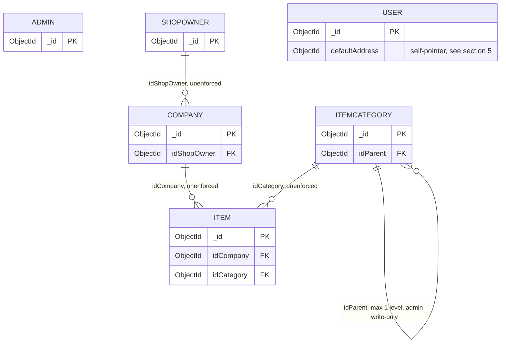

# Data Model — ERD
# Marketplace

**Status:** baselined - brownfield retrofit
**Version:** 1.6
**Date:** 2026-08-29
**Author:** erd-agent
**Changelog:** v1.0 - initial retrofit; reverse-engineered from the 15-repo working tree.
v1.6 - 2026-08-29: §7 `user` loses `deleted_ttl` — dropped by `20260829000100-user-retire-deleted-ttl.js`, three days after v1.4 recorded it as the only index on this platform that deletes documents. The platform owner reversed the mechanism (ADR-041): the document is permanent and the personal fields are overwritten in place at day 30 by a sweep in the Admin resource service, on `shopOwner` as well as `user`. ⚠️ **The index row and its paragraph are struck rather than deleted**, because v1.4's warning about a database not rebuilt after 2026-08-26 inverts — an unrebuilt database still has the TTL and will destroy accounts the design now keeps, so `db.user.getIndexes()` is still the check and the answer it should give is *no such index*. The destructive-re-registration sentence goes with it (ADR-046: re-registering inside the window restores the account). No field, no validator and no other index changed.
v1.5 - 2026-08-27: §8's first four bullets stop being "not this phase" and become "not ever" — ADR-038 (2026-08-27) puts cart, order, delivery and payment permanently out of scope. The `price` bullet loses its "it arrives with the ordering tier, in one migration" ending, which described a tier that is not coming, and §9 question 3 closes as moot rather than answered.
v1.4 - 2026-08-26: §7 `user` gains `deleted_ttl`, the only index on this platform that deletes documents — thirty days after `userDel` stamps `deleted`, MongoDB removes the account. ⚠️ It also **retracts a claim v1.3 made in this document**: `20260301000300-create-user.js` was described as immutable and untouched, and it is neither as of 2026-08-26 — the owner chose to edit the create migration and rebuild the database rather than add a follow-up one, so the note beside `tbl_active_registeredAt` is corrected rather than left standing.
v1.3 - 2026-08-25: §7 `user` gains `tbl_active_registeredAt`, added by E19-S01 in a new migration so the operator's customers table pages on an index instead of a collection scan. Why it is one index where `shopOwner` has four is written down beside it: the other three sort fields are randomly encrypted on this collection.
v1.2 - 2026-08-25: the `itemCategory` note said the other three tiers never write the collection. They write no domain field of it; the ShopOwner tier writes `__v`, via `holdItemCategory`, to make an item write collide with a concurrent `itemCategoryDel`. Restated, DCON-05 having been restated the same way.
v1.1 - 2026-08-12: E03-S08. `personalData` left `shopOwner`'s doc-level `required` list, so §3.2's rows,
its `required` excerpt and the `waitApprov` description all move, and §4 counts three divergences from
`user` rather than four.
**Depends on:** [`CLAUDE.md`](../../../CLAUDE.md) (parent workspace) ✅ · [`docs/devprotocol/phase2/UBIQUITOUS_LANGUAGE.md`](../phase2/UBIQUITOUS_LANGUAGE.md) ✅ · [`docs/devprotocol/phase3/CONSTRAINTS.md`](../phase3/CONSTRAINTS.md) ✅ · [`docs/devprotocol/phase4/CONSTRAINTS.md`](./CONSTRAINTS.md) ✅

---

## 1. Purpose

6 MongoDB collections back this platform. No more, no fewer — DCON in [`docs/devprotocol/phase4/CONSTRAINTS.md`](./CONSTRAINTS.md) §6 pins the count at 6, forbids a 7th this phase. Doc below = field-by-field truth of every collection, sourced from the `$jsonSchema` validators in `BEs/marketplace-db-setup/lib/schemas/` — those builders ARE the schema, ahead of any mongoose model (DCON-01). Physical model, not abstract — nothing at the database level enforces a relationship, so every line below names which validator or which resolver-level guard function stands in for one. Prescriptive: state what platform requires, not narrate what code happens to do.

Ownership chain fixed, source [`docs/devprotocol/phase4/CONSTRAINTS.md`](./CONSTRAINTS.md) §4 + parent [`docs/data-model.md`](../../data-model.md) — do not redraw differently.

---

## 2. Ownership chain — ERD diagram



`ADMIN` and `USER` carry no relationship line on purpose. `admin` owns nothing, is owned by nothing — an operator sits outside the chain entirely. `user` owns only the `addresses[]` embedded inside its own document — not a chain link, a value-object list on the `User` aggregate. Drawing either as parent/child of `shopOwner` / `company` / `item` is wrong per [`docs/devprotocol/phase4/CONSTRAINTS.md`](./CONSTRAINTS.md) §4.

`itemCategory ──idParent──> itemCategory` is capped at **one level** — a document whose `idParent` names a subcategory is the one shape the collection must never hold. The cap lives in a resolver guard (`throwIfParentNotTopLevel`, section 6), not in this diagram's relationship and not in the `$jsonSchema` — `$jsonSchema` reads one document at a time and cannot see whether a sibling document's own `idParent` is set.

---

## 3. Entities

Six collections = six aggregate roots, each with its own `_id`. Every validator is `bsonType: 'object'`, `additionalProperties: false` — **an undeclared field on a write is REJECTED, not silently dropped** (DCON-02, `BEs/marketplace-db-setup/lib/schemas/item.js`). Soft delete everywhere is a `deleted` date field set once, never a hard remove (DCON-03).

### 3.1 `admin`

Source: `BEs/marketplace-db-setup/lib/schemas/admin.js`, called by `migrations/20260301000000-create-admin.js`. Login/reset-password/deleted/disabled sub-shapes shared from `BEs/marketplace-db-setup/lib/schemas/account.js`.

| Field | Type | Required | Constraints | Meaning |
|---|---|---|---|---|
| `_id` | ObjectId | yes (implicit) | — | primary key |
| `login.email` | string | yes | maxLength 250 | login credential |
| `login.password` | string | yes | exactly 60 chars | bcrypt hash (`$2y$14$…`, `SALT_ROUNDS=14`) |
| `login.firstLogin` | date | no | — | set on first successful login |
| `login.lastLogin` | date | no | — | set on every successful login |
| `login.onboardingStep` | string | no | maxLength 4 | shared `LOGIN` shape field; read by ShopOwner tier only, inert here |
| `login.onboardingDone` | bool | no | — | shared `LOGIN` shape field; inert here |
| `login.rememberMe` | bool | no | — | the operator's last "remember me" choice, stored for the form. The lifetime it decides is `sessionCapDays`, resolved from the login mutation's own argument and stamped into the refresh session at sign-in (E14-S07) — this field is not read at login and does not lengthen or shorten a session already running |
| `personalData.firstName` | string | yes | maxLength 100 | operator's first name |
| `personalData.lastName` | string | yes | maxLength 100 | operator's last name |
| `deleted` | date | no | — | soft-delete stamp; `deleted: {$exists:false}` = live |
| `disabled` | bool | no | — | present + true blocks login |
| `resetPwd.resetDateReq` | date | yes if `resetPwd` present | — | password-reset request timestamp |
| `resetPwd.resetHash` | string | yes if `resetPwd` present | exactly 50 chars | comparison hash for the reset link |
| `__v` | int | no | — | mongoose `versionKey` compatibility slot |

Doc-level `required`: `login`, `personalData`. **No `waitApprov`, no `emailVerify`, no `registeredAt`** — an admin account is created by hand, never self-registers, never needs an approval gate or an email-confirmation flow (`BEs/marketplace-db-setup/migrations/20260301000000-create-admin.js`).

```js
// BEs/marketplace-db-setup/migrations/20260301000000-create-admin.js
required: [
  'login',
  'personalData'
],
```

### 3.2 `shopOwner`

Source: `BEs/marketplace-db-setup/lib/schemas/shopOwner.js`, called once by `migrations/20260301000100-create-shopOwner.js`. The collection is created in its final shape — `emailVerify`, the address `position` and the operator `notes` included — so there is one validator here, not a chain of `collMod`s to read in order.

| Field | Type | Required | Constraints | Meaning |
|---|---|---|---|---|
| `_id` | ObjectId | yes | — | primary key |
| `login.email` | string | yes | maxLength 250 | login credential |
| `login.password` | string | yes | exactly 60 chars | bcrypt hash |
| `login.firstLogin` / `login.lastLogin` | date | no | — | login timestamps |
| `login.onboardingStep` | string | no | maxLength 4 | onboarding wizard step |
| `login.onboardingDone` | bool | no | — | onboarding wizard complete |
| `login.rememberMe` | bool | no | — | the owner's last "remember me" choice, stored for the form and editable by an Admin through `shopOwnerUpdatePreferences`. **Not a revocation control:** the lifetime it names is `sessionCapDays`, resolved from the login mutation's own argument and stamped into the refresh session at sign-in (E14-S07), so an Admin toggling it moves no live session — it changes what the next login defaults to |
| `personalData` | object | **no** — whole sub-doc optional since 2026-08-12 | — | absent on a self-registered seller until onboarding fills it in; `shopOwnerAdd` still demands the whole block, which is a rule of that mutation and not of the collection |
| `personalData.firstName` / `.lastName` | string | yes if `personalData` present | maxLength 100 each | owner's name |
| `personalData.birth.date` | date | yes if `personalData` present | — | date of birth |
| `personalData.address.street` | string | yes if `personalData` present | maxLength 250 | home address |
| `personalData.address.postalCode` | string | yes if `personalData` present | exactly 5 chars | — |
| `personalData.address.city` | string | yes if `personalData` present | maxLength 100 | — |
| `personalData.address.province` | string | yes if `personalData` present | exactly 2 chars | — |
| `personalData.address.position` | object | no | GeoJSON Point, tuple `[lng,lat]`, each axis `['double','int','long']` bounded ±180/±90 | optional — no `2dsphere` index, fills in from the operator app's autocomplete |
| `personalData.contacts.mobile` | string | yes if `personalData` present | maxLength 12 | — |
| `personalData.contacts.landline` | string | no | maxLength 12 | — |
| `personalData.contacts.email` | string | yes if `personalData` present | maxLength 250 | second contact address, distinct from `login.email` |
| `registeredAt` | date | yes | — | sign-up date |
| `deleted` | date | no | — | soft-delete stamp |
| `disabled` | bool | no | — | present + true blocks login |
| `waitApprov` | bool | no | — | present + true = this account may not log in until an operator approves it. Written `true` by `shopOwnerRegister` (a stranger signed themselves up) and by `shopOwnerUpdateStatus` (an operator parked an existing account); `$unset` on approval, so the field is truthy-or-absent and never `false`. Absent on every Admin-provisioned account — `shopOwnerAdd` does not write it |
| `notes` | string | no | maxLength 2000 | operator-written note; `marketplace-dev-authenticated-*` never loads this model field, so it cannot leak to the shop owner |
| `resetPwd.resetDateReq` / `.resetHash` | date / string | yes if sub-doc present | exactly 50 chars for hash | password reset slot |
| `emailVerify.*` | object | no (no required members) | see `account.js:96-125` | verify-email slot, koa-utils flow |
| `__v` | int | no | — | versionKey |

Doc-level `required`: `login`, `registeredAt`. ⚠️ **`personalData` was on that list until 2026-08-12** and left it with E03-S08: `shopOwnerRegister` takes an email and a password and nothing else, so a required block would have made the public form impossible to satisfy. Inside the sub-document nothing relaxed — it is still all-or-nothing once present, which is what keeps "half a registry entry" unwritable.

```js
// BEs/marketplace-db-setup/lib/schemas/shopOwner.js
required: [
  'login',
  'registeredAt'
],
```

### 3.3 `company`

Source: `BEs/marketplace-db-setup/lib/schemas/company.js`. **A company IS the shop** — no `shop` collection exists or will (`docs/devprotocol/phase4/CONSTRAINTS.md` §4). One validator, carrying the legal fields and the storefront fields together, called once by `migrations/20260301000200-create-company.js`.

| Field | Type | Required | Constraints | Meaning |
|---|---|---|---|---|
| `_id` | ObjectId | yes | — | primary key |
| `idShopOwner` | ObjectId | yes | — | FK to `shopOwner`, unenforced (section 6) |
| `legalName` | string | yes | maxLength 100 | registered name including legal form, never shown to a customer |
| `vatNumber` | string | yes | exactly 11 chars | VAT registration number, globally unique |
| `taxCode` | string | no | exactly 11 chars | tax code of the legal entity — the 11-char company form, not the 16-char personal one |
| `contactPerson` | string | yes | maxLength 50 | — |
| `administrator` | string | yes | maxLength 50 | — |
| `uniqueCode` | string | no | exactly 7 chars | — |
| `certifiedEmail` | string | yes | maxLength 250 | legally-binding certified mailbox, globally unique |
| `address.street` | string | yes | maxLength 100 | registered seat |
| `address.postalCode` | string | yes | exactly 5 | — |
| `address.city` | string | yes | maxLength 100 | — |
| `address.province` | string | yes | exactly 2 | — |
| `address.position` | object | **yes** | GeoJSON Point, tuple `[lng,lat]` | required here, unlike `shopOwner`'s — this is what the map and "shops near me" run on |
| `registryExtract` | string | yes | maxLength 1000 | business-register extract, a file **path**, not the file itself |
| `publicName` | string | schema-optional, required-in-practice when `published` | maxLength 100 | trading name shown to customers, never `legalName` |
| `slug` | string | schema-optional, required-in-practice when `published` | minLength 2, maxLength 120, pattern `^[a-z0-9]+(?:-[a-z0-9]+)*$` | URL segment of `/shop/:slug` |
| `description` | string | no | maxLength 2000 | shop page body, text-search target |
| `published` | bool | **yes** | — | false until the owner puts the shop live; every public read filters on it |
| `deleted` | date | no | — | soft-delete stamp; `companyDel` sets this and nothing else |
| `__v` | int | no | — | versionKey |

Doc-level `required`: `idShopOwner`, `legalName`, `vatNumber`, `contactPerson`, `administrator`, `certifiedEmail`, `registryExtract`, `address`, `published`. Validator is `$and: [$jsonSchema, $expr]` — see the `PUBLISHED_IMPLIES_LINKABLE` rule in section 6.

```js
// BEs/marketplace-db-setup/lib/schemas/company.js — published ⇒ slug + publicName
const PUBLISHED_IMPLIES_LINKABLE = {
  $expr: {
    $or: [
      { $ne: ['$published', true] },
      { $and: [
          { $eq: [{ $type: '$slug' }, 'string'] },
          { $eq: [{ $type: '$publicName' }, 'string'] }
      ] }
    ]
  }
};
```

### 3.4 `user`

Source: `BEs/marketplace-db-setup/lib/schemas/user.js`. Mirrors `shopOwner` — same three-collection login pattern (DCON-09: tier = which collection you authenticate against, never a `role` field) — with four deliberate divergences, detailed in section 4.

| Field | Type | Required | Constraints | Meaning |
|---|---|---|---|---|
| `_id` | ObjectId | yes | — | primary key |
| `login.email` | string | yes | maxLength 250 | login credential |
| `login.password` | string | yes | exactly 60 chars | bcrypt hash |
| `login.firstLogin` / `.lastLogin` | date | no | — | login timestamps |
| `login.onboardingStep` / `.onboardingDone` | string / bool | no | maxLength 4 for the string | shared `LOGIN` shape field; inert here |
| `login.rememberMe` | bool | no | — | the customer's last "remember me" choice, stored for the form. The lifetime it decides is `sessionCapDays`, resolved from the login mutation's own argument and stamped into the refresh session at sign-in (E14-S07) — this field is not read at login and does not lengthen or shorten a session already running |
| `personalData` | object | **no** — whole sub-doc optional | — | filled in after email confirmation, not at registration |
| `personalData.firstName` / `.lastName` | string | yes if `personalData` present | maxLength 100 each | — |
| `personalData.birth.date` | date | no | — | — |
| `personalData.contacts.mobile` / `.landline` / `.email` | string | no, none of the three | maxLength 12 / 12 / 250 | a second contact address — `login.email` is already the credential |
| `addresses` | array | no | items = `addressItem()`, see below | every address this customer saved |
| `addresses[]._id` | ObjectId | **yes** (per element) | — | required so `defaultAddress` has something to point at |
| `addresses[].label` | string | no | maxLength 50 | free text, e.g. "home", "office" |
| `addresses[].street` | string | yes | maxLength 250 | — |
| `addresses[].postalCode` | string | yes | exactly 5 | — |
| `addresses[].city` | string | yes | maxLength 100 | — |
| `addresses[].province` | string | yes | exactly 2 | — |
| `addresses[].position` | object | no | GeoJSON Point tuple | fills in from geocoder autocomplete |
| `defaultAddress` | ObjectId | no | must be absent or equal to some `addresses[]._id` — enforced by `$expr`, section 5 | pointer to the chosen delivery address |
| `registeredAt` | date | yes | — | sign-up date |
| `deleted` | date | no | — | soft-delete stamp |
| `disabled` | bool | no | — | present + true blocks login |
| `resetPwd.*` | object | no | same shape as `admin`/`shopOwner` | password reset slot |
| `emailVerify.*` | object | no | same shape, koa-utils flow | verify-email slot |
| `__v` | int | no | — | versionKey |

Doc-level `required`: `login`, `registeredAt` only. **No `waitApprov`** anywhere in this collection.

### 3.5 `item`

Source: `BEs/marketplace-db-setup/lib/schemas/item.js`. Bottom of the ownership chain, what a shop sells. **The extension seam** — a new product type is an `itemCategory` document, not a new collection (`BEs/marketplace-db-setup/lib/schemas/item.js`).

| Field | Type | Required | Constraints | Meaning |
|---|---|---|---|---|
| `_id` | ObjectId | yes | — | primary key |
| `idCompany` | ObjectId | yes | — | FK to `company` — the shop that sells this, unenforced |
| `idCategory` | ObjectId | yes | — | FK to `itemCategory`, either level, unenforced |
| `name` | string | yes | maxLength 150 | — |
| `description` | string | yes | maxLength 2000 | — |
| `slug` | string | yes | minLength 2, maxLength 160, pattern `^[a-z0-9]+(?:-[a-z0-9]+)*$` | URL segment of `/shop/:slug/item/:itemSlug` — unique **per company**, not globally |
| `published` | bool | yes | — | false = draft; a public read also requires the parent `company.published` to be true |
| `deleted` | date | no | — | soft-delete stamp |
| `__v` | int | no | — | versionKey |

Doc-level `required`: `idCompany`, `idCategory`, `name`, `description`, `slug`, `published`. **No `price` field, anywhere** — deliberate, see section 8.

```js
// BEs/marketplace-db-setup/lib/schemas/item.js
required: [
  'idCompany',
  'idCategory',
  'name',
  'description',
  'slug',
  'published'
],
```

### 3.6 `itemCategory`

Source: `BEs/marketplace-db-setup/lib/schemas/itemCategory.js`. Platform-wide taxonomy, two levels, no `idShopOwner` — two shops selling the same kind of thing land in the same category or the customer-facing filter means nothing.

| Field | Type | Required | Constraints | Meaning |
|---|---|---|---|---|
| `_id` | ObjectId | yes | — | primary key |
| `name` | string | yes | maxLength 100 | — |
| `slug` | string | yes | minLength 2, maxLength 120, pattern `^[a-z0-9]+(?:-[a-z0-9]+)*$` | URL segment of `/category/:slug`, unique **across both levels** |
| `idParent` | ObjectId | no | self-FK, unenforced | absent = top-level category; present = subcategory |
| `position` | int | yes | minimum 0 | **sort ordinal** — not GeoJSON, shares a name with `geo.js`'s point and nothing else |
| `deleted` | date | no | — | soft-delete stamp; a category is never hard-deleted because `item.idCategory` is required and nothing stops a dangling reference |
| `__v` | int | no | — | versionKey |

Doc-level `required`: `name`, `slug`, `position`. **Every mutation on this collection lives in the Admin resource service** (`BEs/dev/marketplace-dev-admin-authenticated-resource`) — ShopOwner, User and public tiers read it (DCON-05). ⚠️ **One deliberate exception, one field:** `holdItemCategory` on the ShopOwner tier `$inc`s `__v` on a category inside every `itemAdd`/`itemUpdate` transaction, so an item write and a concurrent `itemCategoryDel` collide instead of skewing past each other. It reaches no domain field and no `idParent`, so the depth cap keeps exactly one enforcement point (ADR-012).

```js
// BEs/marketplace-db-setup/lib/schemas/itemCategory.js
idParent: {
  bsonType: 'objectId',
  description: 'absent = top-level category; present = subcategory. Depth beyond 2 is refused by the resolver'
},
```

---

## 4. `user`'s three divergences from `shopOwner`

Both collections share `login`, `resetPwd`, `emailVerify`, `deleted`/`disabled` from `BEs/marketplace-db-setup/lib/schemas/account.js` — role on this platform is which collection you authenticate against, not a field (DCON-09). Three fields diverge, all argued at `BEs/marketplace-db-setup/lib/schemas/user.js`, none an accident to "fix":

| # | Divergence | `shopOwner` | `user` | Why |
|---|---|---|---|---|
| 1 | address storage | one `personalData.address` object | `addresses[]` array, each element with required `_id` | a customer has a home, an office, a friend's flat; a shop owner has one residence |
| 2 | `waitApprov` | present, operator approval gate | **absent entirely** | a customer self-serves with nothing to approve; the only gate is email confirmation (`loginUser` checks `emailVerify.valid`). A shop owner who self-serves carries both gates, one an Admin created carries neither |
| 3 | `defaultAddress` | no counterpart | top-level `ObjectId` pointer into `addresses[]._id` | see section 5 |

⚠️ **`personalData` was the fourth until 2026-08-12** and is not a divergence any more: it left `shopOwner`'s doc-level `required` list with E03-S08, so both collections now register an email and a password and collect the rest later. What still differs is what "later" means — a customer may never fill it in and can still order, a shop owner is walked through onboarding before they can sell.

A fourth, smaller divergence: `shopOwner.personalData.contacts` requires `mobile` and `email`; `user.personalData.contacts` requires none of its members — `login.email` is already the credential, so demanding a duplicate contact email is asking the customer to retype what they already gave (`BEs/marketplace-db-setup/lib/schemas/user.js`).

---

## 5. The `defaultAddress` invariant

"At most one default address" is a **shape**, not a rule the app has to remember to check. Original design considered a boolean `default` per array element; adopted design is a single top-level `defaultAddress` ObjectId pointing into `addresses[]._id`. A boolean can represent two defaults (or zero) at once and every write path would have to clear-then-set with a window between the two steps; a pointer cannot represent a second default at all — setting one is one atomic `$set`.

The one failure a pointer *can* have is dangling, and that is checkable. `user`'s validator is therefore `$and: [{$jsonSchema}, {$expr}]`, not a bare `$jsonSchema` — a collection validator accepts any query expression, and `$jsonSchema` is only one operator inside it:

```js
// BEs/marketplace-db-setup/lib/schemas/user.js
const DEFAULT_ADDRESS_POINTS_INTO_ADDRESSES = {
  $expr: {
    $or: [
      { $eq: [{ $type: '$defaultAddress' }, 'missing'] },
      {
        $in: [
          '$defaultAddress',
          { $map: { input: { $ifNull: ['$addresses', []] }, in: '$$this._id' } }
        ]
      }
    ]
  }
};
```

`defaultAddress` is accepted only if **missing**, or **present in `$map` over `addresses`**. The `$ifNull: ['$addresses', []]` is load-bearing, not defensive filler: `addresses` is optional at doc level, `$map` over a missing field returns `null`, and `$in` against a `null` array **errors** rather than returning `false` — without the `$ifNull`, a brand-new customer with no `addresses` yet would be unable to write their own document at all.

⚠️ **Deleting the default address must `$unset` `defaultAddress` in the same update.** If it doesn't, the write is rejected by MongoDB at the validator, not by an application code path someone forgot to call. ⚠️ **Anything that ever replaces `user`'s validator must restate both clauses of the `$and`.** A validator is set wholesale, never merged — passing the `$jsonSchema` half alone silently drops the `$expr` half, and nothing fails until a dangling pointer is written and read back. `validatorUser()` returns the pair and nothing else, so there is no way to get half of it.

Cost, recorded so it is not re-litigated: reading "is this address the default?" is a comparison against a sibling field (`address._id === user.defaultAddress`) rather than a local boolean — any API wanting a boolean derives it at the read edge.

---

## 6. Reference integrity — unenforced FKs and their guards

MongoDB has no foreign-key constraint of any kind. Every arrow in the section-2 diagram is an ObjectId with nothing behind it at the database layer except the two `$expr` cross-field checks above and below. A missing guard is a finding below, not something papered over.

| Relationship | FK field | DB-enforced? | Guard | Source |
|---|---|---|---|---|
| `shopOwner` → `company` | `company.idShopOwner` | No | `throwIfShopOwnerDontOwnCompany` — refuses an `idCompany` the calling session does not hold | `BEs/dev/marketplace-dev-authenticated-resource/src/lib/company/throwIfShopOwnerDontOwnCompany.mts` |
| `company` → `item` | `item.idCompany` | No | same `throwIfShopOwnerDontOwnCompany`, called from `itemAdd` before the write — an owner cannot stock a company the session does not own | `BEs/dev/marketplace-dev-authenticated-resource/src/graphQLApi/schema/mutations/itemAdd.mts:5,40` |
| `itemCategory` → `item` | `item.idCategory` | No | `throwIfItemCategoryMissing` — refuses a category id that does not resolve to a document | `BEs/dev/marketplace-dev-authenticated-resource/src/graphQLApi/schema/mutations/itemAdd.mts:7,41` (imports `@lib/item/throwIfItemCategoryMissing.mjs`) |
| `itemCategory` → `itemCategory` (`idParent`) | `itemCategory.idParent` | No — and a `$jsonSchema` structurally cannot check this: it reads a sibling document | `throwIfParentNotTopLevel` — called only when `idParent` is sent, refuses a parent that is itself a subcategory | `BEs/dev/marketplace-dev-admin-authenticated-resource/src/lib/itemCategory/funItemCategoryAdd.mts:2,24` (imports `@lib/itemCategory/throwIfParentNotTopLevel.mjs`) |
| `user.defaultAddress` → `user.addresses[]._id` | intra-document | **Yes** — the one reference MongoDB itself checks | `$expr` `DEFAULT_ADDRESS_POINTS_INTO_ADDRESSES` | `BEs/marketplace-db-setup/lib/schemas/user.js` |
| `company.published` ⇒ `slug` + `publicName` present | not an FK, a cross-field invariant | **Yes** | `$expr` `PUBLISHED_IMPLIES_LINKABLE` | `BEs/marketplace-db-setup/lib/schemas/company.js` |

The write-path guards (rows 1–4) are Admin/ShopOwner **resource-service application code**, never the collection validator — `$jsonSchema` cannot see across documents (DCON-01/DCON-05). The database-enforced rows (5–6) are both **intra-document** `$expr` clauses; that is the only kind of cross-reference a MongoDB validator can check, which is exactly why cross-collection FKs (rows 1–4) need a named guard function instead.

`company.idShopOwner` itself has no existence guard on `company` creation beyond the caller being an authenticated `shopOwner` session — `companyAdd` trusts `ctx.state.user._id` as the value, which cannot dangle by construction rather than by check (`BEs/dev/marketplace-dev-authenticated-resource/src/graphQLApi/schema/mutations/companyAdd.mts`).

---

## 7. Indexes

Not tuning — part of the design. The public catalogue is read by anonymous traffic at scale; a listing sorted without a supporting index is a blocking in-memory `SORT`, capped at 32 MB, that fails outright past the cap (`QueryExceededMemoryLimitNoDiskUseAllowed`) rather than degrading. Verify any geo query with `.explain()`, expect `IXSCAN` on the `2dsphere` field, never `COLLSCAN`.

### `admin`

| Index | Keys | Serves | Source |
|---|---|---|---|
| `login.email_unique` | `{'login.email':1}`, unique | login credential lookup | `BEs/marketplace-db-setup/lib/schemas/account.js` (`INDEXES_LOGIN_EMAIL`), applied by `20260301000000-create-admin.js` |

### `shopOwner`

| Index | Keys | Serves | Source |
|---|---|---|---|
| `login.email_unique` | `{'login.email':1}`, unique | login credential lookup | `account.js` `INDEXES_LOGIN_EMAIL`, `20260301000100-create-shopOwner.js` |
| `tbl_active_registeredAt` | `{deleted:1,disabled:1,registeredAt:-1,_id:-1}` | `shopOwnersActiveTbl` default sort — ESR order, `_id` tiebreak makes offset pagination deterministic over a non-unique sort key | `20260301000100-create-shopOwner.js` |
| `tbl_active_lastName_firstName` | `{deleted:1,disabled:1,'personalData.lastName':1,'personalData.firstName':1,_id:1}` | `sortBy: LAST_NAME`, firstName as tie-breaker | same |
| `tbl_active_firstName` | `{deleted:1,disabled:1,'personalData.firstName':1,_id:1}` | `sortBy: FIRST_NAME` | same |
| `tbl_active_city` | `{deleted:1,disabled:1,'personalData.address.city':1,_id:1}` | `sortBy: CITY` | same |
| `registeredAt_series` | `{registeredAt:1}`, plain, no compound | `shopOwnersPerPeriod` chart aggregation (`$match` range + `$group` by day/month) — deliberately does **not** filter `deleted`/`disabled`, so it cannot reuse `tbl_active_registeredAt`'s leading keys | `20260301000100-create-shopOwner.js` |

⚠️ `search` on this collection is **deliberately not indexed** — the resolver's case-insensitive prefix regex (`/^term/i`) disqualifies index use regardless (the `i` flag rules out the scan, and `$regex` ignores collation), and the cardinality is shop owners, not the ~50k-scale end-customer collection. Revisit if `shopOwner` reaches six figures (`BEs/marketplace-db-setup/migrations/20260301000100-create-shopOwner.js`).

### `company`

| Index | Keys | Serves | Source |
|---|---|---|---|
| `vatNumber_unique` | `{vatNumber:1}`, unique, **global, no `partialFilterExpression`** | one VAT number = one company, ever — a soft-deleted company keeps the slot occupied (DCON-04) | `20260301000200-create-company.js` |
| `certifiedEmail_unique` | `{certifiedEmail:1}`, unique, global | same reasoning for *PEC* | same |
| `idShopOwner_list` | `{idShopOwner:1}`, non-unique | "my companies" list | same |
| `slug_unique` | `{slug:1}`, unique, **partial** on `{slug:{$type:'string'}}` | `/shop/:slug` — partial avoids treating every pre-migration slugless document as one colliding null key | `20260301000200-create-company.js` |
| `address.position_2dsphere` | 2dsphere on `address.position` | the map, "shops near me" — `companiesNearby` **is** this query | same |
| `published_list` | `{published:1,deleted:1}` | the two equality predicates every public read carries | same |
| `published_publicName` | `{published:1,deleted:1,publicName:1}` | `/shops` listing sorted by `publicName` | `20260301000200-create-company.js` |
| `published_city_publicName` | `{published:1,deleted:1,'address.city':1,publicName:1}` | `/shops/:city` listing | same |
| `search_text` | text index, weights `publicName:10, description:1`, `default_language:'english'` | company half of platform-wide `search` | same |

`published_list` is a prefix of `published_publicName` and is **left installed anyway** — `company` is written a handful of times per shop, so the spare index is cheap and dropping it is a separate audit (contrast with `item` below, which drops its superseded pair).

### `item`

| Index | Serves | Source |
|---|---|---|
| `idCompany_list` | owner's own catalogue (`companyItems`, ShopOwner + Admin tiers) | `20260301000500-create-item.js` |
| `idCompany_slug_unique` | enforces the per-company unique slug; doubles as the item-page lookup `(idCompany, slug)` | same |
| `idCompany_published_name` | public shop page listing, sorted by `name` — **supersedes** a 3-key `idCompany_published` from the same create migration | `20260301000500-create-item.js` |
| `idCategory_published_name` | category browse, the widest fan-out on the platform — **supersedes** `idCategory_published` | same |
| `search_text` | platform-wide item search, weights `name:10, description:1`, `default_language:'english'` | `20260301000500-create-item.js` |

The two `_name` indexes replaced 3-key predecessors that omitted `name` — both listings sort by `name`, and neither original index covered the sort, forcing a blocking in-memory `SORT`. Measured on 100 000 items in one category: 100 000 keys / 100 000 docs scanned / 170 ms before → 24 keys / 24 docs / 3 ms after. Unlike `company.published_list`, the superseded pair was **dropped**, not left installed: `item` is the write-heavy collection of the three (a shop owner edits a catalogue continuously, not a one-time registration), so the redundant index costs more here.

⚠️ `search_text` is **not compound with `idCompany`** — MongoDB requires an equality predicate on every non-text prefix key of a compound text index, so scoping it to one company would make platform-wide search unable to use it at all; per-shop search filters after the text match. **No `2dsphere` on `item`** — an item is located at its shop, so "items near me" resolves through `company.address.position_2dsphere`; a copied point on `item` would go stale the moment the shop's address changes.

### `itemCategory`

| Index | Keys | Serves | Source |
|---|---|---|---|
| `slug_unique` | `{slug:1}`, unique, global | `/category/:slug` and `/category/:slug/:subSlug` resolve through one flat URL space across both levels | `20260301000400-create-itemCategory.js` |
| `idParent_position` | compound on `idParent` + the sort ordinal `position` | the two listing reads: top-level categories, and subcategories under one parent, both in display order | same |

### `user`

| Index | Keys | Serves | Source |
|---|---|---|---|
| `login.email_unique` | `{'login.email':1}`, unique | login credential, from the shared `INDEXES_LOGIN_EMAIL` | `account.js`, applied by `20260301000300-create-user.js` |
| `tbl_active_registeredAt` | `{deleted:1,disabled:1,registeredAt:-1,_id:-1}` | `usersActiveTbl` — the operator's customers table, same ESR order and `_id` tiebreak as its `shopOwner` namesake, so a page boundary cannot repeat or skip a row | `20260825000000-user-add-tbl-active-index.js` — a **new** migration, which was the rule this repo follows |
| ~~`deleted_ttl`~~ **— dropped 2026-08-29** by `20260829000100-user-retire-deleted-ttl.js` (ADR-041), so no live database carries it; `INDEXES_USER` still declares it because the create migration reading that constant is immutable, and `test/migrations.test.mjs` asserts the end state instead. What it used to be: `{deleted:1}`, `expireAfterSeconds: 2592000` | the retention purge — thirty days after `userDel` stamps `deleted`, MongoDB's TTL monitor removes the document, its `personalData` and its `addresses` (`phase1/NFR.md` open question 6, GDPR Art. 5(1)(e)) | `lib/schemas/user.js` (`INDEXES_USER`), applied by `20260301000300-create-user.js` — ⚠️ **that migration was edited after it had been applied**, on the owner's call, and the database rebuilt in the same work |

⚠️ **`user` has one `tbl_active_*` index where `shopOwner` has four, and that is the whole design.** The other three sort `shopOwner` by last name, first name and city; on `user` those three fields are randomly encrypted (ADR-029), so an index over them would order ciphertext — stable, arbitrary, and indistinguishable from a working sort. `registeredAt` is clear, so it is the only sortable column the customers table has and `UsersTblSortField` has exactly one member (`phase5/epics/E19.md` E19-S05). There is no `registeredAt_series` counterpart either: no `usersPerPeriod` chart exists to need one.

⚠️ **Superseded 2026-08-29 — the paragraph below describes an index this collection no longer has, and is
kept only so the reversal is legible.** Retention is now a day-30 **overwrite in place** run by
`retentionSweep.mts` in `marketplace-dev-admin-authenticated-resource`, on `user` and `shopOwner` alike, and
the document survives it permanently (ADR-041). The final sentence is wrong twice over: re-registering inside
the thirty days now **restores** the account rather than destroying it (ADR-046), and the platform has no
application hard delete at all.

~~⚠️ **`deleted_ttl` is what makes `userDel` an erasure rather than a flag, and it is `user`'s alone.**~~
`funUserDel` stamps `deleted`, revokes every session and writes nothing else, so without the index the
record and its `login.email_unique` entry would stand for ever and the person who closed the account could
never register that address again. Three things about its shape are not free choices: it is **single-field**
because `expireAfterSeconds` is refused on a compound index, so it stands beside `tbl_active_registeredAt`
rather than riding on it even though that index already leads with `deleted` — read as duplicates and
merged, the purge disappears; it reads `deleted` only because that field is **not** in
`ENCRYPTED_FIELDS_USER` (ADR-029), a `binData` never comparing as a date; and it is declared in
`INDEXES_USER` rather than on the shared `INDEXES_LOGIN_EMAIL`, which would destroy `admin` and
`shopOwner` accounts thirty days after an operator disabled them. On this collection `deleted` is
therefore a destruction clock rather than a status. ⚠️ Because the create migration was edited in place and
`migrate-mongo-config.js` sets `useFileHash: false`, **a database not rebuilt on or after 2026-08-26 has no
`deleted_ttl` and its changelog will not say so** — `db.user.getIndexes()` is the check. Re-registering a
closed address destroys the document at once instead of waiting out the thirty days, the platform's one
application hard delete (ADR-011 §Amendment 2026-08-26).

No `2dsphere` over `addresses[].position` — nothing on the platform queries customers by distance.

---

## 8. What this model does NOT include

Out of scope for this phase, per [`docs/devprotocol/phase4/CONSTRAINTS.md`](./CONSTRAINTS.md) §6 — named here only so nobody goes looking for a shape that does not exist, never designed.

⚠️ **The first four are out of scope permanently, not for this phase** — [ADR-038](../phase3/adr/ADR-038-commerce-is-permanently-out-of-scope.md), 2026-08-27. There is no later phase in which they get a collection, a node in §2's diagram, or a row anywhere in this document:

- **Order** — no collection, no state machine, no resolver, no node in section 2's diagram, no aggregate. Permanently (ADR-038).
- **Cart** — no collection, no node. Permanently (ADR-038).
- **Delivery** — not built and will not be: no collection, no resolver, no design (ADR-038).
- **Payment** — no gateway, no integration, no error taxonomy for a payment failure, and no provider will ever be chosen (ADR-038).
- **`price` on `item`** — deliberately absent, everywhere, not "TODO." A price implies a currency, a precision, a VAT treatment and a discount model, none of which is decided; `Decimal128`, the BSON type a price would need, is a *rejected* write on this platform anyway because it cannot survive `.lean()` into a GraphQL `Float` (`BEs/marketplace-db-setup/lib/schemas/item.js`). It does **not** arrive later: there is no ordering tier to arrive with, and a display-only price was offered to the platform owner and refused on 2026-08-27 (ADR-009 §Note, ADR-038). No migration adds this field.
- **A `shop` collection** — a shop **is** a `company`. There is not going to be a seventh collection for it (`docs/devprotocol/phase4/CONSTRAINTS.md` §4).
- **A `role` field or permission enum**, on any collection — tier = which collection/service the caller hits, never a stored value (DCON-09).
- **A fourth tier** — `admin` / `shopOwner` / `user` stays 3.

---

## 9. Physical storage mapping

| Logical entity | Physical storage | Format | Validator kind |
|---|---|---|---|
| `Admin` | MongoDB collection `admin` | BSON document | `$jsonSchema` only |
| `ShopOwner` | MongoDB collection `shopOwner` | BSON document | `$jsonSchema` only |
| `Company` | MongoDB collection `company` | BSON document | `$and: [$jsonSchema, $expr]` — `PUBLISHED_IMPLIES_LINKABLE` |
| `User` | MongoDB collection `user` | BSON document | `$and: [$jsonSchema, $expr]` — `DEFAULT_ADDRESS_POINTS_INTO_ADDRESSES` |
| `User.addresses[]` | embedded array on the `user` document | BSON sub-documents | validated by the parent's `$jsonSchema` `items` clause — no collection of its own |
| `Item` | MongoDB collection `item` | BSON document | `$jsonSchema` only |
| `ItemCategory` | MongoDB collection `itemCategory` | BSON document | `$jsonSchema` only |

All six live in one database, `dbMarketplaceDev` (dev) / `dbMarketplaceTest` (each repo's own integration copy — see parent [`docs/testing.md`](../../testing.md) §Per-repo integration database). `validationLevel: 'strict'`, `validationAction: 'error'` on every collection (`BEs/marketplace-db-setup/lib/schemas/collection.js`) — a write violating the shape is refused outright, never partially applied.

---

## 10. Open questions

| # | Question | Source of the gap | Status |
|---|---|---|---|
| 1 | `search` on `shopOwner` is unindexed by design at current cardinality — no threshold or alert exists for "collection reached six figures, revisit." | `BEs/marketplace-db-setup/migrations/20260301000100-create-shopOwner.js` | open, no owner |
| 2 | `company.idShopOwner` has no existence guard at `companyAdd` time beyond trusting the authenticated session's own id — correct today because the id cannot be attacker-supplied, but the absence is implicit rather than a named guard the way `throwIfShopOwnerDontOwnCompany` is for reads. | `BEs/dev/marketplace-dev-authenticated-resource/src/graphQLApi/schema/mutations/companyAdd.mts` | flagged, not a defect under current call pattern |
| 3 | ~~Order / Cart / Delivery / Payment collections — genuinely undesigned, not merely undocumented. `item` carries no `price` for exactly this reason.~~ | [`docs/devprotocol/phase4/CONSTRAINTS.md`](./CONSTRAINTS.md) §6, [ADR-038](../phase3/adr/ADR-038-commerce-is-permanently-out-of-scope.md) | **Closed 2026-08-27 — moot, not answered.** The four are permanently out of scope, so there is no undesigned collection waiting on a designer. Nothing to ask about before inventing, because nothing is to be invented |
| 4 | Whether a "genuinely new product type" ever needs a 7th collection (vs. an `itemCategory` document) has no decision procedure beyond "check first" — the bar to clear is undocumented as a checklist. | parent [`docs/data-model.md`](../../data-model.md) | owned by whoever proposes the next product type, not this phase |
