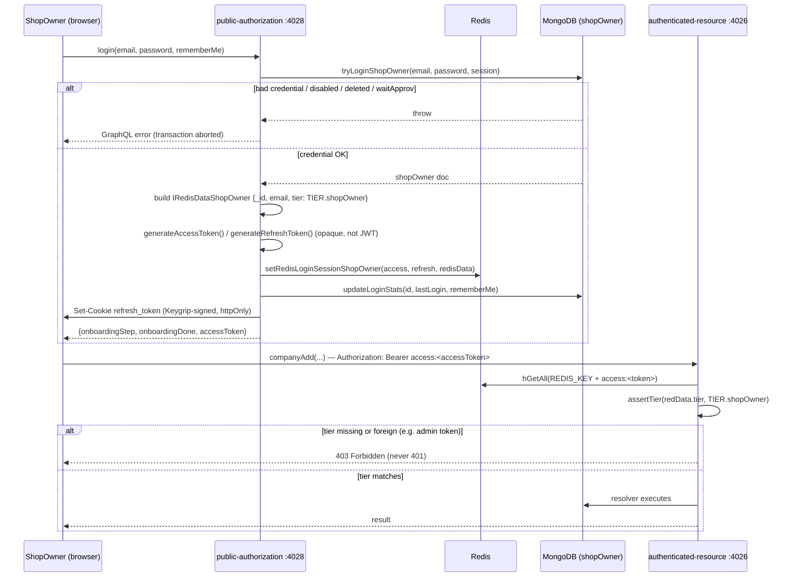
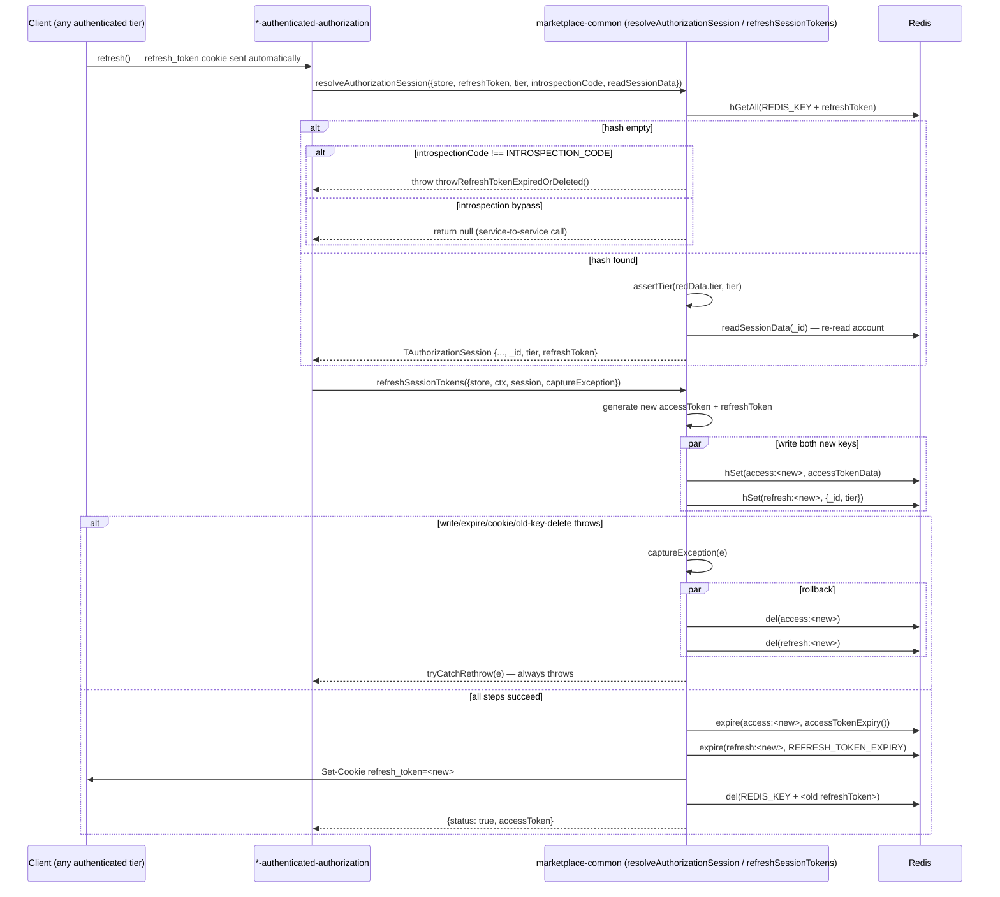
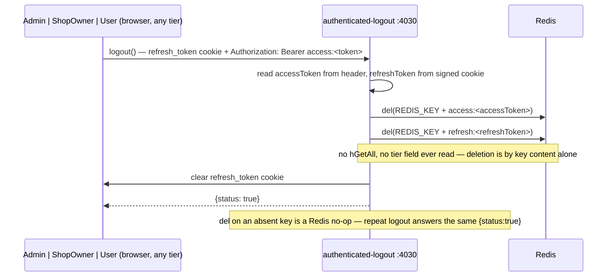
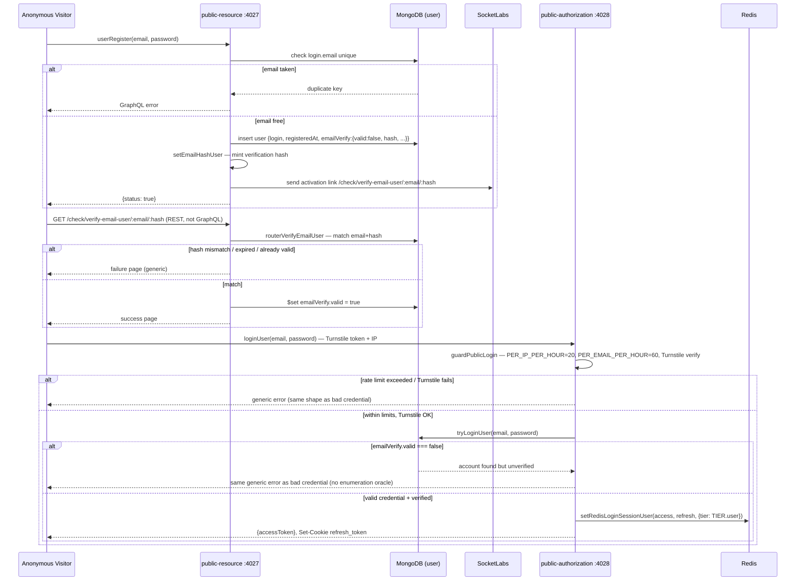
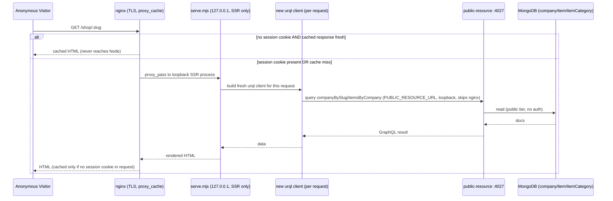
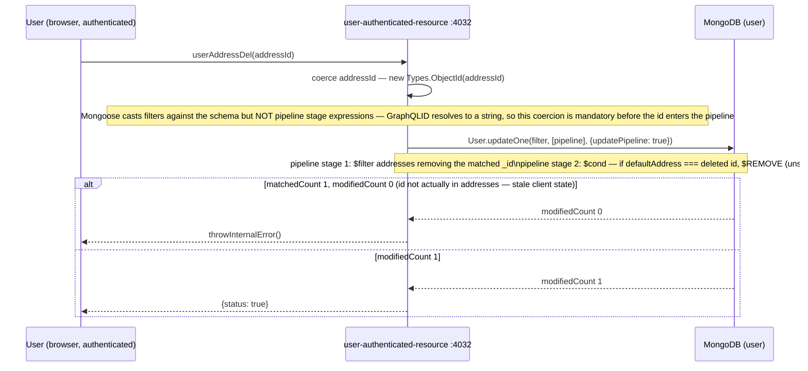
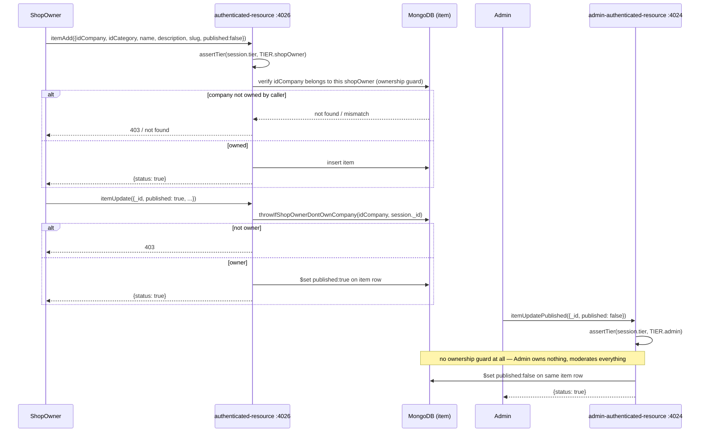

# Sequence Diagrams
# Marketplace

**Status:** baselined - brownfield retrofit
**Version:** 1.0
**Date:** 2026-08-07
**Author:** sequence-agent
**Changelog:** v1.0 - initial retrofit; reverse-engineered from the 15-repo working tree.
**Depends on:** `phase2/EVENT_STORMING.md` ✅ · `phase4/API_CONTRACTS.md` ✅ · `phase2/BOUNDED_CONTEXT.md` ✅ · `phase4/DDD_AGGREGATES.md` ✅ · `phase5/CONSTRAINTS.md` ✅ (binding, §4 Flow rules)
**Mutability:** keep in sync — update when a flow, actor set or branching condition changes.

---

## 1. Purpose

Runtime behaviour of every non-trivial flow on the built portion of the platform. Complex flows (3+
actors, branching, auth) get a full mermaid `sequenceDiagram` plus a numbered narrative, every step cited
to the file that implements it. Linear 2-actor flows with no branching get one paragraph in §2 and a
cross-reference, per `phase5/CONSTRAINTS.md` §4 (Flow rules) and the agent skill's own rule against
diagramming what is already self-evident from `phase4/API_CONTRACTS.md`. Brownfield: every flow below is
BUILT and running unless its heading says PLANNED — no speculative design, no flow for order/cart/delivery
/payment (§10).

Participant set is fixed per `phase5/CONSTRAINTS.md` §4: actors `Admin` / `ShopOwner` / `User` / Anonymous
Visitor; frontends `marketplace-admin` (3043) / `marketplace-shopowner` (3044) / `marketplace-user` (3045,
SSR); the 9 named backend services, each its own port; Redis (cluster, shared `REDIS_KEY` prefix); MongoDB
(6 collections). No `Shop`/`Order`/`Cart` participant — those do not exist. Tokens are opaque, never
decoded client-side — every "is this valid" step is a Redis `hGetAll`, never a signature verify.

---

## 2. Simple flows

### 2.1 — `shopOwnerAdd` (Admin provisions a ShopOwner account)
No self-service ShopOwner registration exists on this platform — every account is Admin-created.
`Admin` calls `shopOwnerAdd` on `marketplace-dev-admin-authenticated-resource` (4024); the resolver writes
the `shopOwner` collection directly, no activation-link step. Source of truth:
`BEs/dev/marketplace-dev-admin-authenticated-resource/src/graphQLApi/schema/mutations/shopOwnerAdd.mts`,
event `Shop Owner Account Created` / `Duplicate Login Email Rejected` per
`phase2/UBIQUITOUS_LANGUAGE.md` §14-15.

### 2.2 — `loginAdmin`
Same three-step shape as ShopOwner login (§3 below) minus rate-limit/Turnstile (not yet wired for this
tier — see §3's failure-path note) and minus `waitApprov`/onboarding (Admin owns nothing, is gated only by
existence). `BEs/dev/marketplace-dev-public-authorization/src/graphQLPublic/schema/mutations/loginAdmin.mts`.
Not diagrammed separately: identical mechanism to §3, only the collection and the `TIER.admin` stamp
differ.

### 2.3 — `companyAdd` / `companyUpdate` / `companyDel` (ShopOwner and Admin tiers)
Linear CRUD, no multi-actor coordination. ShopOwner tier answers `OnlyIdType`, Admin tier answers
`Boolean`; `companyDel` differs by guard, not by branching worth a diagram — ShopOwner's write goes
through `throwIfShopOwnerDontOwnCompany` (403 on an already-retired row, because the guard does not filter
`deleted`... it does filter, giving 403); Admin's has no ownership guard at all and accepts a delete on an
already-retired row (200). `BEs/dev/marketplace-dev-authenticated-resource/src/graphQLApi/schema/mutations/companyAdd.mts`,
`BEs/dev/marketplace-dev-admin-authenticated-resource/src/graphQLApi/schema/mutations/companyAdd.mts`.

### 2.4 — `itemCategoryAdd` / `itemCategoryUpdate` / `itemCategoryDel`
Admin-only writes, linear. Depth cap ("my parent must be top-level") enforced in the resolver, not the
`$jsonSchema` validator, because a validator cannot read a second document.
`BEs/dev/marketplace-dev-admin-authenticated-resource/src/lib/itemCategory/funItemCategoryAdd.mts`.

### 2.5 — `userPersonalDataUpdate` / `userUpdatePwd` / `userAddressAdd` / `userAddressUpdate` / `userDefaultAddressSet`
Each a single authenticated write against the caller's own `user` document, no branching beyond a
validation throw. `userDefaultAddressSet` is the one-line positive case of the mechanism §8 diagrams in
its negative (delete) form — a plain atomic `$set` of the root `defaultAddress` pointer, no `$unset`
needed because nothing is being removed.
`BEs/dev/marketplace-dev-user-authenticated-resource/src/graphQLApi/schema/mutations/`,
`.../src/lib/user/funUserDefaultAddressSet.mts`.

### 2.6 — Public catalogue reads (`companies`, `items`, `search`, `companyBySlug`, `itemBySlug`, `itemCategories`, `sitemapEntries`)
Two actors, no auth, no branching worth a diagram: Anonymous Visitor → `marketplace-dev-public-resource`
(4027) → MongoDB, straight read. Geo queries hit the `address.position_2dsphere` index. Fully defined by
their resolver signatures in `BEs/dev/marketplace-dev-public-resource/src/graphQLPublic/schema/queries/`
and `src/lib/catalogue/publicRead.mts`; §7 below diagrams the SSR wrapper around exactly this call, which
is the part that is not self-evident from the resolver alone.

### 2.7 — `userVerifyEmailResend`
Re-sends the activation mail on an unverified `user` row without restarting registration — mints a fresh
hash via the same `setEmailHashUser` helper §6 uses on the "restart" branch, resets `requestTimes`/
`dateLastReq`. `BEs/dev/marketplace-dev-public-resource/src/graphQLPublic/schema/mutations/userVerifyEmailResend.mts`,
`BEs/dev/marketplace-dev-public-resource/src/lib/access/verifyEmailFlowUser.mts:74-82`.

### 2.8 — `shopOwnerUpdateStatus` / `shopOwnerUpdateNote` / `shopOwnerUpdatePreferences`
Admin-only, linear writes on a `shopOwner` row Admin does not own. `shopOwnerUpdateStatus` produces
`Shop Owner Approval Granted` / `Withheld` / `Shop Owner Disabled` — three outcomes of one field write, no
actor coordination.
`BEs/dev/marketplace-dev-admin-authenticated-resource/src/graphQLApi/schema/mutations/shopOwnerUpdateStatus.mts`.

---

## 3. Sequence diagram 1 — ShopOwner login → opaque token pair → tier-asserted resource call



**Narrative**

1. `login` resolves inside one `mongoose.startSession()` transaction — `session.withTransaction`, so no
   Redis session mints for a row that failed to load.
   `BEs/dev/marketplace-dev-public-authorization/src/graphQLPublic/schema/mutations/login.mts:41-71`
2. `tryLoginShopOwner` (bcrypt compare, `checkUserAuthorizationDisDel` for `deleted`/`disabled`, plus
   ShopOwner-only `waitApprov` gate) throws on any failure; transaction aborts, `tryCatchRethrow` rethrows —
   nothing partial left in Redis or Mongo.
   `BEs/dev/marketplace-dev-public-authorization/src/graphQLPublic/schema/mutations/login.mts:46,72-82`
3. Session hash stamped `tier: TIER.shopOwner` at mint time, from service's own constant — never copied
   from caller input.
   `BEs/dev/marketplace-dev-public-authorization/src/graphQLPublic/schema/mutations/login.mts:56-65`
   ```ts
   const redisData: IRedisDataShopOwner = { _id: id.toString(), email, tier: TIER.shopOwner }
   ```
4. `accessToken`/`refreshToken` opaque random strings, not JWTs — `generateAccessToken` /
   `generateRefreshToken`. Refresh token goes only into Keygrip-signed httpOnly cookie
   (`setLoginCookies`); access token goes only into mutation response body.
   `BEs/dev/marketplace-dev-public-authorization/src/graphQLPublic/schema/mutations/login.mts:64-70`
5. Resource call: auth middleware does one Redis read (`hGetAll`) + one assertion — never a signature check.
   `BEs/marketplace-common/src/others/assertTier.mts:21-23`
   ```ts
   export function assertTier(actual: string | undefined, expected: Tier): void {
       if (actual !== expected) throw throwForbiddenError()
   }
   ```
6. Missing `tier` (session minted before field existed) hits same `actual !== expected` branch as foreign
   one — fail closed, no wildcard branch.
   `BEs/marketplace-common/src/others/Tier.mts:12-18`
7. **Failure path is 403, never 401.** Caller authenticated correctly, just against wrong tier's collection
   — a 401 would tell client to refresh, which fixes nothing (`docs/architecture.md` §Auth model, load-bearing property
   #2).

---

## 4. Sequence diagram 2 — Token refresh via `refreshSessionTokens`, two-key rollback on failure



**Narrative**

1. Middleware verifies signed refresh cookie, calls shared `resolveAuthorizationSession` — body all three
   `*-authenticated-authorization` services carry since `marketplace-common@4.4.0`.
   `BEs/marketplace-common/src/others/resolveAuthorizationSession.mts:63-89`
2. Tier asserted **before** `_id` lookup — all 9 services share one `REDIS_KEY` prefix (shared logout
   service needs that), so well-formed session found under key may belong to another tier.
   `BEs/marketplace-common/src/others/resolveAuthorizationSession.mts:70-88`
3. `refreshSessionTokens` **rotates, not re-issues**: mints brand-new access/refresh pair, writes both,
   deletes old refresh key by content — stolen copy of old token worthless moment legitimate client refreshes.
   `BEs/marketplace-common/src/others/refreshSessionTokens.mts:56-102`
4. Refresh hash keeps only `{_id, tier}` — everything else re-read from DB on *next* refresh, so stale
   email or since-revoked onboarding step can't survive in it.
   `BEs/marketplace-common/src/others/refreshSessionTokens.mts:85`
5. **Failure path — rollback unconditional.** Any throw between two `hSet` calls and old-key delete lands
   in `catch`, deletes **both freshly-written keys** before rethrow. Session stored without TTL would never
   expire — half-written rotation must leave nothing behind.
   `BEs/marketplace-common/src/others/refreshSessionTokens.mts:103-122`
   ```ts
   } catch (e) {
       captureException(e)
       accessToken = ''
       await Promise.all([store.del(keyAccess), store.del(keyRefresh)])
       tryCatchRethrow(e as GraphQLError | Error)
   }
   ```
6. **Old** refresh key deleted only on happy path, last write before `status = true`. Failure earlier
   (either `hSet`, either `expire`, or cookie write) leaves client's original refresh session intact in
   Redis for retry — only the two just-minted, never-used keys roll back.
   `BEs/marketplace-common/src/others/refreshSessionTokens.mts:87-102`

---

## 5. Sequence diagram 3 — Logout: one service, three tiers, keys deleted by token content never tier



**Narrative**

1. One process serves `Admin`, `ShopOwner` and `User` — all three frontends point their logout mutation at
   port **4030**. The resolver never inspects `tier`; it deletes by the token strings the caller presents.
   `BEs/dev/marketplace-dev-authenticated-logout/src/graphQLApi/schema/mutations/logout.mts:1-35`
2. The handler pulls the access token from the `Authorization` header and the refresh token from the same
   Keygrip-signed cookie every tier writes at login, then issues two `del` calls — no `hGetAll`, so it
   never learns (or needs) which collection minted the session.
   `BEs/dev/marketplace-dev-authenticated-logout/src/lib/authorizationLogoutHandler.mts:1-82`
3. Consequence documented in `docs/architecture.md` §Auth model: tier-named logout mutations were evaluated and
   rejected — a single content-addressed delete is simpler and cannot desync from whichever tier the
   session actually belongs to.
4. **No failure branch tied to tier** — the one deviation from the other diagrams. A `del` on a key that
   does not exist (already logged out, or expired) is a Redis no-op, not an error; the resolver returns the
   same `{status: true}` either way, so repeated logout calls are idempotent by construction.
   `BEs/dev/marketplace-dev-authenticated-logout/src/lib/authorizationLogoutHandler.mts:1-82`

---

## 6. Sequence diagram 4 — Customer registration → activation email → verify-email-user → first `loginUser`



**Narrative**

1. `userRegister` inserts the `user` row with `emailVerify.valid: false` and a hash, then emails the
   activation link — no session is minted at registration time, only after verification+login.
   `BEs/dev/marketplace-dev-public-resource/src/graphQLPublic/schema/mutations/userRegister.mts:1-109`
2. The only three REST endpoints on the platform live here, mounted by a real `@koa/router` at prefix
   `/check` beside the GraphQL endpoint — `GET /check/verify-email-user/:email/:hash` is one of them.
   `BEs/dev/marketplace-dev-public-resource/src/middleware/router/index.mts:1-28`
3. `routerVerifyEmailUser` matches the path's `:email`/`:hash` against the stored `emailVerify` fields and
   `$set`s `emailVerify.valid = true` on match — a wrong or reused hash returns the same generic failure
   page regardless of *why* it failed.
   `BEs/dev/marketplace-dev-public-resource/src/lib/access/verifyEmailFlowUser.mts:1-83`
4. `userVerifyEmailResend` (§2.7) reuses the same `setEmailHashUser` helper on the "restart" branch, so a
   lost email does not require a fresh registration.
   `BEs/dev/marketplace-dev-public-resource/src/lib/access/verifyEmailFlowUser.mts:74-82`
5. **`loginUser` is the one login mutation gated by rate limit + Turnstile** — `PER_IP_PER_HOUR=20` and
   `PER_EMAIL_PER_HOUR=60`, checked before the credential lookup. `login`/`loginAdmin` carry no such guard
   yet (§2.2).
   `BEs/dev/marketplace-dev-public-authorization/src/graphQLPublic/schema/mutations/loginUser.mts:1-40`
6. **Failure path — anti-enumeration is deliberate.** `loginUser` refuses an account whose
   `emailVerify.valid` is `false`, but returns the exact same generic error shape as a wrong password or a
   nonexistent email — an attacker cannot use the response to learn whether an address is registered,
   registered-but-unverified, or simply wrong.
   `BEs/dev/marketplace-dev-public-authorization/src/graphQLPublic/schema/mutations/loginUser.mts:41-134`

---

## 7. Sequence diagram 5 — Anonymous SSR page render, nginx cache bypass on session cookie



**Narrative**

1. `serve.mjs` is the SSR-only process — `vite build` emits `dist/server/server.js` as a `{ fetch }`
   handler with no listener, so `serve.mjs` is what actually binds a port and calls it.
   `marketplace-user/serve.mjs:1-48`
2. It is **the one deliberate exception** to the platform's wildcard-bind convention: every backend service
   binds `::` (all interfaces), `serve.mjs` binds loopback only — it has no auth of its own, and reaching it
   directly bypasses every nginx rate-limit and cache rule in front of it.
   `marketplace-user/serve.mjs:1-48`
3. `src/api/ssr.ts` builds **a new urql client per request** rather than reusing a module-level singleton —
   a shared client would let one visitor's response (or its cache) leak into the next visitor's render.
   `marketplace-user/src/api/ssr.ts:1-53`
4. The SSR client talks to `PUBLIC_RESOURCE_URL` directly — deliberately not `VITE_`-prefixed, since that
   prefix would inline a loopback address into the client-side bundle that ships to browsers.
   `marketplace-user/src/api/ssr.ts:1-53`, `marketplace-user/CLAUDE.md:47-49`
5. **Cache bypass is keyed on the session cookie**, not on the route — one `map` sets `$mkt_user_no_cache`
   from `$http_cookie`, and the apex vhost feeds it to **both** `proxy_cache_bypass` (skip the lookup) and
   `proxy_no_cache` (never store), independent of whether the route itself is public.
   `nginx/conf.d/30-cache.conf:32-35`, `nginx/sites-available/marketplace-domain.com.conf` §`location /`
6. **Failure/negative path is architectural, not a thrown error**: `/account/*` routes are declared
   `ssr: false` specifically so this diagram's server-render path never executes for authenticated pages —
   rendering authenticated HTML behind a shared `proxy_cache` is exactly how one customer's data would reach
   another. Weakening either half (turning SSR on for `/account/*`, or removing the cookie-keyed bypass)
   reopens the leak.
   `marketplace-user/CLAUDE.md:18-30`
7. **Cached-repeat-request branch**: an anonymous request that matches a fresh `proxy_cache` entry never
   reaches `serve.mjs` at all — nginx answers from cache, so `PUBLIC_RESOURCE_URL`/Mongo are not touched a
   second time until the cache entry expires or is bypassed by a cookie.
   `nginx/conf.d/30-cache.conf:8,32-35`

---

## 8. Sequence diagram 6 — Customer deletes default address (aggregation-pipeline update, `$unset` in one write)



**Narrative**

1. `funUserAddressDel` is **the only aggregation-pipeline update on the platform** — every other write is a
   plain filter+`$set`. Mongoose 9 refuses an array literal in a query update unless `{updatePipeline:
   true}` is explicitly passed (`Cannot pass an array to query updates unless the 'updatePipeline' option is
   set.`), thrown before the driver is even reached.
   `BEs/dev/marketplace-dev-user-authenticated-resource/src/lib/user/funUserAddressDel.mts:1-87`
2. Mongoose casts a query **filter** against the schema automatically, but a pipeline stage is an opaque
   aggregation expression to it — nothing inside `$filter`/`$cond` gets cast. `GraphQLID` resolves to a
   plain string, so `new Types.ObjectId(addressId)` must happen before the id enters the pipeline or every
   comparison against a real ObjectId silently never matches.
   `BEs/dev/marketplace-dev-user-authenticated-resource/src/lib/user/funUserAddressDel.mts:12-20`
   ```ts
   const addressObjectId = new Types.ObjectId(addressId)
   const ret = await User.updateOne(
       { _id: _id, 'addresses._id': addressObjectId },
       [
           { $set: { addresses: { $filter: { input: '$addresses', cond: { $ne: ['$this._id', addressObjectId] } } } } },
           { $set: { defaultAddress: { $cond: [{ $eq: ['$defaultAddress', addressObjectId] }, '$REMOVE', '$defaultAddress'] } } }
       ],
       { updatePipeline: true }
   ).exec()
   ```
3. Both effects happen in **one atomic write**: stage 1 filters the deleted address out of the array, stage
   2 unsets `defaultAddress` only if it pointed at the address just removed — never a "delete, then check,
   then unset" two-step with a window where the pointer dangles.
   `BEs/dev/marketplace-dev-user-authenticated-resource/src/lib/user/funUserAddressDel.mts:12-20`
4. This is the write side of the collection-level invariant: the `user` validator is
   `$and: [{$jsonSchema}, {$expr}]`, and the `$expr` accepts `defaultAddress` only if absent or present in
   `$map` over `addresses` — a dangling pointer is rejected by MongoDB itself, not by application code, so
   this resolver is the one place on the platform that *must* get the unset right in the same write as the
   deletion (`docs/data-model.md` §`user`, divergence 4).
5. **Failure path**: `ret.modifiedCount !== 1` throws `throwInternalError()` — covers the case where the
   filter's `_id`+`addresses._id` matched (so `matchedCount` is 1) but the array had already changed under
   a race, or the addressId did not correspond to a live array element.
   `BEs/dev/marketplace-dev-user-authenticated-resource/src/lib/user/funUserAddressDel.mts:21-24`
   ```ts
   if (ret.modifiedCount !== 1) { throwInternalError() }
   ```

---

## 9. Sequence diagram 7 — ShopOwner publishes an item, Admin unpublishes it: two tiers, one row, different guards



**Narrative**

1. `itemAdd` on the ShopOwner tier requires `idCompany` and `idCategory`, and defaults a new item to
   unpublished — an owner drafts before appearing on an indexed page.
   `BEs/dev/marketplace-dev-authenticated-resource/src/graphQLApi/schema/mutations/itemAdd.mts:1-58`
2. The ShopOwner-tier write path is gated by an **ownership guard**: the caller's session `_id` must own
   the `company` the item's `idCompany` points at, same `throwIfShopOwnerDontOwnCompany` pattern used on
   `companyDel` (§2.3) — this is a company-ownership check, not an item-ownership check, since items have no
   owner of their own.
   `BEs/dev/marketplace-dev-authenticated-resource/src/graphQLApi/schema/mutations/itemAdd.mts:1-58`
3. **Admin's `itemUpdatePublished` carries no ownership guard at all** — moderation is the point of the
   Admin tier, and an operator does not "own" any company to be checked against. The only gate is
   `assertTier(session.tier, TIER.admin)` at the transport layer; nothing downstream re-checks who created
   the row.
   `BEs/dev/marketplace-dev-admin-authenticated-resource/src/graphQLApi/schema/mutations/itemUpdatePublished.mts:1-37`
4. Both tiers write the same field (`item.published`) on the same document through two structurally
   different resolvers in two different services — there is no shared "can this caller touch this item"
   function between them, by design: ShopOwner's guard answers "is this my shop", Admin's answers only "is
   this an admin session."
5. **Failure path, ShopOwner side**: a `published: true` update against a `company` the caller does not own
   throws before the write — same `throwIfShopOwnerDontOwnCompany` 403 as `companyDel` (§2.3), so a
   ShopOwner cannot publish an item under a company they do not control even if they somehow obtained its
   `_id`.
   `BEs/dev/marketplace-dev-authenticated-resource/src/graphQLApi/schema/mutations/itemAdd.mts:1-58`
6. **Failure path, Admin side**: the only rejection is tier mismatch (403 via `assertTier`) — a non-Admin
   token, or a missing `tier`, is refused before the resolver body runs; there is no ownership branch to
   fail because none exists.
   `BEs/dev/marketplace-dev-admin-authenticated-resource/src/graphQLApi/schema/mutations/itemUpdatePublished.mts:1-37`

---

## 10. Out of scope — no flow exists, and none is designed here

Per `phase5/CONSTRAINTS.md` §6 and `phase2/BOUNDED_CONTEXT.md` BC-11, four capabilities are **absent**, not
merely undocumented — no collection, no resolver, no schema field, no frontend screen:

| Capability | State | Why it cannot be diagrammed |
|---|---|---|
| Cart | UNBUILT | no `cart` collection; no mutation adds an item to anything persistent |
| Order | UNBUILT | no `order` collection, no state machine, no order-placed event |
| Delivery | UNBUILT | no delivery-zone, no courier, no fulfillment status field anywhere |
| Payment | UNBUILT | no payment-provider integration, no transaction record |

`item` carries no `price` field for exactly this reason — a price with nothing to buy is a guess at a
design decision nobody has made (`docs/data-model.md`, "No `price` field, deliberately").
The customer tier that shipped 2026-08-05 is identity and catalogue-browsing only: a `User` can register,
verify email, log in, maintain `personalData` and `addresses[]` — nothing in that tier or any other lets
them purchase anything.

This section records the gap; it does not fill it. Do not add a speculative checkout/cart/delivery/payment
diagram — `phase5/CONSTRAINTS.md` §6 reserves exactly one epic (BC-11) for recording this absence, not a
design.

---
